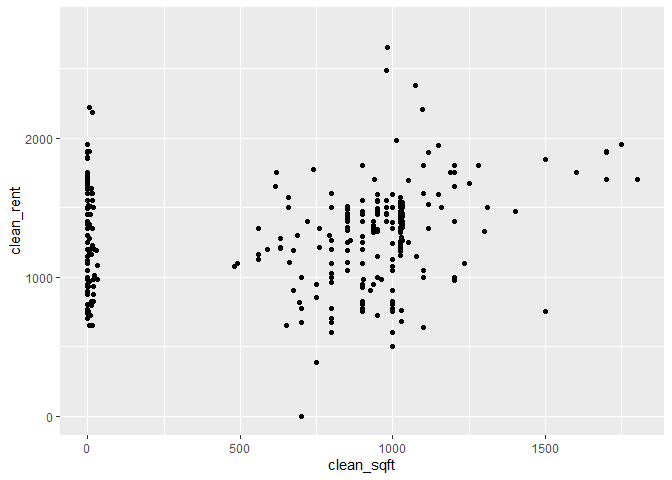
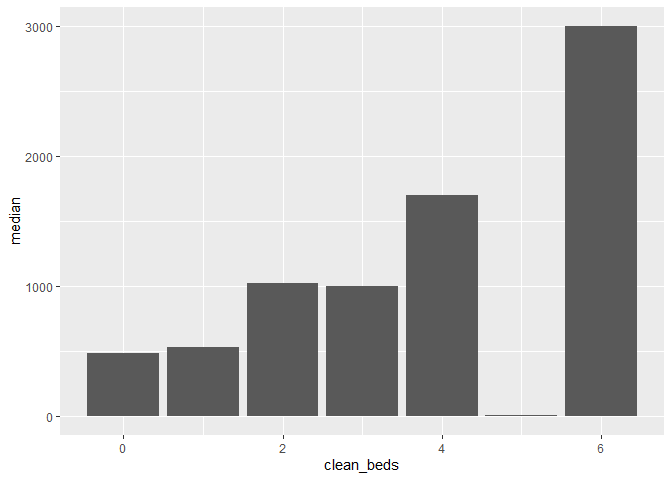
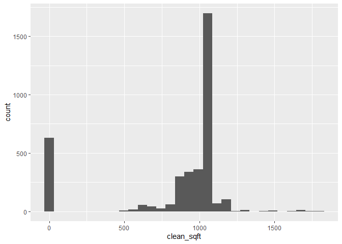
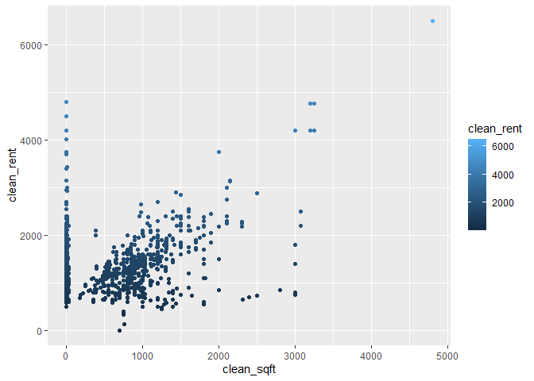
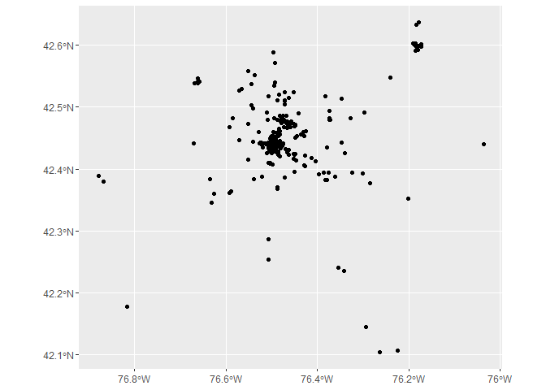
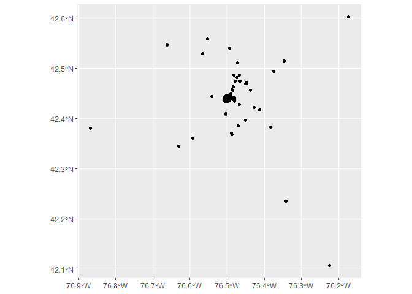

Hands-on Task 1: Wrangle the Craigslist data
============================================

Here you will use `dplyr` to complete process the listing data that we
started with to get a feel for writing data manipulation code. Once we
are done preparing the data, we will do some basic data visualization
and statistical analysis to understand patterns and relationships within
the data.

Load the listing data.
----------------------

    library(dplyr)

    ## 
    ## Attaching package: 'dplyr'

    ## The following objects are masked from 'package:stats':
    ## 
    ##     filter, lag

    ## The following objects are masked from 'package:base':
    ## 
    ##     intersect, setdiff, setequal, union

    library(tidyverse) 

    ## -- Attaching packages --------------------------------------------------- tidyverse 1.3.0 --

    ## √ ggplot2 3.3.2     √ purrr   0.3.4
    ## √ tibble  3.0.2     √ stringr 1.4.0
    ## √ tidyr   1.1.0     √ forcats 0.5.0
    ## √ readr   1.3.1

    ## -- Conflicts ------------------------------------------------------ tidyverse_conflicts() --
    ## x dplyr::filter() masks stats::filter()
    ## x dplyr::lag()    masks stats::lag()

    library(sf)       

    ## Linking to GEOS 3.8.0, GDAL 3.0.4, PROJ 6.3.1

    library(lubridate)

    ## 
    ## Attaching package: 'lubridate'

    ## The following objects are masked from 'package:base':
    ## 
    ##     date, intersect, setdiff, union

    library(leaflet)
    load("./input/ithaca_rentals.RData")

Create a new data frame that is limited to 1 bedroom units.
-----------------------------------------------------------

    one_bedroom <- filter(scraped, scraped_beds == "1BR")

Mutate fields in `scraped` that are currently character but should be numeric as new columns.
---------------------------------------------------------------------------------------------

    scraped <- mutate(scraped,clean_rent = parse_number(scraped_rent),
                      clean_sqft = parse_number(scraped_sqft),
                      clean_baths = parse_number(scraped_baths))

    ## Warning: 582 parsing failures.
    ## row col expected        actual
    ## 401  -- a number available now
    ## 409  -- a number available now
    ## 438  -- a number -            
    ## 500  -- a number available now
    ## 508  -- a number available now
    ## ... ... ........ .............
    ## See problems(...) for more details.

    ## Warning: 84 parsing failures.
    ##  row col expected   actual
    ##  296  -- a number sharedBa
    ##  367  -- a number sharedBa
    ##  454  -- a number sharedBa
    ##  975  -- a number sharedBa
    ## 1306  -- a number sharedBa
    ## .... ... ........ ........
    ## See problems(...) for more details.

Create a new data frame with listings that mention “affordable” in their title
------------------------------------------------------------------------------

    affordable <- filter(scraped, str_detect(listing_title, pattern = "affordable"))

Create a column in `scraped` indicating whether the rent asked is more than $800.
---------------------------------------------------------------------------------

    scraped <- mutate(scraped, scraped_rent > 800)

Create a new data frame that only has the `listing_title` and our new numeric columns using `where()` and `is_numeric()`.
-------------------------------------------------------------------------------------------------------------------------

    char_cols <- select(scraped, where(is_numeric),listing_title)

    ## Warning: Deprecated

    ## Warning: Deprecated

    ## Warning: Deprecated

    ## Warning: Deprecated

    ## Warning: Deprecated

    ## Warning: Deprecated

    ## Warning: Deprecated

    ## Warning: Deprecated

    ## Warning: Deprecated

    ## Warning: Deprecated

    ## Warning: Deprecated

    ## Warning: Deprecated

    ## Warning: Deprecated

    ## Warning: Deprecated

    ## Warning: Deprecated

    ## Warning: Deprecated

    ## Warning: Deprecated

    ## Warning: Deprecated

Create a summary statistic table with the minimum, maximum and average rent values for 1 bedroom units, as well as the number of 1 bedroom units in the data.
-------------------------------------------------------------------------------------------------------------------------------------------------------------

    summarize(one_bedroom,min_1b=min(parse_number(scraped_rent),na.rm = T),
              max_1b=max(parse_number(scraped_rent),na.rm = T),
              mean_1b=mean(parse_number(scraped_rent),na.rm = T),
              length_1b=length(scraped_rent))

    ## Simple feature collection with 1 feature and 4 fields
    ## geometry type:  MULTIPOINT
    ## dimension:      XY
    ## bbox:           xmin: -78.90302 ymin: 42.10706 xmax: -76.17315 ymax: 42.93978
    ## geographic CRS: WGS 84
    ##   min_1b max_1b  mean_1b length_1b                       geometry
    ## 1      1   2400 1087.765      3738 MULTIPOINT ((-78.90302 42.9...

Summarize the average square footage for 1, 2 and 3 bedroom units.
------------------------------------------------------------------

    summarize(filter(scraped, parse_number(scraped_beds) <= 3),
              mean_b=mean(parse_number(scraped_sqft),na.rm = T))

    ## Warning: 352 parsing failures.
    ## row col expected        actual
    ## 351  -- a number available now
    ## 359  -- a number available now
    ## 428  -- a number available now
    ## 436  -- a number available now
    ## 462  -- a number available now
    ## ... ... ........ .............
    ## See problems(...) for more details.

    ## Simple feature collection with 1 feature and 1 field
    ## geometry type:  MULTIPOINT
    ## dimension:      XY
    ## bbox:           xmin: -78.90302 ymin: 42.10337 xmax: -76.03615 ymax: 42.93978
    ## geographic CRS: WGS 84
    ##     mean_b                       geometry
    ## 1 695.7065 MULTIPOINT ((-78.90302 42.9...

Summarize the average number of bedrooms across months in the listing data.
---------------------------------------------------------------------------

    scraped %>% #take our listing data
      filter(!is.na(listing_date), !is.na(parse_number(scraped_rent))) %>% 
      group_by(month(listing_date)) %>% 
      summarize(med_rent = median(parse_number(scraped_rent))) 

    ## `summarise()` ungrouping output (override with `.groups` argument)

    ## Simple feature collection with 5 features and 2 fields
    ## geometry type:  MULTIPOINT
    ## dimension:      XY
    ## bbox:           xmin: -78.90302 ymin: 42.10337 xmax: -76.03615 ymax: 42.93978
    ## geographic CRS: WGS 84

    ## Warning: `...` is not empty.
    ## 
    ## We detected these problematic arguments:
    ## * `needs_dots`
    ## 
    ## These dots only exist to allow future extensions and should be empty.
    ## Did you misspecify an argument?

    ## # A tibble: 5 x 3
    ##   `month(listing_dat~ med_rent                                          geometry
    ##                 <dbl>    <dbl>                         <MULTIPOINT [arc_degree]>
    ## 1                   1     1415 ((-78.90302 42.93978), (-78.66828 42.7929), (-76~
    ## 2                   2     1395 ((-78.90302 42.93978), (-78.66828 42.7929), (-76~
    ## 3                   3     1385 ((-76.87419 42.38192), (-76.81691 42.17695), (-7~
    ## 4                   4     1395 ((-76.87419 42.38192), (-76.81691 42.17695), (-7~
    ## 5                   5     1325 ((-76.8791 42.38874), (-76.86736 42.38024), (-76~

Create a summary table for the proportion of 1, 2 and 3 bedroom units with rents below Fair Market Rent levels set by the Department of Housing and Urban Development.
----------------------------------------------------------------------------------------------------------------------------------------------------------------------

You will want to consult
[this](https://www.rentdata.org/ithaca-ny-msa/2018) site for the FMR
values. Hint: you could use `case_when()` to create a FMR column with
each bedroom size’s FMR value and then `mutate()` another column
flagging if the row’s rent was greater than or less than the FMR.

    scraped <- mutate(scraped, clean_beds = parse_number(scraped_beds))
    scraped <- mutate(scraped, clean_beds = ifelse(clean_beds > 6, NA, clean_beds))
    fmr <- scraped %>% 
    mutate(limit = case_when( 
           clean_beds == 1 ~ 978, 
           clean_beds == 2 ~ 1164, 
           clean_beds == 3 ~ 1495))  %>% 
    mutate(clean_rent < limit)
    table(fmr$`clean_rent < limit`, useNA = "always")

    ## 
    ## FALSE  TRUE  <NA> 
    ##  8341  2716  2096

    sum(fmr$`clean_rent < limit`,na.rm = T)/length(scraped$clean_rent)

    ## [1] 0.2064928

If housing assistance allows households to rent units up to the FMR level, how much choice would you say they have on the rental markes? What policy proposals, if any, would you propose given the evidence you’ve generated using current rental listings?
------------------------------------------------------------------------------------------------------------------------------------------------------------------------------------------------------------------------------------------------------------

They have 2716 kinds of choice. The houses with rents lower than FMR
level is only 21% of the whole market. The rental market is overheating
and mn people may can’t afford the price. The government could subsidize
the renters. Therefore, they will be more willing to set a lower price
to meet the FMR standard. As the price decreases, more tenant could
afford the price, solving the housing problem in the society.

 

 

Hands-on Task 2: Making some plots of the Craigslist data
=========================================================

Create and interpret a scatterplot of square footage by rent asked for 2 bedroom listings using `ggplot()`.
-----------------------------------------------------------------------------------------------------------

    point <- scraped %>% filter(parse_number(scraped_beds)==2)
    ggplot(point, aes(x = clean_sqft, y = clean_rent)) +
      geom_point()

    ## Warning: Removed 487 rows containing missing values (geom_point).

Create and interpret a bar chart of average square footage by bedroom size using `ggplot()`.
--------------------------------------------------------------------------------------------

    sum_df <- scraped %>%
      group_by(clean_beds) %>%
      summarize(median = median(clean_sqft,na.rm = T))

    ## `summarise()` ungrouping output (override with `.groups` argument)

    ggplot(sum_df, aes(x = clean_beds, y = median)) +
      geom_bar(stat = "identity")

    ## Warning: Removed 1 rows containing missing values (position_stack).

Create and interpret a histogram of square footage using `ggplot()`.
--------------------------------------------------------------------

    ggplot(point, aes(x = clean_sqft)) +
      geom_histogram()

    ## `stat_bin()` using `bins = 30`. Pick better value with `binwidth`.

    ## Warning: Removed 487 rows containing non-finite values (stat_bin).

Create and interpret a ggplot of your choice using the listing data that incorporates the color aesthetic.
----------------------------------------------------------------------------------------------------------

    ggplot(scraped, aes(x = clean_sqft, y = clean_rent,color = clean_rent)) +
      geom_point()

    ## Warning: Removed 2861 rows containing missing values (geom_point).

This shows the relation between the rent and the the square footage. The
lighter the point, the higher the rent.

 

 

Hands-on Task 3: Correlation
============================

Estimate the correlation between square footage and rent overall and interpret this statistic.
----------------------------------------------------------------------------------------------

    cor.test(scraped$clean_sqft,scraped$clean_rent,method = "pearson")

    ## 
    ##  Pearson's product-moment correlation
    ## 
    ## data:  scraped$clean_sqft and scraped$clean_rent
    ## t = 34.133, df = 10290, p-value < 2.2e-16
    ## alternative hypothesis: true correlation is not equal to 0
    ## 95 percent confidence interval:
    ##  0.3014562 0.3361675
    ## sample estimates:
    ##       cor 
    ## 0.3189188

The p-value is smaller than 2.2e-16, the correlation is significant. The
cor value is about 0.3,which is weak positive relation. This means
higher square foot may leads to higher rent.  

 

Hands-on Task 4: Make a map
===========================

Create a map of 2 bedroom units listed in May with `ggplot()` or `leaflet()`
----------------------------------------------------------------------------

    scraped <- scraped %>% 
      filter(month(listing_date)==5)
    scraped <- st_set_crs(scraped, "EPSG:4326")
    ggplot(scraped) +
      geom_sf()

    leaflet(scraped) %>%
      addTiles() %>%
      addMarkers()

<!--html_preserve-->

<script type="application/json" data-for="htmlwidget-eee35a55f5554e5d2ae7">{"x":{"options":{"crs":{"crsClass":"L.CRS.EPSG3857","code":null,"proj4def":null,"projectedBounds":null,"options":{}}},"calls":[{"method":"addTiles","args":["//{s}.tile.openstreetmap.org/{z}/{x}/{y}.png",null,null,{"minZoom":0,"maxZoom":18,"tileSize":256,"subdomains":"abc","errorTileUrl":"","tms":false,"noWrap":false,"zoomOffset":0,"zoomReverse":false,"opacity":1,"zIndex":1,"detectRetina":false,"attribution":"&copy; <a href=\"http://openstreetmap.org\">OpenStreetMap<\/a> contributors, <a href=\"http://creativecommons.org/licenses/by-sa/2.0/\">CC-BY-SA<\/a>"}]},{"method":"addMarkers","args":[[42.441694,42.481332,42.4416320000001,42.4416320000001,42.4565300000001,42.436743,42.449969,42.441513,42.4395110000001,42.637137,42.43138,42.462703,42.429123,42.479828,42.4593050000001,42.4593050000001,42.394459,42.421492,42.451853,42.486091,42.486091,42.486091,42.486091,42.38808,42.439462,42.419997,42.44059,42.476827,42.476827,42.456896,42.481332,42.481332,42.486091,42.486091,42.486091,42.486091,42.435802,42.43466,42.43466,42.511393,42.445042,42.440649,42.1070610000001,42.486091,42.486091,42.486091,42.486091,42.511393,42.486091,42.481332,42.481332,42.4345539999999,42.476827,42.476827,42.510231,42.453062,42.472812,42.4420469999999,42.431354,42.5050600000001,42.441096,42.439834,42.405363,42.38808,42.38808,42.481332,42.417597,42.47854,42.38808,42.4501680000001,42.438512,42.476827,42.441096,42.451853,42.439877,42.486091,42.637137,42.43138,42.429123,42.479828,42.481332,42.4593050000001,42.4593050000001,42.394459,42.4565300000001,42.421492,42.486091,42.486091,42.486091,42.486091,42.38808,42.481332,42.439462,42.419997,42.44059,42.476827,42.476827,42.456896,42.462703,42.441694,42.481332,42.481332,42.486091,42.486091,42.486091,42.486091,42.435802,42.43466,42.43466,42.481332,42.445042,42.440649,42.1070610000001,42.486091,42.486091,42.486091,42.486091,42.486091,42.4345539999999,42.476827,42.476827,42.510231,42.511393,42.511393,42.453062,42.472812,42.4420469999999,42.431354,42.5050600000001,42.439834,42.405363,42.453415,42.38808,42.38808,42.481332,42.417597,42.47854,42.38808,42.4501680000001,42.438512,42.476827,42.441096,42.445519,42.445519,42.453415,42.479311,42.461292,42.432056,42.449818,42.419991,42.439071,42.404184,42.461292,42.479311,42.461292,42.432056,42.449818,42.419991,42.439071,42.404184,42.461292,42.43723,42.43723,42.486091,42.493511,42.4410420000001,42.441117,42.441052,42.441062,42.419997,42.1070610000001,42.4416570000001,42.449714,42.439562,42.476827,42.539318,42.419997,42.437833,42.38808,42.38808,42.476827,42.486091,42.435149,42.486091,42.486091,42.476827,42.476827,42.440574,42.453173,42.602813,42.44498,42.481332,42.486091,42.486091,42.486091,42.476827,42.486091,42.486091,42.486091,42.476827,42.486091,42.4707570000001,42.453062,42.509547,42.452753,42.511393,42.442593,42.481332,42.486091,42.486091,42.442491,42.440968,42.4565300000001,42.452092,42.450272,42.450272,42.481332,42.435802,42.4375230000001,42.486091,42.476827,42.486091,42.486091,42.486091,42.486091,42.481332,42.473512,42.447221,42.447221,42.441694,42.428896,42.469728,42.4418590000001,42.4418590000001,42.394459,42.472002,42.419991,42.451325,42.486091,42.38808,42.4416570000001,42.449714,42.451325,42.439562,42.439562,42.449818,42.476827,42.460041,42.46013,42.460082,42.460041,42.460041,42.453415,42.44256,42.419997,42.44498,42.394459,42.443862,42.440251,42.39307,42.4750840000001,42.441981,42.439281,42.439591,42.383053,42.361163,42.597924,42.4375940000001,42.435149,42.46729,42.419997,42.49131,42.482546,42.440652,42.4450870000001,42.38808,42.38808,42.38808,42.391727,42.453173,42.447221,42.447221,42.443961,42.443961,42.435632,42.1070610000001,42.447024,42.38808,42.524812,42.486091,42.486091,42.486091,42.486091,42.446564,42.447024,42.447024,42.447024,42.442776,42.449818,42.439071,42.478594,42.455614,42.444452,42.486091,42.511393,42.452753,42.509547,42.453062,42.4707570000001,42.4395110000001,42.435802,42.440498,42.38808,42.38808,42.435149,42.44498,42.352357,42.441219,42.486091,42.486091,42.486091,42.419997,42.441694,42.441513,42.441117,42.441052,42.450272,42.450272,42.452092,42.476827,42.476827,42.445002,42.4484340000001,42.44826,42.486091,42.486091,42.486091,42.486091,42.446564,42.446564,42.438975,42.486091,42.419997,42.449969,42.486091,42.486091,42.486091,42.436743,42.437453,42.453173,42.4375230000001,42.434708,42.43466,42.103372,42.486091,42.486091,42.486091,42.486091,42.440646,42.486091,42.486091,42.486091,42.486091,42.476827,42.431354,42.486091,42.439834,42.5050600000001,42.474489,42.405363,42.445145,42.486091,42.458715,42.486091,42.4416320000001,42.44826,42.435802,42.476827,42.440724,42.440681,42.440946,42.440946,42.440724,42.450272,42.38808,42.38808,42.435149,42.44498,42.352357,42.441219,42.486091,42.486091,42.486091,42.419997,42.441117,42.441052,42.450272,42.452092,42.476827,42.476827,42.445002,42.4484340000001,42.441694,42.44826,42.486091,42.486091,42.486091,42.446564,42.446564,42.438975,42.419997,42.449969,42.486091,42.486091,42.486091,42.436743,42.437453,42.453173,42.4375230000001,42.434708,42.43466,42.103372,42.486091,42.486091,42.486091,42.440646,42.486091,42.486091,42.486091,42.486091,42.476827,42.431354,42.441513,42.439834,42.5050600000001,42.474489,42.478594,42.405363,42.445145,42.486091,42.486091,42.486091,42.458715,42.486091,42.4416320000001,42.44826,42.435802,42.476827,42.440724,42.440681,42.435857,42.445519,42.445519,42.445519,42.445519,42.476827,42.445519,42.449818,42.49102,42.478594,42.476827,42.436646,42.449818,42.49102,42.478594,42.436646,42.409871,42.406922,42.481332,42.39307,42.394459,42.419997,42.4450870000001,42.440652,42.540222,42.427758,42.426621,42.469728,42.428896,42.38808,42.38808,42.38808,42.361163,42.361163,42.486091,42.486091,42.439272,42.441708,42.439272,42.486091,42.43448,42.442398,42.476827,42.476827,42.486091,42.476827,42.486091,42.426357,42.409198,42.406922,42.409198,42.409871,42.439462,42.409198,42.40894,42.409198,42.409198,42.409198,42.409198,42.476827,42.442292,42.486091,42.486091,42.486091,42.38808,42.598732,42.438102,42.486091,42.486091,42.486091,42.437716,42.486091,42.476827,42.449818,42.253147,42.453173,42.486091,42.486091,42.476827,42.416874,42.5409130000001,42.419997,42.481332,42.456585,42.456585,42.476827,42.476827,42.481332,42.438864,42.438895,42.430894,42.427758,42.426621,42.428896,42.486091,42.38808,42.38808,42.38808,42.361163,42.361163,42.486091,42.486091,42.439272,42.441708,42.439272,42.486091,42.43448,42.442398,42.476827,42.476827,42.486091,42.476827,42.437716,42.486091,42.409871,42.406922,42.426357,42.409198,42.406922,42.476827,42.409198,42.409871,42.409198,42.40894,42.409198,42.409198,42.409198,42.409198,42.476827,42.442292,42.486091,42.486091,42.439462,42.38808,42.598732,42.438102,42.486091,42.486091,42.486091,42.253147,42.453173,42.486091,42.486091,42.476827,42.416874,42.5409130000001,42.419997,42.419997,42.456585,42.456585,42.476827,42.476827,42.481332,42.438864,42.438895,42.486091,42.486091,42.409198,42.476827,42.442292,42.486091,42.444452,42.455614,42.4349,42.4349,42.438386,42.439692,42.438386,42.449818,42.439692,42.4484340000001,42.47854,42.4677009999999,42.435802,42.419997,42.486091,42.486091,42.486091,42.486091,42.5117079999999,42.439532,42.4375940000001,42.597924,42.38808,42.486091,42.447221,42.447221,42.440557,42.35996,42.486091,42.486091,42.453173,42.438102,42.437716,42.393747,42.476827,42.442198,42.440627,42.38808,42.38808,42.476827,42.44826,42.394459,42.442042,42.4418590000001,42.440229,42.4418590000001,42.4418590000001,42.442042,42.442042,42.517962,42.524358,42.476827,42.486091,42.486091,42.444668,42.482546,42.44498,42.437453,42.43466,42.419997,42.445042,42.434708,42.434708,42.445042,42.43466,42.476827,42.443681,42.427211,42.479828,42.429123,42.4593050000001,42.476827,42.4593050000001,42.441981,42.439272,42.439281,42.439272,42.486091,42.439272,42.517962,42.449818,42.524358,42.439272,42.486091,42.476827,42.38808,42.486091,42.447221,42.447221,42.440557,42.35996,42.486091,42.486091,42.453173,42.438102,42.437716,42.393747,42.476827,42.442198,42.440627,42.38808,42.38808,42.476827,42.44826,42.394459,42.442042,42.4418590000001,42.440229,42.4418590000001,42.4418590000001,42.4418590000001,42.442042,42.442042,42.4418590000001,42.4418590000001,42.4418590000001,42.4418590000001,42.4418590000001,42.4418590000001,42.441012,42.467246,42.4418590000001,42.4418590000001,42.4418590000001,42.4418590000001,42.441012,42.467246,42.44498,42.47927,42.486091,42.486091,42.444668,42.482546,42.437453,42.43466,42.419997,42.445042,42.434708,42.434708,42.445042,42.435802,42.43898,42.449818,42.442776,42.46013,42.479311,42.461292,42.460041,42.432056,42.439071,42.442776,42.46013,42.449818,42.479311,42.461292,42.460041,42.432056,42.47927,42.47927,42.47927,42.486091,42.486091,42.4742,42.47927,42.434892,42.4418590000001,42.486091,42.2861290000001,42.44826,42.419997,42.453173,42.38808,42.486091,42.486091,42.394459,42.440557,42.438102,42.437716,42.4413470000001,42.465599,42.38808,42.4416570000001,42.476827,42.476827,42.422555,42.427543,42.476827,42.476827,42.4413470000001,42.480022,42.440187,42.431787,42.434151,42.472162,42.474489,42.439877,42.441096,42.441096,42.438512,42.4501680000001,42.438804,42.424898,42.435857,42.526412,42.439962,42.439692,42.422555,42.447024,42.4501680000001,42.428396,42.430447,42.473547,42.435149,42.426202,42.4313860000001,42.430447,42.428486,42.481332,42.1070610000001,42.476827,42.1070610000001,42.476827,42.419997,42.476827,42.470777,42.38808,42.435865,42.447252,42.486091,42.486091,42.440637,42.443862,42.54779,42.43466,42.486091,42.441433,42.4707570000001,42.453062,42.509547,42.452753,42.511393,42.44498,42.394459,42.440557,42.438102,42.437716,42.465599,42.38808,42.47927,42.4416570000001,42.476827,42.476827,42.427543,42.476827,42.476827,42.4413470000001,42.480022,42.440187,42.431787,42.4413470000001,42.434151,42.472162,42.474489,42.439877,42.441096,42.441096,42.438512,42.4501680000001,42.422555,42.438804,42.424898,42.435857,42.526412,42.439962,42.422555,42.447024,42.4501680000001,42.428396,42.430447,42.473547,42.426202,42.4313860000001,42.470777,42.430447,42.428486,42.481332,42.1070610000001,42.1070610000001,42.476827,42.419997,42.476827,42.38808,42.435865,42.38808,42.447252,42.486091,42.404184,42.486091,42.440637,42.443862,42.54779,42.43466,42.441433,42.449818,42.440737,42.439272,42.449818,42.368141,42.404184,42.439692,42.49102,42.368141,42.4742,42.47927,42.47927,42.441117,42.486091,42.486091,42.447221,42.447221,42.439281,42.4450870000001,42.419997,42.441979,42.441117,42.4410420000001,42.38808,42.38808,42.38808,42.419997,42.476827,42.476827,42.476827,42.440557,42.486091,42.486091,42.486091,42.486091,42.478594,42.478594,42.438102,42.437716,42.441052,42.441052,42.441694,42.472812,42.453062,42.511393,42.476827,42.476827,42.476827,42.440652,42.441981,42.476827,42.486091,42.486091,42.486091,42.39307,42.38808,42.38808,42.473076,42.447252,42.434708,42.439272,42.385861,42.486091,42.486091,42.486091,42.447252,42.439272,42.439272,42.428896,42.43466,42.445073,42.43466,42.1070610000001,42.443961,42.419997,42.352357,42.476827,42.476827,42.419997,42.441979,42.441117,42.4410420000001,42.441117,42.38808,42.38808,42.38808,42.419997,42.476827,42.476827,42.476827,42.440557,42.486091,42.486091,42.486091,42.486091,42.478594,42.478594,42.438102,42.437716,42.441052,42.441052,42.441694,42.472812,42.453062,42.511393,42.476827,42.476827,42.440652,42.441981,42.476827,42.486091,42.486091,42.486091,42.39307,42.478594,42.4757479999999,42.449818,42.460041,42.4600890000001,42.460041,42.446856,42.460082,42.4757479999999,42.449818,42.460041,42.4600890000001,42.449818,42.47927,42.47927,42.5291,42.5291,42.470777,42.46893,42.486091,42.486091,42.441694,42.486091,42.486091,42.435802,42.429613,42.445785,42.486091,42.445972,42.571847,42.588071,42.394459,42.44498,42.447221,42.441012,42.486091,42.453173,42.486091,42.486091,42.486091,42.440757,42.440757,42.440671,42.4416570000001,42.43138,42.421492,42.513725,42.421492,42.592897,42.423673,42.419997,42.441117,42.486091,42.38808,42.38808,42.38808,42.447221,42.439653,42.447221,42.476827,42.472002,42.486091,42.486091,42.486091,42.486091,42.476827,42.441052,42.4410420000001,42.441052,42.419997,42.440557,42.486091,42.4707570000001,42.453062,42.509547,42.452753,42.511393,42.437716,42.438102,42.4484340000001,42.476827,42.486091,42.240219,42.449969,42.44826,42.4395110000001,42.436743,42.430931,42.443681,42.443681,42.486091,42.463787,42.486091,42.5028980000001,42.4375230000001,42.571847,42.588071,42.394459,42.44498,42.441012,42.486091,42.453173,42.486091,42.486091,42.486091,42.440757,42.440757,42.440671,42.4416570000001,42.43138,42.421492,42.513725,42.410042,42.421492,42.592897,42.423673,42.419997,42.441117,42.38808,42.38808,42.38808,42.447221,42.439653,42.486091,42.4603910000001,42.441601,42.449818,42.49102,42.410042,42.436646,42.479311,42.455614,42.444452,42.461292,42.4603910000001,42.441601,42.449818,42.49102,42.4401300000001,42.4401300000001,42.439591,42.442398,42.449818,42.419997,42.449818,42.441052,42.4410420000001,42.441117,42.441981,42.440652,42.419997,42.38808,42.38808,42.38808,42.486091,42.486091,42.486091,42.396081,42.440637,42.443862,42.382763,42.452092,42.450272,42.450272,42.409198,42.409198,42.40894,42.409198,42.409198,42.409198,42.409871,42.409198,42.441117,42.426357,42.409198,42.406922,42.409871,42.406922,42.435149,42.44498,42.441052,42.440498,42.453173,42.396081,42.419997,42.38808,42.456086,42.456086,42.46729,42.1070610000001,42.1070610000001,42.5589630000001,42.473512,42.486091,42.486091,42.486091,42.448842,42.391727,42.597924,42.4375940000001,42.445519,42.539318,42.449818,42.440571,42.427554,42.368141,42.4742,42.5291,42.4397,42.434708,42.43466,42.434708,42.434708,42.486091,42.433835,42.486091,42.440649,42.4395110000001,42.440646,42.476827,42.486091,42.440963,42.440963,42.436988,42.436988,42.435822,42.434832,42.486091,42.38808,42.38808,42.38808,42.460082,42.5028980000001,42.546035,42.541796,42.437716,42.438102,42.440557,42.394459,42.44059,42.486091,42.486091,42.486091,42.435857,42.486091,42.426202,42.446564,42.438975,42.446564,42.445145,42.446817,42.447024,42.428486,42.430447,42.4313860000001,42.4501680000001,42.424898,42.438512,42.441096,42.4413470000001,42.385861,42.435149,42.445002,42.473076,42.437453,42.434708,42.437453,42.43466,42.438864,42.438895,42.430894,42.451559,42.44498,42.445042,42.434502,42.435822,42.442422,42.433709,42.43999,42.435543,42.434832,42.4379050000001,42.434342,42.435822,42.434502,42.434342,42.445042,42.441911,42.430941,42.43076,42.440662,42.446272,42.451559,42.425504,42.441607,42.441911,42.441911,42.486091,42.486091,42.486091,42.441911,42.442439,42.4416570000001,42.419997,42.1070610000001,42.439462,42.443961,42.4295470000001,42.361163,42.361163,42.47854,42.47854,42.440574,42.486091,42.486091,42.486091,42.486091,42.486091,42.486091,42.447362,42.447221,42.431902,42.433508,42.431902,42.431902,42.433508,42.486091,42.486091,42.441694,42.38808,42.5050600000001,42.38808,42.435632,42.443292,42.440557,42.444581,42.445002,42.419997,42.511393,42.4435010000001,42.486091,42.486091,42.486091,42.486091,42.476827,42.447221,42.447221,42.47854,42.436743,42.431354,42.441513,42.449969,42.43466,42.439834,42.453062,42.511393,42.472812,42.4375230000001,42.439637,42.43466,42.437453,42.445042,42.440649,42.486091,42.405363,42.486091,42.486091,42.439637,42.439637,42.439637,42.441979,42.486091,42.486091,42.486091,42.4450870000001,42.442491,42.456585,42.456585,42.476827,42.476827,42.476827,42.43898,42.433781,42.449818,42.4295470000001,42.387229,42.460065,42.439071,42.460041,42.460082,42.460041,42.46013,42.47927,42.47927,42.472002,42.517209,42.476827,42.451853,42.442876,42.442876,42.520192,42.439281,42.440652,42.435802,42.44498,42.435149,42.4416320000001,42.440724,42.440946,42.440946,42.486091,42.486091,42.486091,42.419997,42.4484340000001,42.470777,42.2861290000001,42.440557,42.38808,42.38808,42.38808,42.438102,42.476827,42.476827,42.476827,42.434742,42.478594,42.442292,42.476827,42.632784,42.476827,42.396081,42.438804,42.4501680000001,42.441096,42.439877,42.474489,42.472162,42.434151,42.4413470000001,42.431787,42.440187,42.480022,42.447024,42.526412,42.439962,42.422555,42.428396,42.422555,42.430447,42.473547,42.458715,42.474489,42.440557,42.437716,42.486091,42.486091,42.419997,42.438029,42.438652,42.431902,42.441208,42.440946,42.440946,42.486091,42.486091,42.486091,42.419997,42.4484340000001,42.470777,42.2861290000001,42.440557,42.38808,42.38808,42.38808,42.438102,42.476827,42.476827,42.476827,42.434742,42.478594,42.442292,42.476827,42.476827,42.632784,42.476827,42.396081,42.438804,42.4501680000001,42.441096,42.439877,42.474489,42.472162,42.434151,42.4413470000001,42.431787,42.440187,42.480022,42.447024,42.526412,42.439962,42.422555,42.428396,42.422555,42.430447,42.473547,42.458715,42.474489,42.440557,42.437716,42.438102,42.486091,42.486091,42.419997,42.438029,42.438652,42.431902,42.441208,42.486091,42.474489,42.476827,42.445519,42.445519,42.449818,42.460082,42.460082,42.450567,42.440228,42.460041,42.368141,42.460082,42.46013,42.410042,42.436646,42.449818,42.460082,42.460082,42.450567,42.440228,42.460041,42.368141,42.460082,42.46013,42.436646,42.46893,42.47927,42.14477,42.46893,42.47927,42.14477,42.4397,42.486091,42.486091,42.486091,42.438102,42.437716,42.440557,42.235527,42.435865,42.440396,42.440396,42.441117,42.441052,42.406922,42.449969,42.436743,42.431354,42.441513,42.5050600000001,42.409198,42.4375230000001,42.405363,42.439834,42.38808,42.38808,42.409198,42.591822,42.601954,42.426357,42.406922,42.409198,42.409198,42.409871,42.409198,42.40894,42.409198,42.409198,42.436483,42.44059,42.440737,42.440737,42.440727,42.476827,42.442198,42.456585,42.456585,42.439532,42.442198,42.456585,42.478594,42.439596,42.442602,42.437496,42.486091,42.440169,42.440167,42.486091,42.486091,42.427257,42.468648,42.476827,42.472812,42.443862,42.440637,42.486091,42.486091,42.486091,42.486091,42.486091,42.439532,42.476827,42.476827,42.479931,42.481332,42.434708,42.43466,42.486091,42.434708,42.486091,42.437453,42.437453,42.486091,42.441513,42.5050600000001,42.4375230000001,42.405363,42.439834,42.38808,42.38808,42.409198,42.591822,42.601954,42.591822,42.426357,42.406922,42.409198,42.409871,42.409198,42.40894,42.409198,42.406922,42.409198,42.409198,42.409198,42.436483,42.44059,42.440737,42.440737,42.440727,42.476827,42.456585,42.456585,42.456585,42.478594,42.439596,42.486091,42.486091,42.442602,42.437496,42.486091,42.486091,42.486091,42.486091,42.486091,42.476827,42.439532,42.440169,42.440167,42.486091,42.486091,42.427257,42.439532,42.468648,42.476827,42.472812,42.443862,42.440637,42.486091,42.486091,42.476827,42.433781,42.460113,42.460113,42.47927,42.47927,42.4742,42.47927,42.47927,42.4742,42.419997,42.449818,42.476827,42.441117,42.434708,42.441052,42.486091,42.486091,42.419997,42.443681,42.486091,42.486091,42.486091,42.437716,42.438102,42.440557,42.4410420000001,42.38808,42.486091,42.486091,42.486091,42.486091,42.437496,42.446123,42.441172,42.441172,42.441172,42.462703,42.486091,42.486091,42.456233,42.440757,42.440757,42.4416570000001,42.476827,42.476827,42.476827,42.444051,42.476827,42.447362,42.486091,42.486091,42.486091,42.439591,42.478594,42.486091,42.43466,42.43466,42.43466,42.43466,42.434708,42.434708,42.437453,42.452042,42.434502,42.476827,42.5117079999999,42.476827,42.439776,42.440134,42.1070610000001,42.1070610000001,42.4707570000001,42.511393,42.396081,42.445002,42.4416320000001,42.4416320000001,42.435822,42.451559,42.438864,42.438895,42.430894,42.440963,42.440963,42.436988,42.436988,42.445042,42.425504,42.435822,42.4379050000001,42.38808,42.486091,42.486091,42.486091,42.434708,42.486091,42.437496,42.446123,42.441172,42.441172,42.476827,42.441172,42.440757,42.440757,42.4416570000001,42.476827,42.456233,42.462703,42.419997,42.444051,42.476827,42.447362,42.486091,42.486091,42.486091,42.439591,42.478594,42.486091,42.486091,42.486091,42.476827,42.434708,42.43466,42.43466,42.43466,42.43466,42.434708,42.437453,42.452042,42.5117079999999,42.419997,42.476827,42.439776,42.440134,42.1070610000001,42.1070610000001,42.4707570000001,42.511393,42.396081,42.439462,42.452705,42.368141,42.368141,42.449818,42.449818,42.47927,42.47927,42.520192,42.447221,42.436988,42.436988,42.447221,42.442876,42.442876,42.451559,42.447221,42.438864,42.438895,42.430894,42.440963,42.440963,42.435822,42.445042,42.434502,42.435822,42.4379050000001,42.434342,42.435822,42.434502,42.434342,42.445042,42.430941,42.1070610000001,42.43076,42.440662,42.446272,42.451559,42.425504,42.481332,42.476827,42.476827,42.476827,42.473512,42.476827,42.35996,42.486091,42.486091,42.445519,42.445519,42.388737,42.46013,42.486091,42.486091,42.486091,42.441694,42.486091,42.486091,42.456303,42.4395110000001,42.440169,42.476827,42.476827,42.476827,42.476827,42.441563,42.47854,42.44498,42.441012,42.414765,42.38808,42.38808,42.486091,42.486091,42.486091,42.486091,42.4375940000001,42.597924,42.435865,42.38808,42.441513,42.5050600000001,42.486091,42.486091,42.486091,42.486091,42.602844,42.600271,42.602844,42.4375230000001,42.602844,42.478594,42.441194,42.439834,42.405363,42.591822,42.4416570000001,42.476827,42.486091,42.481332,42.476827,42.4295470000001,42.4295470000001,42.486091,42.486091,42.486091,42.486091,42.444453,42.441592,42.540222,42.427758,42.426621,42.476827,42.476827,42.486091,42.486091,42.406922,42.601196,42.440557,42.437716,42.438102,42.38808,42.38808,42.38808,42.38808,42.476827,42.476827,42.48108,42.419997,42.480022,42.385861,42.4413470000001,42.441096,42.438512,42.424898,42.4501680000001,42.4313860000001,42.430447,42.428486,42.447024,42.446817,42.446564,42.438975,42.446564,42.426202,42.435857,42.434151,42.474489,42.458715,42.473547,42.486091,42.602844,42.600271,42.602844,42.602844,42.4375230000001,42.602844,42.602844,42.441194,42.439834,42.405363,42.591822,42.4416570000001,42.476827,42.481332,42.476827,42.4295470000001,42.4295470000001,42.434151,42.433781,42.455614,42.444452,42.447024,42.447024,42.447024,42.446564,42.460082,42.460082,42.4349,42.4349,42.440228,42.450567,42.460041,42.449818,42.460082,42.47927,42.49739,42.4397,42.476827,42.460113,42.460082,42.46013,42.445073,42.4484340000001,42.536994,42.49131,42.439776,42.447221,42.438967,42.450352,42.441052,42.441052,42.437596,42.419997,42.486091,42.486091,42.440757,42.486091,42.440757,42.439591,42.470702,42.442702,42.38808,42.382342,42.38808,42.441117,42.441117,42.440498,42.441694,42.428896,42.443961,42.486091,42.486091,42.486091,42.450724,42.476827,42.476827,42.511393,42.235527,42.439776,42.479931,42.476827,42.481332,42.536994,42.437716,42.4707570000001,42.476827,42.440646,42.472002,42.438102,42.486513,42.440557,42.486091,42.486091,42.486091,42.486091,42.42517,42.452092,42.450272,42.450272,42.4412770000001,42.412946,42.4487570000001,42.481332,42.472812,42.486091,42.481332,42.4416570000001,42.441694,42.460041,42.419997,42.486091,42.486091,42.440757,42.440757,42.439591,42.461292,42.449818,42.470702,42.442702,42.38808,42.38808,42.441117,42.449818,42.442764,42.394459,42.440396,42.440396,42.441981,42.419997,42.486091,42.486091,42.597924,42.4375940000001,42.486091,42.38808,42.4384270000001,42.445785,42.445972,42.526412,42.43448,42.442876,42.442876,42.440707,42.44498,42.441012,42.465599,42.486091,42.486091,42.440968,42.440968,42.440968,42.447221,42.440637,42.443862,42.4410420000001,42.441117,42.421492,42.513725,42.421492,42.43138,42.439462,42.439462,42.419997,42.38808,42.38808,42.42517,42.486091,42.486091,42.486091,42.4818900000001,42.449818,42.444452,42.455614,42.438386,42.439692,42.4603910000001,42.49102,42.410042,42.436646,42.479311,42.461292,42.441202,42.368141,42.49739,42.474004,42.486091,42.445002,42.486091,42.421492,42.538358,42.44826,42.435865,42.38808,42.486091,42.38808,42.421492,42.4230639999999,42.470702,42.429613,42.486091,42.486091,42.472002,42.476827,42.439776,42.4416570000001,42.486091,42.486091,42.486091,42.486091,42.486091,42.419997,42.514947,42.434708,42.43466,42.43466,42.43466,42.43466,42.434708,42.434708,42.482012,42.47854,42.435149,42.44498,42.4416320000001,42.4416320000001,42.486091,42.486091,42.486091,42.440449,42.440449,42.444468,42.440449,42.486091,42.440449,42.486091,42.486091,42.437453,42.434708,42.43466,42.486091,42.486091,42.409198,42.409198,42.409198,42.406922,42.409198,42.40894,42.409198,42.409871,42.409198,42.406922,42.409198,42.472002,42.426357,42.406922,42.429613,42.486091,42.486091,42.486091,42.476827,42.439776,42.4416570000001,42.486091,42.486091,42.486091,42.486091,42.486091,42.486091,42.419997,42.434708,42.514947,42.434708,42.43466,42.43466,42.43466,42.43466,42.434708,42.434708,42.482012,42.409871,42.47854,42.435149,42.44498,42.4416320000001,42.4416320000001,42.486091,42.486091,42.486091,42.440449,42.440449,42.444468,42.440449,42.440449,42.440449,42.486091,42.440449,42.486091,42.486091,42.437453,42.434708,42.43466,42.486091,42.409198,42.409198,42.409198,42.406922,42.409198,42.40894,42.409198,42.409198,42.406922,42.409198,42.426357,42.406922,42.4358350000001,42.409198,42.419997,42.514947,42.434708,42.43466,42.43466,42.43466,42.43466,42.434708,42.482012,42.47854,42.435149,42.44498,42.4416320000001,42.4416320000001,42.486091,42.486091,42.486091,42.440449,42.440449,42.444468,42.440449,42.440449,42.460082,42.440449,42.445519,42.445519,42.445519,42.445519,42.460041,42.433781,42.43898,42.43898,42.43898,42.432056,42.449818,42.460082,42.46013,42.432056,42.449818,42.460082,42.460041,42.460082,42.46013,42.460082,42.4397,42.4397,42.447221,42.4671040000001,42.452753,42.476827,42.383851,42.472812,42.453062,42.511393,42.440557,42.486091,42.486091,42.486091,42.486091,42.440757,42.440757,42.439302,42.486091,42.44826,42.462703,42.38808,42.456233,42.445972,42.445785,42.42517,42.419997,42.4707570000001,42.511393,42.440557,42.437716,42.438102,42.486091,42.439637,42.441979,42.439637,42.439637,42.439637,42.383053,42.361163,42.486091,42.486091,42.442347,42.486091,42.441607,42.486091,42.441911,42.441911,42.441911,42.442439,42.421492,42.441521,42.513725,42.421492,42.441117,42.476827,42.476827,42.442292,42.456585,42.456585,42.419997,42.481332,42.441521,42.445714,42.479931,42.442172,42.476827,42.476827,42.48108,42.479931,42.445002,42.476827,42.476827,42.476827,42.476827,42.486091,42.486091,42.476827,42.476827,42.476827,42.478594,42.38808,42.38808,42.440757,42.440757,42.439302,42.361163,42.44826,42.462703,42.38808,42.456233,42.445972,42.445785,42.42517,42.419997,42.4707570000001,42.511393,42.440557,42.437716,42.438102,42.486091,42.439637,42.441979,42.439637,42.439637,42.439637,42.383053,42.486091,42.486091,42.442347,42.486091,42.441607,42.441911,42.441911,42.441911,42.442439,42.421492,42.513725,42.486091,42.421492,42.441117,42.476827,42.476827,42.442292,42.476827,42.486091,42.456585,42.456585,42.419997,42.481332,42.441521,42.445714,42.441521,42.479931,42.442172,42.476827,42.476827,42.48108,42.479931,42.445002,42.5028980000001,42.449818,42.427554,42.473943,42.439007,42.439007,42.449818,42.427554,42.509547,42.511393,42.473512,42.419997,42.441052,42.441117,42.4410420000001,42.435637,42.426621,42.427758,42.540222,42.447221,42.394175,42.486091,42.486091,42.486091,42.486091,42.486091,42.4487570000001,42.436743,42.449969,42.5050600000001,42.441513,42.4375230000001,42.476827,42.444453,42.405363,42.38808,42.44498,42.44059,42.476827,42.478594,42.442198,42.442198,42.43466,42.441012,42.43466,42.440727,42.440737,42.440737,42.436483,42.481332,42.441172,42.441172,42.441172,42.435865,42.452042,42.476827,42.437716,42.438102,42.440557,42.481332,42.439834,42.486091,42.486091,42.486091,42.42517,42.476827,42.481332,42.481332,42.453062,42.445145,42.441981,42.419997,42.434708,42.478594,42.441052,42.441052,42.4484340000001,42.4410420000001,42.481332,42.486091,42.486091,42.486091,42.486091,42.38808,42.38808,42.426621,42.427758,42.540222,42.447221,42.394175,42.486091,42.486091,42.486091,42.486091,42.486091,42.4487570000001,42.436743,42.449969,42.5050600000001,42.441513,42.43898,42.46013,42.43898,42.449818,42.4349,42.4349,42.438386,42.4349,42.4349,42.438386,42.452753,42.472812,42.511393,42.440396,42.476827,42.447221,42.44498,42.419997,42.476827,42.441607,42.441911,42.441911,42.441911,42.442439,42.445714,42.429123,42.438102,42.424033,42.437716,42.440557,42.44498,42.435149,42.419997,42.440396,42.439776,42.441117,42.441117,42.440498,42.439143,42.486091,42.486091,42.486091,42.486091,42.442876,42.442876,42.476827,42.442602,42.38808,42.486091,42.437633,42.38808,42.4416320000001,42.4416320000001,42.486091,42.486091,42.4671040000001,42.476827,42.476827,42.4416570000001,42.486091,42.476827,42.476827,42.442172,42.478594,42.440637,42.460041,42.481332,42.486091,42.486091,42.486091,42.593013,42.534252,42.440724,42.476827,42.476827,42.481332,42.447252,42.4416320000001,42.441694,42.437961,42.437961,42.435865,42.450352,42.460113,42.49131,42.482382,42.486091,42.486091,42.419997,42.486091,42.486091,42.419997,42.476827,42.1070610000001,42.456585,42.447221,42.429123,42.438102,42.424033,42.437716,42.440557,42.44498,42.435149,42.439776,42.441117,42.441117,42.440498,42.439143,42.486091,42.486091,42.486091,42.486091,42.486091,42.442876,42.442876,42.4416320000001,42.38808,42.486091,42.437633,42.38808,42.4416320000001,42.476827,42.486091,42.4671040000001,42.476827,42.476827,42.4416570000001,42.486091,42.442172,42.478594,42.440637,42.460041,42.481332,42.486091,42.486091,42.450352,42.486091,42.593013,42.534252,42.440724,42.476827,42.476827,42.442602,42.481332,42.447252,42.4416320000001,42.441694,42.437961,42.437961,42.435865,42.460113,42.49131,42.482382,42.486091,42.486091,42.445519,42.445519,42.46013,42.46013,42.449818,42.449818,42.47927,42.47927,42.49739,42.49739,42.476827,42.481332,42.481332,42.476827,42.473512,42.452042,42.44059,42.486153,42.486091,42.486091,42.476827,42.476827,42.486091,42.486091,42.441172,42.441172,42.441172,42.436483,42.440737,42.440737,42.440727,42.437716,42.440557,42.48108,42.447221,42.441694,42.442172,42.38808,42.38808,42.486091,42.47283,42.476827,42.43466,42.486091,42.486091,42.486091,42.486091,42.434708,42.476827,42.476827,42.440449,42.439272,42.439272,42.439272,42.447252,42.440449,42.440449,42.440449,42.441694,42.486091,42.1070610000001,42.1070610000001,42.442347,42.439637,42.439637,42.439637,42.441979,42.439637,42.426357,42.406922,42.435149,42.409198,42.409198,42.406922,42.409198,42.409871,42.406922,42.44498,42.409198,42.40894,42.409198,42.409198,42.409198,42.478594,42.42517,42.486091,42.441708,42.440968,42.440968,42.486091,42.486091,42.441172,42.436483,42.440737,42.440737,42.440727,42.481332,42.437716,42.440557,42.48108,42.447221,42.441694,42.442172,42.481332,42.38808,42.38808,42.486091,42.47283,42.476827,42.43466,42.486091,42.486091,42.486091,42.486091,42.434708,42.476827,42.476827,42.440449,42.439272,42.439272,42.439272,42.447252,42.445519,42.445519,42.445519,42.445519,42.445519,42.442702,42.439071,42.486091,42.438386,42.441273,42.486091,42.486091,42.486091,42.441592,42.4484340000001,42.419997,42.441052,42.442702,42.441117,42.486091,42.486091,42.486091,42.445785,42.445972,42.476827,42.476827,42.481332,42.479931,42.479931,42.457112,42.486091,42.441052,42.441117,42.476827,42.419997,42.1070610000001,42.476827,42.476385,42.452753,42.453062,42.472812,42.511393,42.396081,42.476827,42.396081,42.380244,42.486091,42.44498,42.441012,42.476827,42.4671040000001,42.414765,42.452092,42.436743,42.449969,42.598006,42.437716,42.486091,42.460082,42.486091,42.440557,42.47283,42.441513,42.4375230000001,42.5050600000001,42.46013,42.405363,42.476827,42.382342,42.38808,42.38808,42.38808,42.486091,42.486091,42.486091,42.442702,42.441592,42.4484340000001,42.419997,42.43898,42.449818,42.387229,42.436087,42.449818,42.439071,42.460082,42.460041,42.486091,42.486091,42.49739,42.37035,42.446123,42.439143,42.486091,42.4392920000001,42.452042,42.377482,42.447221,42.442172,42.38808,42.38808,42.486091,42.486091,42.486091,42.456303,42.421492,42.513725,42.421492,42.421492,42.421492,42.4707570000001,42.511393,42.453062,42.511393,42.509547,42.441577,42.441911,42.441577,42.438087,42.433759,42.435149,42.425313,42.452092,42.445714,42.345569,42.345569,42.445073,42.44498,42.38808,42.38808,42.44149,42.445002,42.444452,42.44094,42.441202,42.452802,42.439692,42.4603910000001,42.49102,42.410042,42.436646,42.419997,42.44498,42.441012,42.35996,42.419997,42.441708,42.511393,42.472812,42.453062,42.452753,42.441052,42.5139300000001,42.461213,42.486153,42.1070610000001,42.1070610000001,42.486091,42.486091,42.486091,42.4671040000001,42.449969,42.436743,42.441513,42.47283,42.435865,42.5050600000001,42.405363,42.440557,42.437716,42.4410420000001,42.38808,42.38808,42.38808,42.447221,42.442172,42.364175,42.489863,42.486091,42.486091,42.486091,42.486091,42.177533,42.43898,42.449818,42.419997,42.435149,42.509547,42.511393,42.453062,42.511393,42.4707570000001,42.445972,42.445785,42.441052,42.441117,42.440498,42.444962,42.44498,42.452092,42.486091,42.486091,42.486091,42.486091,42.440942,42.425313,42.597654,42.446055,42.441273,42.476827,42.476827,42.442292,42.456585,42.476827,42.476827,42.478594,42.478594,42.476827,42.478594,42.472002,42.473512,42.486091,42.486091,42.476827,42.476827,42.476827,42.436911,42.476827,42.476827,42.476827,42.476827,42.476827,42.486091,42.6020970000001,42.440557,42.440557,42.437716,42.421492,42.426621,42.435637,42.54779,42.476827,42.43466,42.43466,42.437453,42.437453,42.481332,42.47854,42.47854,42.481332,42.5522640000001,42.44149,42.4416320000001,42.4416320000001,42.38808,42.38808,42.38808,42.48108,42.452092,42.452092,42.486091,42.486091,42.486091,42.476827,42.486091,42.440942,42.425313,42.597654,42.446055,42.441273,42.442292,42.456585,42.476827,42.476827,42.478594,42.478594,42.476827,42.478594,42.472002,42.473512,42.486091,42.486091,42.476827,42.476827,42.436911,42.476827,42.476827,42.476827,42.476827,42.486091,42.6020970000001,42.440557,42.440557,42.437716,42.421492,42.426621,42.435637,42.43466,42.43466,42.437453,42.437453,42.481332,42.54779,42.47854,42.47854,42.481332,42.5522640000001,42.44149,42.4416320000001,42.4416320000001,42.38808,42.446055,42.38808,42.38808,42.4313860000001,42.425313,42.597654,42.478082,42.445519,42.478082,42.445519,42.449818,42.4349,42.460041,42.46013,42.460041,42.46013,42.37035,42.49739,42.49739,42.37035,42.571847,42.437716,42.421492,42.441273,42.476827,42.476827,42.442292,42.456585,42.476827,42.476827,42.478594,42.478594,42.476827,42.478594,42.472002,42.473512,42.486091,42.486091,42.478082,42.445519,42.419997,42.486091,42.43466,42.601967,42.486091,42.441052,42.435632,42.437716,42.440557,42.486091,42.486091,42.486091,42.486091,42.44059,42.38808,42.44059,42.438386,42.442198,42.476827,42.481332,42.456585,42.452753,42.453062,42.476827,42.441052,42.472812,42.511393,42.476827,42.486091,42.442702,42.481332,42.476827,42.478594,42.440727,42.440737,42.440737,42.436483,42.441172,42.4671040000001,42.447221,42.441172,42.441172,42.476827,42.440968,42.476827,42.486091,42.440968,42.440968,42.43466,42.43466,42.437453,42.43466,42.43466,42.486091,42.442172,42.476827,42.476827,42.486091,42.441052,42.435632,42.437716,42.440557,42.486091,42.486091,42.486091,42.44059,42.38808,42.44059,42.601967,42.43466,42.438386,42.442198,42.476827,42.481332,42.486091,42.442702,42.481332,42.456585,42.452753,42.453062,42.472812,42.511393,42.476827,42.419997,42.476827,42.478594,42.476827,42.441052,42.43898,42.449818,42.387229,42.449818,42.387229,42.413865,42.413865,42.460082,42.46013,42.486091,42.460082,42.46013,42.47927,42.47927,42.44094],[-76.486647,-76.474209,-76.487447,-76.487447,-76.486907,-76.489998,-76.503386,-76.49219,-76.492141,-76.17725,-76.462798,-76.48335,-76.504002,-76.373639,-76.430371,-76.430371,-76.386659,-76.42742,-76.500958,-76.467471,-76.467471,-76.467471,-76.467471,-76.361697,-76.501737,-76.482953,-76.493823,-76.466978,-76.466978,-76.486146,-76.474209,-76.474209,-76.467471,-76.467471,-76.467471,-76.467471,-76.494202,-76.494556,-76.494556,-76.471978,-76.494891,-76.489572,-76.224669,-76.467471,-76.467471,-76.467471,-76.467471,-76.471978,-76.467471,-76.474209,-76.474209,-76.379697,-76.466978,-76.466978,-76.471884,-76.444611,-76.452571,-76.670209,-76.496109,-76.47158,-76.481322,-76.477629,-76.42943,-76.361697,-76.361697,-76.474209,-76.412422,-76.478286,-76.361697,-76.490605,-76.483945,-76.466978,-76.481322,-76.500958,-76.476332,-76.467471,-76.17725,-76.462798,-76.504002,-76.373639,-76.474209,-76.430371,-76.430371,-76.386659,-76.486907,-76.42742,-76.467471,-76.467471,-76.467471,-76.467471,-76.361697,-76.474209,-76.501737,-76.482953,-76.493823,-76.466978,-76.466978,-76.486146,-76.48335,-76.486647,-76.474209,-76.474209,-76.467471,-76.467471,-76.467471,-76.467471,-76.494202,-76.494556,-76.494556,-76.474209,-76.494891,-76.489572,-76.224669,-76.467471,-76.467471,-76.467471,-76.467471,-76.467471,-76.379697,-76.466978,-76.466978,-76.471884,-76.471978,-76.471978,-76.444611,-76.452571,-76.670209,-76.496109,-76.47158,-76.477629,-76.42943,-76.49958,-76.361697,-76.361697,-76.474209,-76.412422,-76.478286,-76.361697,-76.490605,-76.483945,-76.466978,-76.481322,-76.482668,-76.482668,-76.49958,-76.508147,-76.482974,-76.490347,-76.494979,-76.482941,-76.477565,-76.427085,-76.482974,-76.508147,-76.482974,-76.490347,-76.494979,-76.482941,-76.477565,-76.427085,-76.482974,-76.49539,-76.49539,-76.467471,-76.374128,-76.481442,-76.480453,-76.481021,-76.50739,-76.482953,-76.224669,-76.484411,-76.492088,-76.495055,-76.466978,-76.662446,-76.482953,-76.477549,-76.361697,-76.361697,-76.466978,-76.467471,-76.519019,-76.467471,-76.467471,-76.466978,-76.466978,-76.483246,-76.429288,-76.190079,-76.498119,-76.474209,-76.467471,-76.467471,-76.467471,-76.466978,-76.467471,-76.467471,-76.467471,-76.466978,-76.467471,-76.448793,-76.444611,-76.471375,-76.445413,-76.471978,-76.489844,-76.474209,-76.467471,-76.467471,-76.50145,-76.492209,-76.486907,-76.4966,-76.496197,-76.496197,-76.474209,-76.493991,-76.506029,-76.467471,-76.466978,-76.467471,-76.467471,-76.467471,-76.467471,-76.474209,-76.46502,-76.499408,-76.499408,-76.486647,-76.496152,-76.450229,-76.489859,-76.489859,-76.386659,-76.464521,-76.482941,-76.448634,-76.467471,-76.361697,-76.484411,-76.492088,-76.448634,-76.495055,-76.495055,-76.494979,-76.466978,-76.528605,-76.528581,-76.528654,-76.528605,-76.528605,-76.49958,-76.52367,-76.482953,-76.498119,-76.386659,-76.500935,-76.489675,-76.300218,-76.476048,-76.491765,-76.492097,-76.485959,-76.53856,-76.592148,-76.183631,-76.494911,-76.519019,-76.458658,-76.482953,-76.297788,-76.374216,-76.489241,-76.495202,-76.361697,-76.361697,-76.361697,-76.396444,-76.429288,-76.499408,-76.499408,-76.494595,-76.494595,-76.501529,-76.224669,-76.493128,-76.361697,-76.470831,-76.467471,-76.467471,-76.467471,-76.467471,-76.493188,-76.493128,-76.493128,-76.493128,-76.524208,-76.494979,-76.477565,-76.482248,-76.436698,-76.503391,-76.467471,-76.471978,-76.445413,-76.471375,-76.444611,-76.448793,-76.492141,-76.493991,-76.487449,-76.361697,-76.361697,-76.519019,-76.498119,-76.201797,-76.487479,-76.467471,-76.467471,-76.467471,-76.482953,-76.486647,-76.49219,-76.480453,-76.481021,-76.496197,-76.496197,-76.4966,-76.466978,-76.466978,-76.497079,-76.497318,-76.49032,-76.467471,-76.467471,-76.467471,-76.467471,-76.493188,-76.493188,-76.488957,-76.467471,-76.482953,-76.503386,-76.467471,-76.467471,-76.467471,-76.489998,-76.500658,-76.429288,-76.506029,-76.494559,-76.494556,-76.262789,-76.467471,-76.467471,-76.467471,-76.467471,-76.480398,-76.467471,-76.467471,-76.467471,-76.467471,-76.466978,-76.496109,-76.467471,-76.477629,-76.47158,-76.465777,-76.42943,-76.49817,-76.467471,-76.489273,-76.467471,-76.487447,-76.49032,-76.493991,-76.466978,-76.48742,-76.487951,-76.511402,-76.511402,-76.48742,-76.496197,-76.361697,-76.361697,-76.519019,-76.498119,-76.201797,-76.487479,-76.467471,-76.467471,-76.467471,-76.482953,-76.480453,-76.481021,-76.496197,-76.4966,-76.466978,-76.466978,-76.497079,-76.497318,-76.486647,-76.49032,-76.467471,-76.467471,-76.467471,-76.493188,-76.493188,-76.488957,-76.482953,-76.503386,-76.467471,-76.467471,-76.467471,-76.489998,-76.500658,-76.429288,-76.506029,-76.494559,-76.494556,-76.262789,-76.467471,-76.467471,-76.467471,-76.480398,-76.467471,-76.467471,-76.467471,-76.467471,-76.466978,-76.496109,-76.49219,-76.477629,-76.47158,-76.465777,-76.482248,-76.42943,-76.49817,-76.467471,-76.467471,-76.467471,-76.489273,-76.467471,-76.487447,-76.49032,-76.493991,-76.466978,-76.48742,-76.487951,-76.496788,-76.482668,-76.482668,-76.482668,-76.482668,-76.466978,-76.482668,-76.494979,-76.511358,-76.482248,-76.466978,-76.506623,-76.494979,-76.511358,-76.482248,-76.506623,-76.502936,-76.497885,-76.474209,-76.300218,-76.386659,-76.482953,-76.495202,-76.489241,-76.493049,-76.486156,-76.486399,-76.450229,-76.496152,-76.361697,-76.361697,-76.361697,-76.592148,-76.592148,-76.467471,-76.467471,-76.489679,-76.489859,-76.489679,-76.467471,-76.50048,-76.500929,-76.466978,-76.466978,-76.467471,-76.466978,-76.467471,-76.499421,-76.502955,-76.497885,-76.502955,-76.502936,-76.485114,-76.502955,-76.503039,-76.502955,-76.502955,-76.502955,-76.502955,-76.466978,-76.48791,-76.467471,-76.467471,-76.467471,-76.361697,-76.180314,-76.493448,-76.467471,-76.467471,-76.467471,-76.492938,-76.467471,-76.466978,-76.494979,-76.507229,-76.429288,-76.467471,-76.467471,-76.466978,-76.452705,-76.658379,-76.482953,-76.474209,-76.481464,-76.481464,-76.466978,-76.466978,-76.474209,-76.488886,-76.488936,-76.503018,-76.486156,-76.486399,-76.496152,-76.467471,-76.361697,-76.361697,-76.361697,-76.592148,-76.592148,-76.467471,-76.467471,-76.489679,-76.489859,-76.489679,-76.467471,-76.50048,-76.500929,-76.466978,-76.466978,-76.467471,-76.466978,-76.492938,-76.467471,-76.502936,-76.497885,-76.499421,-76.502955,-76.497885,-76.466978,-76.502955,-76.502936,-76.502955,-76.503039,-76.502955,-76.502955,-76.502955,-76.502955,-76.466978,-76.48791,-76.467471,-76.467471,-76.485114,-76.361697,-76.180314,-76.493448,-76.467471,-76.467471,-76.467471,-76.507229,-76.429288,-76.467471,-76.467471,-76.466978,-76.452705,-76.658379,-76.482953,-76.482953,-76.481464,-76.481464,-76.466978,-76.466978,-76.474209,-76.488886,-76.488936,-76.467471,-76.467471,-76.502955,-76.466978,-76.48791,-76.467471,-76.503391,-76.436698,-76.498785,-76.498785,-76.506328,-76.475295,-76.506328,-76.494979,-76.475295,-76.497318,-76.478286,-76.59213,-76.493991,-76.482953,-76.467471,-76.467471,-76.467471,-76.467471,-76.488014,-76.498812,-76.494911,-76.183631,-76.361697,-76.467471,-76.499408,-76.499408,-76.495006,-76.626171,-76.467471,-76.467471,-76.429288,-76.493448,-76.492938,-76.323932,-76.466978,-76.487519,-76.492522,-76.361697,-76.361697,-76.466978,-76.49032,-76.386659,-76.490219,-76.489859,-76.512326,-76.489859,-76.489859,-76.490219,-76.490219,-76.38178,-76.451124,-76.466978,-76.467471,-76.467471,-76.494698,-76.374216,-76.498119,-76.500658,-76.494556,-76.482953,-76.494891,-76.494559,-76.494559,-76.494891,-76.494556,-76.466978,-76.500925,-76.489239,-76.373639,-76.504002,-76.430371,-76.466978,-76.430371,-76.491765,-76.489679,-76.492097,-76.489679,-76.467471,-76.489679,-76.38178,-76.494979,-76.451124,-76.489679,-76.467471,-76.466978,-76.361697,-76.467471,-76.499408,-76.499408,-76.495006,-76.626171,-76.467471,-76.467471,-76.429288,-76.493448,-76.492938,-76.323932,-76.466978,-76.487519,-76.492522,-76.361697,-76.361697,-76.466978,-76.49032,-76.386659,-76.490219,-76.489859,-76.512326,-76.489859,-76.489859,-76.489859,-76.490219,-76.490219,-76.489859,-76.489859,-76.489859,-76.489859,-76.489859,-76.489859,-76.515368,-76.473526,-76.489859,-76.489859,-76.489859,-76.489859,-76.515368,-76.473526,-76.498119,-76.48703,-76.467471,-76.467471,-76.494698,-76.374216,-76.500658,-76.494556,-76.482953,-76.494891,-76.494559,-76.494559,-76.494891,-76.493991,-76.479887,-76.494979,-76.524208,-76.528581,-76.508147,-76.482974,-76.528605,-76.490347,-76.477565,-76.524208,-76.528581,-76.494979,-76.508147,-76.482974,-76.528605,-76.490347,-76.48703,-76.48703,-76.48703,-76.467471,-76.467471,-76.47801,-76.48703,-76.494608,-76.489859,-76.467471,-76.50663,-76.49032,-76.482953,-76.429288,-76.361697,-76.467471,-76.467471,-76.386659,-76.495006,-76.493448,-76.492938,-76.489838,-76.484348,-76.361697,-76.484602,-76.466978,-76.466978,-76.461889,-76.465661,-76.466978,-76.466978,-76.489838,-76.371365,-76.505933,-76.470583,-76.498754,-76.447781,-76.465777,-76.476332,-76.481322,-76.481322,-76.483945,-76.490605,-76.488776,-76.448599,-76.496788,-76.571099,-76.498984,-76.475295,-76.461889,-76.493128,-76.490605,-76.488141,-76.493142,-76.467003,-76.519019,-76.488249,-76.495927,-76.493142,-76.504601,-76.474209,-76.224669,-76.466978,-76.224669,-76.466978,-76.482953,-76.466978,-76.448092,-76.361697,-76.493947,-76.493058,-76.467471,-76.467471,-76.491422,-76.500935,-76.239628,-76.494556,-76.467471,-76.49436,-76.448793,-76.444611,-76.471375,-76.445413,-76.471978,-76.498119,-76.386659,-76.495006,-76.493448,-76.492938,-76.484348,-76.361697,-76.48703,-76.484602,-76.466978,-76.466978,-76.465661,-76.466978,-76.466978,-76.489838,-76.371365,-76.505933,-76.470583,-76.489838,-76.498754,-76.447781,-76.465777,-76.476332,-76.481322,-76.481322,-76.483945,-76.490605,-76.461889,-76.488776,-76.448599,-76.496788,-76.571099,-76.498984,-76.461889,-76.493128,-76.490605,-76.488141,-76.493142,-76.467003,-76.488249,-76.495927,-76.448092,-76.493142,-76.504601,-76.474209,-76.224669,-76.224669,-76.466978,-76.482953,-76.466978,-76.361697,-76.493947,-76.361697,-76.493058,-76.467471,-76.427085,-76.467471,-76.491422,-76.500935,-76.239628,-76.494556,-76.49436,-76.494979,-76.488012,-76.489679,-76.494979,-76.487127,-76.427085,-76.475295,-76.511358,-76.487127,-76.47801,-76.48703,-76.48703,-76.480453,-76.467471,-76.467471,-76.499408,-76.499408,-76.492097,-76.495202,-76.482953,-76.494458,-76.480453,-76.481442,-76.361697,-76.361697,-76.361697,-76.482953,-76.466978,-76.466978,-76.466978,-76.495006,-76.467471,-76.467471,-76.467471,-76.467471,-76.482248,-76.482248,-76.493448,-76.492938,-76.481021,-76.481021,-76.486647,-76.452571,-76.444611,-76.471978,-76.466978,-76.466978,-76.466978,-76.489241,-76.491765,-76.466978,-76.467471,-76.467471,-76.467471,-76.300218,-76.361697,-76.361697,-76.550891,-76.493058,-76.494559,-76.489679,-76.470859,-76.467471,-76.467471,-76.467471,-76.493058,-76.489679,-76.489679,-76.496152,-76.494556,-76.494679,-76.494556,-76.224669,-76.494595,-76.482953,-76.201797,-76.466978,-76.466978,-76.482953,-76.494458,-76.480453,-76.481442,-76.480453,-76.361697,-76.361697,-76.361697,-76.482953,-76.466978,-76.466978,-76.466978,-76.495006,-76.467471,-76.467471,-76.467471,-76.467471,-76.482248,-76.482248,-76.493448,-76.492938,-76.481021,-76.481021,-76.486647,-76.452571,-76.444611,-76.471978,-76.466978,-76.466978,-76.489241,-76.491765,-76.466978,-76.467471,-76.467471,-76.467471,-76.300218,-76.482248,-76.457589,-76.494979,-76.528605,-76.528533,-76.528605,-76.490318,-76.528654,-76.457589,-76.494979,-76.528605,-76.528533,-76.494979,-76.48703,-76.48703,-76.56632,-76.56632,-76.448092,-76.45056,-76.467471,-76.467471,-76.486647,-76.467471,-76.467471,-76.493991,-76.491658,-76.501024,-76.467471,-76.500537,-76.492239,-76.495848,-76.386659,-76.498119,-76.499408,-76.515368,-76.467471,-76.429288,-76.467471,-76.467471,-76.467471,-76.522359,-76.522359,-76.48975,-76.484411,-76.462798,-76.42742,-76.3462,-76.42742,-76.183742,-76.450178,-76.482953,-76.480453,-76.467471,-76.361697,-76.361697,-76.361697,-76.499408,-76.495639,-76.499408,-76.466978,-76.464521,-76.467471,-76.467471,-76.467471,-76.467471,-76.466978,-76.481021,-76.481442,-76.481021,-76.482953,-76.495006,-76.467471,-76.448793,-76.444611,-76.471375,-76.445413,-76.471978,-76.492938,-76.493448,-76.497318,-76.466978,-76.467471,-76.354965,-76.503386,-76.49032,-76.492141,-76.489998,-76.496355,-76.500925,-76.500925,-76.467471,-76.483808,-76.467471,-76.544473,-76.506029,-76.492239,-76.495848,-76.386659,-76.498119,-76.515368,-76.467471,-76.429288,-76.467471,-76.467471,-76.467471,-76.522359,-76.522359,-76.48975,-76.484411,-76.462798,-76.42742,-76.3462,-76.507478,-76.42742,-76.183742,-76.450178,-76.482953,-76.480453,-76.361697,-76.361697,-76.361697,-76.499408,-76.495639,-76.467471,-76.496289,-76.489611,-76.494979,-76.511358,-76.507478,-76.506623,-76.508147,-76.436698,-76.503391,-76.482974,-76.496289,-76.489611,-76.494979,-76.511358,-76.48576,-76.48576,-76.485959,-76.500929,-76.494979,-76.482953,-76.494979,-76.481021,-76.481442,-76.480453,-76.491765,-76.489241,-76.482953,-76.361697,-76.361697,-76.361697,-76.467471,-76.467471,-76.467471,-76.450877,-76.491422,-76.500935,-76.379545,-76.4966,-76.496197,-76.496197,-76.502955,-76.502955,-76.503039,-76.502955,-76.502955,-76.502955,-76.502936,-76.502955,-76.480453,-76.499421,-76.502955,-76.497885,-76.502936,-76.497885,-76.519019,-76.498119,-76.481021,-76.487449,-76.429288,-76.450877,-76.482953,-76.361697,-76.482748,-76.482748,-76.458658,-76.224669,-76.224669,-76.552323,-76.46502,-76.467471,-76.467471,-76.467471,-76.502477,-76.396444,-76.183631,-76.494911,-76.482668,-76.662446,-76.494979,-76.036148,-76.466896,-76.487127,-76.47801,-76.56632,-76.47731,-76.494559,-76.494556,-76.494559,-76.494559,-76.467471,-76.480228,-76.467471,-76.489572,-76.492141,-76.480398,-76.466978,-76.467471,-76.483531,-76.483531,-76.500639,-76.500639,-76.493401,-76.495341,-76.467471,-76.361697,-76.361697,-76.361697,-76.528654,-76.544473,-76.661906,-76.660985,-76.492938,-76.493448,-76.495006,-76.386659,-76.493823,-76.467471,-76.467471,-76.467471,-76.496788,-76.467471,-76.488249,-76.493188,-76.488957,-76.493188,-76.49817,-76.498309,-76.493128,-76.504601,-76.493142,-76.495927,-76.490605,-76.448599,-76.483945,-76.481322,-76.489838,-76.470859,-76.519019,-76.497079,-76.550891,-76.500658,-76.494559,-76.500658,-76.494556,-76.488886,-76.488936,-76.503018,-76.496329,-76.498119,-76.494961,-76.494544,-76.493401,-76.505942,-76.499577,-76.480348,-76.502733,-76.495341,-76.488488,-76.494534,-76.493401,-76.494544,-76.494534,-76.494891,-76.491405,-76.502115,-76.502285,-76.489001,-76.498195,-76.496329,-76.499863,-76.488932,-76.491405,-76.491405,-76.467471,-76.467471,-76.467471,-76.491405,-76.488769,-76.484221,-76.482953,-76.224669,-76.501737,-76.494595,-76.494003,-76.592148,-76.592148,-76.478286,-76.478286,-76.483246,-76.467471,-76.467471,-76.467471,-76.467471,-76.467471,-76.467471,-76.571219,-76.499408,-76.494131,-76.505858,-76.494131,-76.494131,-76.505858,-76.467471,-76.467471,-76.486647,-76.361697,-76.47158,-76.361697,-76.501529,-76.501914,-76.495006,-76.499439,-76.497079,-76.482953,-76.471978,-76.540889,-76.467471,-76.467471,-76.467471,-76.467471,-76.466978,-76.499408,-76.499408,-76.478286,-76.489998,-76.496109,-76.49219,-76.503386,-76.494556,-76.477629,-76.444611,-76.471978,-76.452571,-76.506029,-76.495248,-76.494556,-76.500658,-76.494891,-76.489572,-76.467471,-76.42943,-76.467471,-76.467471,-76.495248,-76.495248,-76.495248,-76.494458,-76.467471,-76.467471,-76.467471,-76.495202,-76.50145,-76.481464,-76.481464,-76.466978,-76.466978,-76.466978,-76.479887,-76.506968,-76.494979,-76.494003,-76.521728,-76.528569,-76.477565,-76.528605,-76.528654,-76.528605,-76.528581,-76.48703,-76.48703,-76.464521,-76.507387,-76.466978,-76.500958,-76.488376,-76.488376,-76.483193,-76.492097,-76.489241,-76.493991,-76.498119,-76.519019,-76.487447,-76.48742,-76.511402,-76.511402,-76.467471,-76.467471,-76.467471,-76.482953,-76.497318,-76.448092,-76.50663,-76.495006,-76.361697,-76.361697,-76.361697,-76.493448,-76.466978,-76.466978,-76.466978,-76.482058,-76.482248,-76.48791,-76.466978,-76.182755,-76.466978,-76.450877,-76.488776,-76.490605,-76.481322,-76.476332,-76.465777,-76.447781,-76.498754,-76.489838,-76.470583,-76.505933,-76.371365,-76.493128,-76.571099,-76.498984,-76.461889,-76.488141,-76.461889,-76.493142,-76.467003,-76.489273,-76.465777,-76.495006,-76.492938,-76.467471,-76.467471,-76.482953,-76.485037,-76.49729,-76.494131,-76.484228,-76.511402,-76.511402,-76.467471,-76.467471,-76.467471,-76.482953,-76.497318,-76.448092,-76.50663,-76.495006,-76.361697,-76.361697,-76.361697,-76.493448,-76.466978,-76.466978,-76.466978,-76.482058,-76.482248,-76.48791,-76.466978,-76.466978,-76.182755,-76.466978,-76.450877,-76.488776,-76.490605,-76.481322,-76.476332,-76.465777,-76.447781,-76.498754,-76.489838,-76.470583,-76.505933,-76.371365,-76.493128,-76.571099,-76.498984,-76.461889,-76.488141,-76.461889,-76.493142,-76.467003,-76.489273,-76.465777,-76.495006,-76.492938,-76.493448,-76.467471,-76.467471,-76.482953,-76.485037,-76.49729,-76.494131,-76.484228,-76.467471,-76.465777,-76.466978,-76.482668,-76.482668,-76.494979,-76.528654,-76.528654,-76.492734,-76.492178,-76.528605,-76.487127,-76.528654,-76.528581,-76.507478,-76.506623,-76.494979,-76.528654,-76.528654,-76.492734,-76.492178,-76.528605,-76.487127,-76.528654,-76.528581,-76.506623,-76.45056,-76.48703,-76.29398,-76.45056,-76.48703,-76.29398,-76.47731,-76.467471,-76.467471,-76.467471,-76.493448,-76.492938,-76.495006,-76.341934,-76.493947,-76.492148,-76.492148,-76.480453,-76.481021,-76.497885,-76.503386,-76.489998,-76.496109,-76.49219,-76.47158,-76.502955,-76.506029,-76.42943,-76.477629,-76.361697,-76.361697,-76.502955,-76.185269,-76.184468,-76.499421,-76.497885,-76.502955,-76.502955,-76.502936,-76.502955,-76.503039,-76.502955,-76.502955,-76.492195,-76.493823,-76.488192,-76.488192,-76.488413,-76.466978,-76.487519,-76.481464,-76.481464,-76.498812,-76.487519,-76.481464,-76.482248,-76.498582,-76.49916,-76.495463,-76.467471,-76.506554,-76.506473,-76.467471,-76.467471,-76.498859,-76.450189,-76.466978,-76.452571,-76.500935,-76.491422,-76.467471,-76.467471,-76.467471,-76.467471,-76.467471,-76.498812,-76.466978,-76.466978,-76.472805,-76.474209,-76.494559,-76.494556,-76.467471,-76.494559,-76.467471,-76.500658,-76.500658,-76.467471,-76.49219,-76.47158,-76.506029,-76.42943,-76.477629,-76.361697,-76.361697,-76.502955,-76.185269,-76.184468,-76.185269,-76.499421,-76.497885,-76.502955,-76.502936,-76.502955,-76.503039,-76.502955,-76.497885,-76.502955,-76.502955,-76.502955,-76.492195,-76.493823,-76.488192,-76.488192,-76.488413,-76.466978,-76.481464,-76.481464,-76.481464,-76.482248,-76.498582,-76.467471,-76.467471,-76.49916,-76.495463,-76.467471,-76.467471,-76.467471,-76.467471,-76.467471,-76.466978,-76.498812,-76.506554,-76.506473,-76.467471,-76.467471,-76.498859,-76.498812,-76.450189,-76.466978,-76.452571,-76.500935,-76.491422,-76.467471,-76.467471,-76.466978,-76.506968,-76.528497,-76.528497,-76.48703,-76.48703,-76.47801,-76.48703,-76.48703,-76.47801,-76.482953,-76.494979,-76.466978,-76.480453,-76.494559,-76.481021,-76.467471,-76.467471,-76.482953,-76.500925,-76.467471,-76.467471,-76.467471,-76.492938,-76.493448,-76.495006,-76.481442,-76.361697,-76.467471,-76.467471,-76.467471,-76.467471,-76.495463,-76.49715,-76.47535,-76.47535,-76.47535,-76.48335,-76.467471,-76.467471,-76.486048,-76.522359,-76.522359,-76.484602,-76.466978,-76.466978,-76.466978,-76.49699,-76.466978,-76.571219,-76.467471,-76.467471,-76.467471,-76.485959,-76.482248,-76.467471,-76.494556,-76.494556,-76.494556,-76.494556,-76.494559,-76.494559,-76.500658,-76.497161,-76.494544,-76.466978,-76.488014,-76.466978,-76.494221,-76.495708,-76.224669,-76.224669,-76.448793,-76.471978,-76.450877,-76.497079,-76.487447,-76.487447,-76.493401,-76.496329,-76.488886,-76.488936,-76.503018,-76.483531,-76.483531,-76.500639,-76.500639,-76.494961,-76.499863,-76.493401,-76.488488,-76.361697,-76.467471,-76.467471,-76.467471,-76.494559,-76.467471,-76.495463,-76.49715,-76.47535,-76.47535,-76.466978,-76.47535,-76.522359,-76.522359,-76.484602,-76.466978,-76.486048,-76.48335,-76.482953,-76.49699,-76.466978,-76.571219,-76.467471,-76.467471,-76.467471,-76.485959,-76.482248,-76.467471,-76.467471,-76.467471,-76.466978,-76.494559,-76.494556,-76.494556,-76.494556,-76.494556,-76.494559,-76.500658,-76.497161,-76.488014,-76.482953,-76.466978,-76.494221,-76.495708,-76.224669,-76.224669,-76.448793,-76.471978,-76.450877,-76.501737,-76.486188,-76.487127,-76.487127,-76.494979,-76.494979,-76.48703,-76.48703,-76.483193,-76.499408,-76.500639,-76.500639,-76.499408,-76.488376,-76.488376,-76.496329,-76.499408,-76.488886,-76.488936,-76.503018,-76.483531,-76.483531,-76.493401,-76.494961,-76.494544,-76.493401,-76.488488,-76.494534,-76.493401,-76.494544,-76.494534,-76.494891,-76.502115,-76.224669,-76.502285,-76.489001,-76.498195,-76.496329,-76.499863,-76.474209,-76.466978,-76.466978,-76.466978,-76.46502,-76.466978,-76.626171,-76.467471,-76.467471,-76.482668,-76.482668,-76.879104,-76.528581,-76.467471,-76.467471,-76.467471,-76.486647,-76.467471,-76.467471,-76.4813,-76.492141,-76.506554,-76.466978,-76.466978,-76.466978,-76.466978,-76.486182,-76.478286,-76.498119,-76.515368,-76.551288,-76.361697,-76.361697,-76.467471,-76.467471,-76.467471,-76.467471,-76.494911,-76.183631,-76.493947,-76.361697,-76.49219,-76.47158,-76.467471,-76.467471,-76.467471,-76.467471,-76.184849,-76.18608,-76.184849,-76.506029,-76.184849,-76.482248,-76.504018,-76.477629,-76.42943,-76.185269,-76.484602,-76.466978,-76.467471,-76.474209,-76.466978,-76.494003,-76.494003,-76.467471,-76.467471,-76.467471,-76.467471,-76.504177,-76.487681,-76.493049,-76.486156,-76.486399,-76.466978,-76.466978,-76.467471,-76.467471,-76.497885,-76.186031,-76.495006,-76.492938,-76.493448,-76.361697,-76.361697,-76.361697,-76.361697,-76.466978,-76.466978,-76.478497,-76.482953,-76.371365,-76.470859,-76.489838,-76.481322,-76.483945,-76.448599,-76.490605,-76.495927,-76.493142,-76.504601,-76.493128,-76.498309,-76.493188,-76.488957,-76.493188,-76.488249,-76.496788,-76.498754,-76.465777,-76.489273,-76.467003,-76.467471,-76.184849,-76.18608,-76.184849,-76.184849,-76.506029,-76.184849,-76.184849,-76.504018,-76.477629,-76.42943,-76.185269,-76.484602,-76.466978,-76.474209,-76.466978,-76.494003,-76.494003,-76.498754,-76.506968,-76.436698,-76.503391,-76.493128,-76.493128,-76.493128,-76.493188,-76.528654,-76.528654,-76.498785,-76.498785,-76.492178,-76.492734,-76.528605,-76.494979,-76.528654,-76.48703,-76.54099,-76.47731,-76.466978,-76.528497,-76.528654,-76.528581,-76.494679,-76.497318,-76.543887,-76.297788,-76.494221,-76.499408,-76.503949,-76.494971,-76.481021,-76.481021,-76.485231,-76.482953,-76.467471,-76.467471,-76.522359,-76.467471,-76.522359,-76.485959,-76.448521,-76.494761,-76.361697,-76.382449,-76.361697,-76.480453,-76.480453,-76.487449,-76.486647,-76.496152,-76.494595,-76.467471,-76.467471,-76.467471,-76.497429,-76.466978,-76.466978,-76.471978,-76.341934,-76.494221,-76.472805,-76.466978,-76.474209,-76.543887,-76.492938,-76.448793,-76.466978,-76.480398,-76.464521,-76.493448,-76.474489,-76.495006,-76.467471,-76.467471,-76.467471,-76.467471,-76.510146,-76.4966,-76.496197,-76.496197,-76.482395,-76.404022,-76.498439,-76.474209,-76.452571,-76.467471,-76.474209,-76.484411,-76.486647,-76.528605,-76.482953,-76.467471,-76.467471,-76.522359,-76.522359,-76.485959,-76.482974,-76.494979,-76.448521,-76.494761,-76.361697,-76.361697,-76.480453,-76.494979,-76.505811,-76.386659,-76.492148,-76.492148,-76.491765,-76.482953,-76.467471,-76.467471,-76.183631,-76.494911,-76.467471,-76.361697,-76.506752,-76.501024,-76.500537,-76.571099,-76.50048,-76.488376,-76.488376,-76.489242,-76.498119,-76.515368,-76.484348,-76.467471,-76.467471,-76.492209,-76.492209,-76.492209,-76.499408,-76.491422,-76.500935,-76.481442,-76.480453,-76.42742,-76.3462,-76.42742,-76.462798,-76.501737,-76.501737,-76.482953,-76.361697,-76.361697,-76.510146,-76.467471,-76.467471,-76.467471,-76.585628,-76.494979,-76.503391,-76.436698,-76.506328,-76.475295,-76.496289,-76.511358,-76.507478,-76.506623,-76.508147,-76.482974,-76.525992,-76.487127,-76.54099,-76.459889,-76.467471,-76.497079,-76.467471,-76.42742,-76.669648,-76.49032,-76.493947,-76.361697,-76.467471,-76.361697,-76.42742,-76.485157,-76.448521,-76.491658,-76.467471,-76.467471,-76.464521,-76.466978,-76.494221,-76.484602,-76.467471,-76.467471,-76.467471,-76.467471,-76.467471,-76.482953,-76.462723,-76.494559,-76.494556,-76.494556,-76.494556,-76.494556,-76.494559,-76.494559,-76.493916,-76.478286,-76.519019,-76.498119,-76.487447,-76.487447,-76.467471,-76.467471,-76.467471,-76.475249,-76.475249,-76.499288,-76.475249,-76.467471,-76.475249,-76.467471,-76.467471,-76.500658,-76.494559,-76.494556,-76.467471,-76.467471,-76.502955,-76.502955,-76.502955,-76.497885,-76.502955,-76.503039,-76.502955,-76.502936,-76.502955,-76.497885,-76.502955,-76.464521,-76.499421,-76.497885,-76.491658,-76.467471,-76.467471,-76.467471,-76.466978,-76.494221,-76.484602,-76.467471,-76.467471,-76.467471,-76.467471,-76.467471,-76.467471,-76.482953,-76.494559,-76.462723,-76.494559,-76.494556,-76.494556,-76.494556,-76.494556,-76.494559,-76.494559,-76.493916,-76.502936,-76.478286,-76.519019,-76.498119,-76.487447,-76.487447,-76.467471,-76.467471,-76.467471,-76.475249,-76.475249,-76.499288,-76.475249,-76.475249,-76.475249,-76.467471,-76.475249,-76.467471,-76.467471,-76.500658,-76.494559,-76.494556,-76.467471,-76.502955,-76.502955,-76.502955,-76.497885,-76.502955,-76.503039,-76.502955,-76.502955,-76.497885,-76.502955,-76.499421,-76.497885,-76.486084,-76.502955,-76.482953,-76.462723,-76.494559,-76.494556,-76.494556,-76.494556,-76.494556,-76.494559,-76.493916,-76.478286,-76.519019,-76.498119,-76.487447,-76.487447,-76.467471,-76.467471,-76.467471,-76.475249,-76.475249,-76.499288,-76.475249,-76.475249,-76.528654,-76.475249,-76.482668,-76.482668,-76.482668,-76.482668,-76.528605,-76.506968,-76.479887,-76.479887,-76.479887,-76.490347,-76.494979,-76.528654,-76.528581,-76.490347,-76.494979,-76.528654,-76.528605,-76.528654,-76.528581,-76.528654,-76.47731,-76.47731,-76.499408,-76.46604,-76.445413,-76.466978,-76.634429,-76.452571,-76.444611,-76.471978,-76.495006,-76.467471,-76.467471,-76.467471,-76.467471,-76.522359,-76.522359,-76.507505,-76.467471,-76.49032,-76.48335,-76.361697,-76.486048,-76.500537,-76.501024,-76.510146,-76.482953,-76.448793,-76.471978,-76.495006,-76.492938,-76.493448,-76.467471,-76.495248,-76.494458,-76.495248,-76.495248,-76.495248,-76.53856,-76.592148,-76.467471,-76.467471,-76.507822,-76.467471,-76.488932,-76.467471,-76.491405,-76.491405,-76.491405,-76.488769,-76.42742,-76.492057,-76.3462,-76.42742,-76.480453,-76.466978,-76.466978,-76.48791,-76.481464,-76.481464,-76.482953,-76.474209,-76.492057,-76.493308,-76.472805,-76.347611,-76.466978,-76.466978,-76.478497,-76.472805,-76.497079,-76.466978,-76.466978,-76.466978,-76.466978,-76.467471,-76.467471,-76.466978,-76.466978,-76.466978,-76.482248,-76.361697,-76.361697,-76.522359,-76.522359,-76.507505,-76.592148,-76.49032,-76.48335,-76.361697,-76.486048,-76.500537,-76.501024,-76.510146,-76.482953,-76.448793,-76.471978,-76.495006,-76.492938,-76.493448,-76.467471,-76.495248,-76.494458,-76.495248,-76.495248,-76.495248,-76.53856,-76.467471,-76.467471,-76.507822,-76.467471,-76.488932,-76.491405,-76.491405,-76.491405,-76.488769,-76.42742,-76.3462,-76.467471,-76.42742,-76.480453,-76.466978,-76.466978,-76.48791,-76.466978,-76.467471,-76.481464,-76.481464,-76.482953,-76.474209,-76.492057,-76.493308,-76.492057,-76.472805,-76.347611,-76.466978,-76.466978,-76.478497,-76.472805,-76.497079,-76.544473,-76.494979,-76.466896,-76.467264,-76.488498,-76.488498,-76.494979,-76.466896,-76.471375,-76.471978,-76.46502,-76.482953,-76.481021,-76.480453,-76.481442,-76.498869,-76.486399,-76.486156,-76.493049,-76.499408,-76.375247,-76.467471,-76.467471,-76.467471,-76.467471,-76.467471,-76.498439,-76.489998,-76.503386,-76.47158,-76.49219,-76.506029,-76.466978,-76.504177,-76.42943,-76.361697,-76.498119,-76.493823,-76.466978,-76.482248,-76.487519,-76.487519,-76.494556,-76.515368,-76.494556,-76.488413,-76.488192,-76.488192,-76.492195,-76.474209,-76.47535,-76.47535,-76.47535,-76.493142,-76.497161,-76.466978,-76.492938,-76.493448,-76.495006,-76.474209,-76.477629,-76.467471,-76.467471,-76.467471,-76.510146,-76.466978,-76.474209,-76.474209,-76.444611,-76.49817,-76.491765,-76.482953,-76.494559,-76.482248,-76.481021,-76.481021,-76.497318,-76.481442,-76.474209,-76.467471,-76.467471,-76.467471,-76.467471,-76.361697,-76.361697,-76.486399,-76.486156,-76.493049,-76.499408,-76.375247,-76.467471,-76.467471,-76.467471,-76.467471,-76.467471,-76.498439,-76.489998,-76.503386,-76.47158,-76.49219,-76.479887,-76.528581,-76.479887,-76.494979,-76.498785,-76.498785,-76.506328,-76.498785,-76.498785,-76.506328,-76.445413,-76.452571,-76.471978,-76.492148,-76.466978,-76.499408,-76.498119,-76.482953,-76.466978,-76.488932,-76.491405,-76.491405,-76.491405,-76.488769,-76.493308,-76.504002,-76.493448,-76.451578,-76.492938,-76.495006,-76.498119,-76.519019,-76.482953,-76.492148,-76.494221,-76.480453,-76.480453,-76.487449,-76.483178,-76.467471,-76.467471,-76.467471,-76.467471,-76.488376,-76.488376,-76.466978,-76.49916,-76.361697,-76.467471,-76.485038,-76.361697,-76.487447,-76.487447,-76.467471,-76.467471,-76.46604,-76.466978,-76.466978,-76.484602,-76.467471,-76.466978,-76.466978,-76.347611,-76.482248,-76.491422,-76.528605,-76.474209,-76.467471,-76.467471,-76.467471,-76.179991,-76.494431,-76.48742,-76.466978,-76.466978,-76.474209,-76.493058,-76.487447,-76.486647,-76.493,-76.493,-76.493947,-76.494971,-76.528497,-76.297788,-76.32763,-76.467471,-76.467471,-76.482953,-76.467471,-76.467471,-76.482953,-76.466978,-76.224669,-76.481464,-76.499408,-76.504002,-76.493448,-76.451578,-76.492938,-76.495006,-76.498119,-76.519019,-76.494221,-76.480453,-76.480453,-76.487449,-76.483178,-76.467471,-76.467471,-76.467471,-76.467471,-76.467471,-76.488376,-76.488376,-76.487447,-76.361697,-76.467471,-76.485038,-76.361697,-76.487447,-76.466978,-76.467471,-76.46604,-76.466978,-76.466978,-76.484602,-76.467471,-76.347611,-76.482248,-76.491422,-76.528605,-76.474209,-76.467471,-76.467471,-76.494971,-76.467471,-76.179991,-76.494431,-76.48742,-76.466978,-76.466978,-76.49916,-76.474209,-76.493058,-76.487447,-76.486647,-76.493,-76.493,-76.493947,-76.528497,-76.297788,-76.32763,-76.467471,-76.467471,-76.482668,-76.482668,-76.528581,-76.528581,-76.494979,-76.494979,-76.48702,-76.48702,-76.54099,-76.54099,-76.466978,-76.474209,-76.474209,-76.466978,-76.46502,-76.497161,-76.493823,-76.481804,-76.467471,-76.467471,-76.466978,-76.466978,-76.467471,-76.467471,-76.47535,-76.47535,-76.47535,-76.492195,-76.488192,-76.488192,-76.488413,-76.492938,-76.495006,-76.478497,-76.499408,-76.486647,-76.347611,-76.361697,-76.361697,-76.467471,-76.464649,-76.466978,-76.494556,-76.467471,-76.467471,-76.467471,-76.467471,-76.494559,-76.466978,-76.466978,-76.475249,-76.489679,-76.489679,-76.489679,-76.493058,-76.475249,-76.475249,-76.475249,-76.486647,-76.467471,-76.224669,-76.224669,-76.507822,-76.495248,-76.495248,-76.495248,-76.494458,-76.495248,-76.499421,-76.497885,-76.519019,-76.502955,-76.502955,-76.497885,-76.502955,-76.502936,-76.497885,-76.498119,-76.502955,-76.503039,-76.502955,-76.502955,-76.502955,-76.482248,-76.510146,-76.467471,-76.489859,-76.492209,-76.492209,-76.467471,-76.467471,-76.47535,-76.492195,-76.488192,-76.488192,-76.488413,-76.474209,-76.492938,-76.495006,-76.478497,-76.499408,-76.486647,-76.347611,-76.474209,-76.361697,-76.361697,-76.467471,-76.464649,-76.466978,-76.494556,-76.467471,-76.467471,-76.467471,-76.467471,-76.494559,-76.466978,-76.466978,-76.475249,-76.489679,-76.489679,-76.489679,-76.493058,-76.482668,-76.482668,-76.482668,-76.482668,-76.482668,-76.494761,-76.477565,-76.467471,-76.506328,-76.500861,-76.467471,-76.467471,-76.467471,-76.487681,-76.497318,-76.482953,-76.481021,-76.494821,-76.480453,-76.467471,-76.467471,-76.467471,-76.501024,-76.500537,-76.466978,-76.466978,-76.474209,-76.472805,-76.472805,-76.486258,-76.467471,-76.481021,-76.480453,-76.466978,-76.482953,-76.224669,-76.466978,-76.457614,-76.445413,-76.444611,-76.452571,-76.471978,-76.450877,-76.466978,-76.450877,-76.867363,-76.467471,-76.498119,-76.515368,-76.466978,-76.46604,-76.551288,-76.4966,-76.489998,-76.503386,-76.173273,-76.492938,-76.467471,-76.528654,-76.467471,-76.495006,-76.464649,-76.49219,-76.506029,-76.47158,-76.528581,-76.42943,-76.466978,-76.382449,-76.361697,-76.361697,-76.361697,-76.467471,-76.467471,-76.467471,-76.494761,-76.487681,-76.497318,-76.482953,-76.479887,-76.494979,-76.521728,-76.48574,-76.494979,-76.477565,-76.528654,-76.528605,-76.467471,-76.467471,-76.54099,-76.48787,-76.49715,-76.483178,-76.467471,-76.484651,-76.497161,-76.284331,-76.499408,-76.347611,-76.361697,-76.361697,-76.467471,-76.467471,-76.467471,-76.4813,-76.42742,-76.3462,-76.42742,-76.42742,-76.42742,-76.448793,-76.471978,-76.444611,-76.471978,-76.471375,-76.491162,-76.491405,-76.491162,-76.494816,-76.499536,-76.519019,-76.339688,-76.4966,-76.493308,-76.630977,-76.630977,-76.494679,-76.498119,-76.361697,-76.361697,-76.492827,-76.497079,-76.503391,-76.49143,-76.525992,-76.49593,-76.475295,-76.496289,-76.511358,-76.507478,-76.506623,-76.482953,-76.498119,-76.515368,-76.626171,-76.482953,-76.489859,-76.471978,-76.452571,-76.444611,-76.445413,-76.481021,-76.346707,-76.425131,-76.481804,-76.224669,-76.224669,-76.467471,-76.467471,-76.467471,-76.46604,-76.503386,-76.489998,-76.49219,-76.464649,-76.493947,-76.47158,-76.42943,-76.495006,-76.492938,-76.481442,-76.361697,-76.361697,-76.361697,-76.499408,-76.347611,-76.588644,-76.441924,-76.467471,-76.467471,-76.467471,-76.467471,-76.816734,-76.479887,-76.494979,-76.482953,-76.519019,-76.471375,-76.471978,-76.444611,-76.471978,-76.448793,-76.500537,-76.501024,-76.481021,-76.480453,-76.487449,-76.497611,-76.498119,-76.4966,-76.467471,-76.467471,-76.467471,-76.467471,-76.510109,-76.339688,-76.180279,-76.493258,-76.500861,-76.466978,-76.466978,-76.48791,-76.481464,-76.466978,-76.466978,-76.482248,-76.482248,-76.466978,-76.482248,-76.464521,-76.46502,-76.467471,-76.467471,-76.466978,-76.466978,-76.466978,-76.496769,-76.466978,-76.466978,-76.466978,-76.466978,-76.466978,-76.467471,-76.173153,-76.495006,-76.495006,-76.492938,-76.42742,-76.486399,-76.498869,-76.239628,-76.466978,-76.494556,-76.494556,-76.500658,-76.500658,-76.474209,-76.478286,-76.478286,-76.474209,-76.53685,-76.492827,-76.487447,-76.487447,-76.361697,-76.361697,-76.361697,-76.478497,-76.4966,-76.4966,-76.467471,-76.467471,-76.467471,-76.466978,-76.467471,-76.510109,-76.339688,-76.180279,-76.493258,-76.500861,-76.48791,-76.481464,-76.466978,-76.466978,-76.482248,-76.482248,-76.466978,-76.482248,-76.464521,-76.46502,-76.467471,-76.467471,-76.466978,-76.466978,-76.496769,-76.466978,-76.466978,-76.466978,-76.466978,-76.467471,-76.173153,-76.495006,-76.495006,-76.492938,-76.42742,-76.486399,-76.498869,-76.494556,-76.494556,-76.500658,-76.500658,-76.474209,-76.239628,-76.478286,-76.478286,-76.474209,-76.53685,-76.492827,-76.487447,-76.487447,-76.361697,-76.493258,-76.361697,-76.361697,-76.495927,-76.339688,-76.180279,-76.481969,-76.482668,-76.481969,-76.482668,-76.494979,-76.498785,-76.528605,-76.528581,-76.528605,-76.528581,-76.48787,-76.54099,-76.54099,-76.48787,-76.492239,-76.492938,-76.42742,-76.500861,-76.466978,-76.466978,-76.48791,-76.481464,-76.466978,-76.466978,-76.482248,-76.482248,-76.466978,-76.482248,-76.464521,-76.46502,-76.467471,-76.467471,-76.481969,-76.482668,-76.482953,-76.467471,-76.494556,-76.189201,-76.467471,-76.481021,-76.501529,-76.492938,-76.495006,-76.467471,-76.467471,-76.467471,-76.467471,-76.493823,-76.361697,-76.493823,-76.506328,-76.487519,-76.466978,-76.474209,-76.481464,-76.445413,-76.444611,-76.466978,-76.481021,-76.452571,-76.471978,-76.466978,-76.467471,-76.494821,-76.474209,-76.466978,-76.482248,-76.488413,-76.488192,-76.488192,-76.492195,-76.47535,-76.46604,-76.499408,-76.47535,-76.47535,-76.466978,-76.492209,-76.466978,-76.467471,-76.492209,-76.492209,-76.494556,-76.494556,-76.500658,-76.494556,-76.494556,-76.467471,-76.347611,-76.466978,-76.466978,-76.467471,-76.481021,-76.501529,-76.492938,-76.495006,-76.467471,-76.467471,-76.467471,-76.493823,-76.361697,-76.493823,-76.189201,-76.494556,-76.506328,-76.487519,-76.466978,-76.474209,-76.467471,-76.494821,-76.474209,-76.481464,-76.445413,-76.444611,-76.452571,-76.471978,-76.466978,-76.482953,-76.466978,-76.482248,-76.466978,-76.481021,-76.479887,-76.494979,-76.521728,-76.494979,-76.521728,-76.447366,-76.447366,-76.528654,-76.528581,-76.467471,-76.528654,-76.528581,-76.48702,-76.48702,-76.49143],null,null,null,{"interactive":true,"draggable":false,"keyboard":true,"title":"","alt":"","zIndexOffset":0,"opacity":1,"riseOnHover":false,"riseOffset":250},null,null,null,null,null,{"interactive":false,"permanent":false,"direction":"auto","opacity":1,"offset":[0,0],"textsize":"10px","textOnly":false,"className":"","sticky":true},null]}],"limits":{"lat":[42.103372,42.637137],"lng":[-76.879104,-76.036148]}},"evals":[],"jsHooks":[]}</script>
<!--/html_preserve-->

Create a map of 1 bedroom units listed in May that have a rent asked that is below Fair Market Rent with `ggplot()` or `leaflet()`
----------------------------------------------------------------------------------------------------------------------------------

    scraped <- scraped %>% 
      filter(month(listing_date)==5,clean_beds==1,clean_rent<978)
    scraped <- st_set_crs(scraped, "EPSG:4326")
    ggplot(scraped) +
      geom_sf()

    leaflet(scraped) %>%
      addTiles() %>%
      addMarkers()

<!--html_preserve-->

<!--/html_preserve-->
