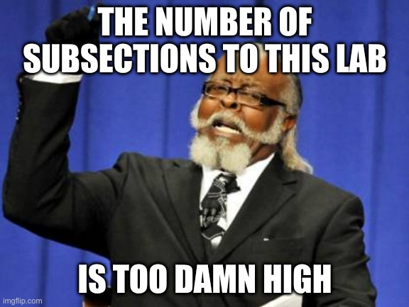

<br>
<hr>
<br>

# Overview

## Goals

In this lab tutorial, we will focus on honing our data analysis skills using the `tidyverse` libraries. These software libraries include:

- `dplyr` - a *very* important package for handling most data manipulation tasks
- `ggplot2` - functions to create data visualizations with the "grammar of graphics"
- `tibble` - a special data frame object with some nice features to improve usability
- `tidyr` - functions to change the structure of data to redefine what a row means
- `readr` - functions to load different filetypes of structured data and to parse the values into R classes
- `stringr` - functions to work with character class, or string, values in a data frame (e.g., look for patterns)
- `forcats` - functions to work with factor class values (where integer values correspond to a set of character values)

A particular goal will be to understand how the six most common verbs of `dplyr` give us a framework for wrangling data into the format we want for running statistical analyses. After this primer on data manipulation, we will also learn some `ggplot2` and `sf` code for creating plots and maps with the data we've prepared.

## Data

The data for this lab are a set of apartment listings in the Ithaca, NY area that we scraped from the internet. Rental listings indicate a housing vacancy somewhere in the real world, so these are intrinsically *spatial data* that contain information about the unit itself, as well as information about its location in physical space. Since we are working with spatial data, the final part of this lab will introduce tools that R has for acting as a *Geographic Information System* (GIS).

<br>
<hr>
<br>

# Preamble: Load the packages and data for our analysis

```{r, warning = FALSE, message = FALSE}
library(tidyverse) #we will use dplyr, readr and other libraries from this metalibrary
library(sf)        #this is what will make R into a Geographic Information System (GIS)
library(lubridate) #this will give us functions to work with dates more easily
library(leaflet)   #this will allow us to easily make interactive maps with base maps

#if needed, install libraries with install.packages()
#e.g.: install.packages("sf")
```

For this problem set, we will use a set of data that are stored in an .RData file. This is somewhat different from a flat file, or spreadsheet of data, which may be stored as comma separated values (CSV). RData files allow us to save data that are not easily structured as conventional spreadsheets and can also be used to store all objects in your environment if you want to create checkpoints in your analysis.

In this case, the file we are loading contains a data frame of listings that includes a "simple features" geometry column that denotes where each listing is located in physical space.

```{r}
load("./input/ithaca_rentals.RData")
```

Now let's see what our environment has in it after loading the RData file

```{r}
ls()
```

We now have an object `scraped` in memory. Let's see what *class* the object is by passing the object to the `class()` function

```{r}
class(scraped)
```

This output shows that the object we loaded is a "sf", or simple feature, class. The output shows "data.frame" too, because "sf" objects are a special form of a data frame that is *spatially aware*. 

We can use the glimpse function on `scraped` to take a peek at what this object contains

```{r}
glimpse(scraped)
```

This output shows the total number of rows in `scraped`, the name of each column in `scraped` along with the column *type* and the first few values. 

The final column named `geometry` is what makes this object spatial in nature---each row actually contains two values, one for the projected longitude coordinate and one for the projected latitude coordinate.

<br>
<hr>
<br>


# Part A: Using `dplyr` verbs to explore the listing data

Now that the data are loaded, let's try using the `dplyr` library to explore and analyze the listings. There are six key functions, or verbs, to this library that give us a vocabulary for analyzing our data. They are:

1. `filter()` - look at specified rows of data based on an expression
2. `select()` - look at specified columns of data based on name, type or a pattern
3. `mutate()` - create a new column based on another or modfiy an existing column 
4. `summarize()` - create a new data frame based on *aggregating* variables with other functions like sum()
5. `group_by()` - group the table by one or more variables, usually before creating new variables or a new data frame
6. `arrange()` - sort the data by a column or columns of interest

Throughout this section we will review how to accomplish common data wrangling tasks in `dplyr` and provide comparison base R code to demonstrate the advantages that using these verbs can provide. We will conclude by discussing less common `dplyr` verbs and by linking to important resources for mastering this library.

Side note: It is important to keep in mind that there are usually many ways to "skin the cat" when programming. `dplyr` provides one toolkit for doing data analysis that emphasizes consistency and interpretability. This enables users to accomplish the most essential data wrangling tasks in a way that others can easily read and understand. 

## `filter()`

One of the most essential things we can do when analyzing data, spatial or non-spatial, is to look at subsets of rows in the overall table.

The dplyr verb, or function, `filter()` takes a data frame as its first argument, followed by one or more expressions that define which rows to return. At its most basic level, `filter()` returns rows where the given expression evaluated to be `TRUE`.

### Equals / does not equal

Let's try filtering to listings that are for 2 bedroom units based on their `scraped_beds` value.

```{r, results='hide'}
filter(scraped, scraped_beds == "2BR")
```

Since `scraped_beds` is currently a *character* type column, the two most basic expressions would be to filter based on rows being equal (`==`) to some value (e.g. "2BR"), or being not equal to some value (`!=`). Character values need to be quoted. If we do not quote values (e.g., "1BA"), R thinks we are trying to refer to a variable/column in our data frame rather than a specific value. 
*Remember:* R reserves single `=` for assignment of objects, and `==` for evaluating expressions based on equality.

We can look at the expression outside of the `filter()` call to see how this filtering based on `TRUE` values works. Note we need to point R to the data frame of interest since we are not using `filter()` where we name the data frame of interest first. 

```{r, R.options = list(max.print=10)}
scraped$scraped_beds == "2BR"
```

### Greater/less than

For a numeric or date column (like `listing_date`), we can also use greater than (`>`) or less than (`<`) operators to create a filtering expression. This can also be modified to be greater/less than or equal to by adding an equals sign (`>=`, `<=`). We will test this by filtering to listings posted on or after to March 1st. Note the year-month-day format used for R dates.

```{r, results='hide'}
filter(scraped, listing_date >= "2020-03-01")
```

### Multiple expressions

If we have a set of values we want to filter with, we can either create a conjunction using the AND (`&`) or OR (`|`) operators. Here we will filter to 2BR listings posted on or after March 1, combining the two previous expressions into one.

```{r, results='hide'}
filter(scraped, listing_date >= "2020-03-01" & scraped_beds == "2BR")
```

For instances where we want to filter by multiple conditions combined by `&` operators, we can also create multiple filter arguments like the following:

```{r, results='hide'}
filter(scraped, listing_date >= "2020-03-01", scraped_beds == "2BR")
```

### Creating a new object based on a subset

And if we want to save some subset of rows as a new data frame, we use an assignment operator (either `=` or `<-`) in combination with our `filter()` function call.

```{r, results='hide'}
#first we assign our filter output to a new object called march_listings
march_listings <- filter(scraped, listing_date >= "2020-03-01", listing_date < "2020-04-01")

#now we look at the result
glimpse(march_listings)

#check the unique date values now in march_listings
unique(march_listings$listing_date)
```

### Beyond the basics

#### Using a set of values

There are many other ways to create filtering expressions. The `%in%` operator allows you to provide a set of values with `c()` function to then create filters that would otherwise require many OR (`|`) operators. 

```{r, results='hide'}
filter(march_listings, scraped_beds %in% c("1BR", "2BR", "3BR"))
#equivalent to filter(march_listings, scraped_beds == "1BR" | scraped_beds == "2BR" | scraped_beds == "3BR")
```

#### Using string matching

For character type columns like `scraped_neighborhoods`, we can also use string functions like `str_detect()` that allows us to match a pattern. Here we will return listings that mentioned "Collegetown" in the `scraped_neighborhoods` field.

```{r, results='hide'}
filter(scraped, str_detect(scraped_neighborhoods, pattern = "Collegetown"))
```

#### Removing rows with missing values in a column

If we want to filter out rows without complete data, we can use the `is.na()` function to create this expression for `filter()`. If we run `is.na()` on a given column, we get `TRUE` or `FALSE` values (i.e. a logical vector) for whether the row's value was an `NA` or not. 

```{r, R.options = list(max.print=100)}
is.na(scraped$scraped_rent)
```

We can use `table()` on this type of function call to compute a quick tabulation of how many rows have an `NA`.

```{r, results='hide'}
table(is.na(scraped$scraped_rent))
```

We can then `filter()` `NA`s out of the data frame by testing rows for if they are not `NA` with `!is.na()`

```{r, results='hide'}
filter(scraped, !is.na(scraped_rent))
```

<br>

## `select()`

The `select()` function allows us to pick subsets of *columns* in our data frame. This is useful if we have many columns and want to remove some, whether due to them being no longer needed or to prepare a table for printing or sharing. `select()`, like `filter()` takes a data frame as its first argument, and then allows users to name columns they want to keep as second, third, etc. columns.

### Basic column selection

If we use select without an assignment operator (e.g., `=`, `<-`), we print this subset of columns to the console. This is like using `filter()` to print subsets of rows to console as we did in the prior section. Note how we drop the columns that are not named.

```{r}
#select listing_date and listing_title columns from scraped
date_title <- select(scraped, listing_date, listing_title)

glimpse(date_title)
```

When we use `select()`, we create a new data frame (or in this case _simple feature_ data frame) using the columns that we named in the function call. This is important to remember, because this means we are going to have the same class object upon assigning the results to a new object. Note how since we have an sf object with a `geometry` column, `dplyr` automatically adds this in so the data stay spatial unless we explicitly use a function to drop it.

```{r, results='hide'}
#select listing_date and listing_title columns from scraped, save to object new_df
new_df <- select(scraped, listing_date, listing_title)

glimpse(new_df)
```

### Using `select()` to reorder a data frame

Sometimes it is useful to reorder the columns in a data frame if we want to produce a table for printing or if some values like row IDs might make sense to have first in the table. We can use the `everything()` function within `select()` to ensure that we don't inadvertently drop columns but just reorder them.

```{r}
reordered_df <- select(scraped, listing_title, everything())

glimpse(reordered_df)
```

### Selecting based on name patterns

The `scraped` data frame has many columns that follow a naming convention where `scraped` as a prefix denotes a column scraped directly from the online listing with no data processing. Other times we might have suffixes for columns that denote the year of measurement for a dataset where rows capture unique people or households (or some other unit) that were measured on multiple occasions over time. We can use `starts_with()` and `ends_with()` to quickly grab column subsets based on pattern matching.

```{r}
scraped_cols <- select(scraped, starts_with("scraped"))

glimpse(scraped_cols)

#Suppose we had a dataset where a household's information was measured each year from 2000-2010 with columns marking the year of measurement with a year suffix. If we wanted columns with information for 2004, we would use the following pseudo code.

#select(hypothetical_df, ends_with("2004"))
```

### Selecting based on column type

There are instances where we might want to select based on a condition, like all columns that are character type. We can use the special `where()` function within select to grab such columns.

```{r}
char_cols <- select(scraped, where(is_character))

glimpse(char_cols)
```

### Select a range of adjacent columns

We can also select a range of columns that are adjacent to each other by using the `:` operator to denote a sequence of columns. We could select all columns from `listing_date` to `scraped_sqft` using the following:

```{r}
col_range <- select(scraped, listing_date:scraped_sqft)

glimpse(col_range)
```

### `pull()` vs `select()`

If we want to grab a column of a data frame and return the value as a vector (like using `$` in `df$var`), we use the `pull()` verb. This is like `select()` but is limited to a single column and returns a vector. 

```{r, R.options = list(max.print=100)}
pull(scraped, listing_date)
```

<br>

## `mutate()`

Now that we have the tools to trim data to particular rows and columns using `filter()` and `select()`, we can focus on how we might create new columns or new data frames (respectively) using the `mutate()` and `summarize()` functions. 

### Making a new column

Let's say we want to mutate a column that flags whether a listing is a 1 bedroom unit or not. We pass scraped as our first argument, and then set our second argument to be an expression that assigns values to a column with a new name not already present in our data frame. We use the `mutate()` and say that our new variable `is_1br` equals whether or not `scraped_beds == "1BR"`

```{r}
#basic idea: mutate(our_df, new_var = some expression or function that returns one value for each row)

#we need to use mutate with assignment to ensure our new column is saved
#here we add a new column to existing data frame scraped, 
#but we can also create entirely new data frames
scraped <- mutate(scraped, is_1br = scraped_beds == "1BR")

glimpse(scraped)

summary(scraped$is_1br)
```

We can see from `summary(scraped$is_1br)` that this preserves `NA` values from `scraped_beds`. If there was no valid value for `scraped_beds` it does not take on a value in `is_1br`. This new column is of type logical, since it can only take on `TRUE` or `FALSE` values.

### Using another function within mutate()

This kind of logical column for conditions can be useful, but many times we want to create a new column based on manipulating values of an existing one. Here we will use other functions within `mutate()` to make this happen.

Right now, our data frame has many character columns where numeric columns might be more advantageous. Examples include `scraped_beds`, `scraped_baths`, `scraped_rent` and `scraped_sqft` since they all could be simplified to a numeric value that could be used for arithmetic or statistical computations. 

Let's use the `parse_number()` function from the `readr` library to create a new column that captures what number was present in the `scraped_beds` field.

```{r}
scraped <- mutate(scraped, clean_beds = parse_number(scraped_beds))

glimpse(scraped)
```

R returns a warning because some of these scraped values did not contain a number in them. These rows accordingly have a `NA` for `clean_beds`. We can check our work by first filtering to the rows with `NA` values in `clean_beds` and then selecting the scraped and clean columns for inspection.

```{r}
beds_na <- filter(scraped, is.na(clean_beds))

select(beds_na, scraped_beds, clean_beds)
```


### Overwriting an existing column

In looking at a summary of this new variable `clean_beds`, we can see that at least one user mistakenly put the rent value in the bedroom field. This shows how online data can be messy because they are user volunteered information.

We can use the `ifelse()` function to deal with implausible values and set them to `NA`. Let's say that 6 bedrooms (a very large house) is the ceiling we want to set for our new variable. The `ifelse()` function allows us to vary what we do in a mutate function based on some expression that we set. The syntax is `ifelse(condition, if_true, else)`.

```{r}
scraped <- mutate(scraped, clean_beds = ifelse(clean_beds > 6, NA, clean_beds))

summary(scraped$clean_beds)
```

### Mutating multiple columns at once

If we want to do a set of column mutates in one fell swoop, we pass additional arguments to `mutate()` like in the following code where each argument has its own line:

```{r}

#first parse character to numeric
scraped <- mutate(scraped,clean_rent = parse_number(scraped_rent),
                  clean_sqft = parse_number(scraped_sqft),
                  clean_baths = parse_number(scraped_baths))

glimpse(scraped)
```

We would want to now set ceiling and floor values for these columns to adjudicate issues with what users inputs or what our scrapers identified for the column value.

```{r}

#first parse character to numeric
scraped <- mutate(scraped, 
                  clean_rent = ifelse(clean_rent < 100, NA, clean_rent),
                  clean_rent = ifelse(clean_rent > 5000, NA, clean_rent),
                  clean_sqft = ifelse(clean_sqft < 50, NA, clean_sqft),
                  clean_sqft = ifelse(clean_sqft > 10000, NA, clean_sqft),
                  clean_baths = ifelse(clean_baths > 10, NA, clean_baths))

glimpse(scraped)
```

### Making a categorical variable (i.e. factor type)

Factor type variables can be useful if we want to establish an ordered variable where values are labelled but arithmetic is not appropriate. An example we will use here is a categorical measure of bedroom sizes for apartments where we truncate the top value to be "4+" and capture all listings for units with 4 bedrooms or more with this factor level.

`dplyr` has a function called `case_when()` that allows us to specify such a variable with appropriate expressions

```{r}
scraped <- mutate(scraped,
                  cat_beds = case_when(
                    clean_beds == 0 ~ "0",
                    clean_beds == 1 ~ "1",
                    clean_beds == 2 ~ "2",
                    clean_beds == 3 ~ "3",
                    clean_beds >= 4 ~ "4+"
                  ))

#tabulate counts for this variable, be sure to print NAs with argument useNA = "always"
table(scraped$cat_beds, useNA = "always")
```

If we want to `filter()` or create expressions with this new categorical variable, we need to remember that values must be quoted. 

<br>

## `summarize()`

If we have a set of data that we want to get *overall* statistics on, like counts or averages, we can use the `summarize()` verb that `dplyr` provides. Let's try counting the number of 2 bedroom units in our data. We will use summarize by itself at first, but this verb becomes much more powerful after we combine it with the `group_by()` verb in order to create groupwise summaries (e.g., average rent for 0B, 1B, 2B, etc by grouping by `clean_beds`).

The most important thing to remember is that `mutate()` expects us to provide it with functions that will produce as many values as there are rows in the data. In contrast, `summarize()` expects us to provide it with a function that will evaluate to a single value.

### Tallying counts

Here we call `summarize()` with our data frame as the first argument, then we set up an equation that assigns values to a new variable `total_2b` using the `sum()` of an expression for whether the `clean_beds` column equaled 2. This syntax is similar to `mutate()`, but the exception is that we compute a value that describes the _entire_ data set, as opposed to a values for each row. `mutate()` creates new columns within an existing data frame, whereas `summarize()` creates new columns in a new data frame.

```{r}
summarize(scraped, total_2b = sum(clean_beds == 2))
```

When we run this code, we should immediately notice that the new column of interest `total_2b` has `NA` for its value. This is because when we tried to compute the sum of rows where `clean_beds` equaled 2, `sum()` encountered `NA` values that it doesn't know what to do with.

We can resolve this in a couple different ways. We can either `filter()` out NA values permanently using an expression that says "keep rows if they are not NA for some column"

```{r}
new_df <- filter(scraped, !is.na(clean_beds))
```

Or, we can resolve this by telling `sum()` to simply ignore/remove `NA` values during the computation:

```{r}
summarize(scraped, total_2b = sum(clean_beds == 2, na.rm = TRUE))
```

### Computing averages

`summarize()` is like `mutate()` in the sense that it is a broad framework for manipulating data into a new structure using other functions. We can do very simple computations like a `mean()`, but should we have functions for computing advanced statistics, inequality indices or other values, we could use them within `summarize()` too.

```{r}
summarize(scraped, mean_rent = mean(clean_rent, na.rm = TRUE))
```

### Other summary functions

Common summary statistic functions include `median()`, `min`, `max()`, `length(unique())`, `sd()`. Each of these can be used within the context of `summarize()` since they will compute these statistics over all rows in the data frame and return a single value.

Like `mutate()`, we can compute multiple summary columns in a single `summarize()` function call.

```{r}
summarize(scraped, 
          med_rent = median(clean_rent, na.rm = TRUE),
          min_rent = min(clean_rent, na.rm = TRUE),
          max_rent = max(clean_rent, na.rm = TRUE),
          unique_rent = length(unique(clean_rent, na.rm = TRUE)),
          sd_rent = sd(clean_rent, na.rm = TRUE))
```

<br>

## "Piping" `dplyr` functions with the magrittr `%>%` operator

Now that we know some of the most essential `dplyr` functions, let's take a minute to learn how we can "pipe" multiple functions together into a set of data manipulation tasks. This is useful if, for example, we want to first do some filtering, then make a column or two, and then summarize overall information about the data set.

The `magrittr` library that is part of the `tidyverse` adds the `%>%` operator to R for piping functions. The basic idea is that `%>%` passes the results of the prior function call to the next one as the first argument. The end result is identical.

```{r}
#instead of:
no_pipe <- filter(scraped, clean_beds == 2)

#we can use the pipe operator %>% to pass scraped to filter()
w_pipe <- scraped %>% filter(clean_beds == 2)

identical(no_pipe, w_pipe)
```

This may not seem advantageous at first, but the power of this syntax change comes through chaining multiple operations together. In the following example we will filter to 2 bedroom listings and then summarize this filtered set's median rent asked. We save this result to new object `med_2b` and then print it to console.

```{r}
med_2b <- scraped %>% filter(clean_beds == 2, !is.na(clean_rent)) %>% summarize(med_rent = median(clean_rent))

med_2b
```

If we omit assignment with `<-` or `=`, the result of our pipe is printed to console rather than saved to an object (whether new or through overwriting an existing one).

### Emphasizing legibility by writing code vertically

The `%>%` pipe operator is therefore powerful for handling complex data manipulations in a manner that just requires us to think about what `dplyr` verbs are needed for each step. This makes `dplyr` an efficient way to think about and write code for analyses.

However, the second real advantage that comes with using `dplyr` and `%>%` together comes from switching from writing code horizontally to writing code vertically. In the prior example, you can see how using 3 or more functions quickly starts to use up our screen real estate. We solve this problem by writing vertically, and we also make it clear that each set of steps builds on the prior function's output. Altogether, this helps to make `dplyr` code easy to read and understand as a set of tasks that are chained together with the `%>%` pipe.

Look at the following example where we do the extend the task as before but with writing vertically instead:

```{r}
rent_2b <- scraped %>% 
  filter(cat_beds == "2", !is.na(clean_rent)) %>% 
  summarize(med_rent = median(clean_rent),
            mean_rent = mean(clean_rent),
            sd_rent = sd(clean_rent))

rent_2b
```

### Best practices for pipes

There is no hard and fast rule for how much is too much piping, but a good practice is to write pipes that accomplish a coherent set of tasks. We want to avoid writing _everything_ in a script as a pipe, because sometimes it is important to save intermediary objects as a way of building from point A to point B. If everything is all one pipe and it fails, it can become hard to debug the code to find out at what point our pipe is breaking.

<br>

## `group_by()`

A common task in data wrangling involves computing _groupwise_ statistics. An example would be to compute the average square footage of units based on their bedroom size, or the average income of persons based on demographic characteristics (e.g., age, sex, gender, race, ethnicity).

We can use the `group_by()` function in combination with our other `dplyr` verbs and the pipe operator `%>%` to accomplish a lot in just a few lines of code.

### Groupwise summaries

One use of `group_by()` is in tandem with `summarize()`, where we produce a new data frame based on summary statistics of each level of the grouping variable. This means if we have 5 groups, the new data frame will have 5 rows with columns indicating the values computed for each group.

```{r}
scraped %>% #take our listing data
  filter(!is.na(cat_beds)) %>% #remove rows with missing values
  group_by(cat_beds) %>% #group the data by bedroom size
  summarize(n = n()) #compute number of listings for each bedroom size
```

The `n()` function is a useful for tool for counting the number of observations in each level of our grouping variable. We can use `tally()` is a shortcut to `summarize(n = n())`.

We can also compute statistics like medians or averages using `summarize()`:

```{r}
scraped %>% #take our listing data
  filter(!is.na(clean_rent), !is.na(cat_beds)) %>% #remove rows with missing values
  group_by(cat_beds) %>% #group the data by bedroom size
  summarize(med_rent = median(clean_rent)) #compute median rents
```

### Groupwise mutates

Another grouped operation would be to compute a new column in the original input data frame that is based on group values. Here we compute the difference between each row's rent asked and the average rent asked for a given bedroom size. This could be used to understand which listings are relatively more or less expensive than others advertised during the timespan of our data.

```{r}
scraped %>% #take our listing data
  filter(!is.na(clean_rent), !is.na(cat_beds)) %>% #remove rows with missing values
  group_by(cat_beds) %>% #group the data by bedroom size
  mutate(rent_diff = clean_rent - mean(clean_rent)) #compute difference of listing's rent and the average rent for apartments of its bedroom size
```

### Multiple grouping variables

We can use multiple grouping variables too. In this example:

  - First we use a function to first grab the month that a listing was in, save this as a new column
  - Then we group by bedroom size and listing month
  - Finally, we'll compute the typical (i.e. median) rent observed in each month for each bedroom size.
  
```{r}
med_by_month <- scraped %>% #start with scraped, save result of pipe as med_by_month
  filter(!is.na(clean_rent)) %>% #filter out NAs
  mutate(listing_month = month(listing_date)) %>% #make new column that indicates month listed
  group_by(clean_beds, listing_month) %>% #group the data by bedroom size AND listing month
  summarize(median_rent = median(clean_rent)) #compute monthly median for each bed size
```

This example shows how we can use multiple grouping variables to create more complex summary tables. We might group by a number of demographic variables when working with person-level data, or use a time index like in this case when working with household panel data (where a given household is surveyed on multiple occasions over some timespan).

<br>

## `arrange()`

`arrange()` is the `dplyr` verb that we have not discussed yet allows us to sort the data frame by some variable. This is an important task in some instances where row order matters for a computation, OR where ordering the data by some values helps make the table more legible (e.g., sorting the values about U.S. cities by alphabetically by name or by descending population size).

### Ascending

The simplest use of `arrange()` is to just pass it a single variable. In the following we *finally* get around to reordering `scraped` by listing_date (oldest -> newest). By assigning the result of the pipe to the name of the starting object, we overwrite `scraped` with this newly sorted version of the same data.

```{r}
scraped <- scraped %>%
  arrange(listing_date)
```

### Descending

We can use `desc()` for the variable we sort by to achieve a sorted table based on descending values (in this case, newest -> oldest)

```{r}
scraped <- scraped %>%
  arrange(desc(listing_date))
```

<br>

## Bringing it all together

This overview has equipped you with a robust set of tools for doing data analyses of your own. While we have just covered the basics here, we can use the `dplyr` verbs by themselves or with other software libraries to tackle whatever analytic tasks we may encounter. 

<br>
<hr>
<br>

# Part B: Learning the basics of `ggplot2` for data visualization

The second focus of this lab is to introduce the "grammar of graphics" that `ggplot2` uses. 

`ggplot2` is a programming interface for high-quality data visualizations based on the idea that the _data_ should be what you think about the most when creating a visualization. Many alternative approaches to data visualization require learning a specific syntax for each type of visualization you might want to produce.

Basic plots include:

- histogram - demonstrate distribution of a single variable
- scatterplot - show relationship between two variables
- bar chart - illustrate differences by group in one or more variables
- line chart - describe differences within group over time or according to another variable
  
These are essential types of data visualization and `ggplot2` can be used to quickly assemble beautiful versions of these graphics. The true value of `ggplot2`, however, is that it brings these visualizations, along with really any other visualization you can dream up into a coherent framework. Instead of learning a new function with new syntax for each type of graphic you want to make, `ggplot2` makes all of graphics expressible through a single "grammar".

## A quick example

### Preparing data for plotting

Let's dive into an example to demonstrate how `ggplot2` works. We will first prepare a data frame to use for plotting using `dplyr` functions:

```{r}
#first, let's create a data frame for plotting
scraped_no_geo <- scraped %>%
  
  #we will drop rows with missing data on columns of interest and limit the bedroom sizes
  filter(!is.na(clean_sqft), !is.na(clean_rent), !is.na(cat_beds)) %>%
  filter(cat_beds %in% c("1", "2", "3")) %>%
  
  #we will make a month column
  mutate(listing_month = month(listing_date)) %>%
  
  #now limit to march through may
  filter(listing_month %in% c(3, 4, 5)) %>%
  
  #we will also drop the geometry column in this because we are not making spatial plots
  st_drop_geometry() %>%
  
  #finally we'll make sure our data aren't grouped from the prior dplyr examples
  ungroup()
```

### Making our plot

We are interested in the relationship between the square footage of a rental unit and the rent that the landlord is asking. We might expect there to be a _positive association_ where larger rental units tend to command higher asking rents. 

Starting from the left of the first line: we will call `ggplot()` and make our first argument a data frame. This tells ggplot that we want this data frame to be the focus of our plot.

Then we get to `aes()`. This defines the _aesthetics_ of our plot. The aesthetics of our plot define how variables map onto plot dimensions. These dimensions can by `x` and `y`, like on a Cartesian coordinate system, but also things like the `color` or `size` of items that we plot with a `geom` function. Here we map `clean_sqft` to the `x` aesthetic and `clean_rent` to the `y` aesthetic in order to visualize if there is a relationship between the size of an apartment and the rent that landlords are asking for it.

Finally, we add to this `ggplot()` function a `geom_point()` function that says to plot those aesthetics using a point for each observation. We will talking later about how `ggplot2` expects data to be structured as well as what `geom`s we have available for plotting. If we don't pass `ggplot2` a geom, then R will print a blank plot (possibly with axes if we defined them). 

```{r}
#now that we have made the data frame we need, let's make a plot as our second step
ggplot(scraped_no_geo, aes(x = clean_sqft, y = clean_rent)) +
  geom_point()
```

So key takeaways so far:

- give `ggplot()` a data frame as the first argument
- define your aesthetics with the second argument `aes()`
- add a `geom` to define how the aesthetics get plotted

## Tidy data

To become a `ggplot2` master, it helps to understand the concept of _tidy data_. The basic notion is that we want each of our rows of data to be able to be defined as a coherent unit of analysis. Then, `ggplot()` will print one geom for each one row in the data frame that we pass to it.

Right now, we have _listing_ level data. When we passed it to `ggplot()` in the prior example, we produced a plot with one point per row of data.

If we wanted a bar graph of the average rent per bedroom size (e.g., 0, 1, 2, etc), then we'd need to _first_ summarize our data so that each row of this summarized data frame denotes a bedroom size level, _then_ pass this new data frame to `ggplot()`.

This logic extends to data whether they are people, neighborhoods, countries or widgets. `ggplot()` expects us to know that 1 row:1 geom. So think about what the bars, points or lines of your plot are going to be and wrangle the data accordingly.

## `aes()`-thetics

The main aesthetics of `ggplot2` include:

- `x` - horizontal axis
- `y` - vertical axis
- `color` - hue of points or lines
- `fill` - hue of inside of bars, heatmap squares, 
- `size` - plot size of points, lines, etc
- `linetype` - whether lines are solid, dashed, dotted
- `shape` - whether points are circles, squares, triangles, etc.

These can either be set manually or variably. 

If we manually set the aesthetic value, we can make it so all geoms are treated the same. See below where we make all points larger and into hollow circles. We set aesthetics manually in a `geom` function. You can see a diagram of R shapes (and their codes) [here](./etc/r-shapes.png).

```{r}
ggplot(scraped_no_geo, aes(x = clean_sqft, y = clean_rent)) +
  geom_point(size = 4, shape = 1) 
```

This stands in contrast to setting aesthetics with a variable. We use the `aes()` function to define aesthetics in this manner. In the following example we will color the points in our scatterplot with the bedroom size categorical variable we made earlier in Part A.

```{r}
ggplot(scraped_no_geo, aes(x = clean_sqft, y = clean_rent, color = cat_beds)) +
  geom_point()
```

## `geom`etry functions

Common `geom` functions include:

- `geom_point()` - plot each row of data frame as a point
- `geom_line()` - plot rows as a connected series with a line

```{r}
sum_df <- scraped_no_geo %>%
  group_by(listing_month, cat_beds) %>%
  summarize(median = median(clean_rent))

ggplot(sum_df, aes(x = listing_month, y = median, color = cat_beds)) +
  geom_line()
```

- `geom_bar()` - plot row as a bar. We specify `stat = "identity"` to tell ggplot that each bar should use our `y` aesthetic which is the median estimates we created, as opposed to the default `stat = "count"` where `ggplot()` counts the number of cases at particular `x` values. 

```{r}
sum_df <- scraped_no_geo %>%
  group_by(cat_beds) %>%
  summarize(median = median(clean_rent))

ggplot(sum_df, aes(x = cat_beds, y = median)) +
  geom_bar(stat = "identity")
```

Note how the default `stat = "count"` produces three equally sized bars since our `sum_df` has one row for each value of `x`.

```{r}
ggplot(sum_df, aes(x = cat_beds)) +
  geom_bar()
```

- `geom_histogram()` - plot distribution of a variable

```{r}
ggplot(scraped_no_geo, aes(x = clean_rent)) +
  geom_histogram()
```

- `geom_smooth()` - add a regression line using a linear or smooth fit. The message R returns about `geom_smooth() using formula 'y ~ x'` means that R is estimating a line of best fit, or regression line, where values of our `x` variable explain variation in our `y` variable. We may also refer to this as _regressing y on x_. We cover linear regression in more detail in Lab 4.

```{r}
ggplot(scraped_no_geo, aes(x = clean_sqft, y = clean_rent, color = cat_beds)) +
  geom_point() +
  geom_smooth(method = "lm")
```

Some annotation related geoms include:

- `geom_vline()` / `geom_hline()` / `geom_abline()` - add line manually, like to denote a particular value of interest (e.g., a time when some policy was implemented) or to draw attention to differences (e.g., relative risks greater than 0). The former example is something we will discuss further in Lab 4.
- `geom_text()` / `geom_label()` - add text or label for each row rather than point. This can be useful, for example, if points on a scatter plot denote particular countries or states where we can add a layer of information about what points are which cases with a simple label.

## Adding our pieces together

Here's a more polished version of our example graphic, where we add a `color` aesthetic, labels for the aesthetics and a simple theme to spruce up the final product.

```{r}
ggplot(scraped_no_geo, aes(x = clean_sqft, y = clean_rent, color = cat_beds)) +
  geom_point() +
  labs(x = "Unit size", y = "Rent asked", color = "Number of bedrooms") +
  scale_y_continuous(labels = scales::dollar) +
  scale_color_brewer(palette = "Reds") +
  theme_bw()
```

Note how in this example we added helper functions to our `ggplot()` to customize labels (`labs()`), scales (`scale_y_continuous()`, `scale_color_brewer()`) and the overall plot theme (`theme_bw()`). [The official `ggplot2` cheatsheet](https://rstudio.com/wp-content/uploads/2015/03/ggplot2-cheatsheet.pdf) covers how you can add these support functions to customize each detail of your visualization.

## Saving visualizations

We can use the `ggsave()` function to store the plot we produce as a jpeg, png or pdf file.

```{r}
ggplot(scraped_no_geo, aes(x = clean_sqft, y = clean_rent, color = cat_beds)) +
  geom_point() +
  labs(x = "Unit size", y = "Rent asked", color = "Number of bedrooms") +
  scale_y_continuous(labels = scales::dollar) +
  scale_color_brewer(palette = "Reds") +
  theme_bw() +
  ggsave(filename = "./output/ggplot_example.pdf", width = 8, height = 8)
```

<br>
<hr>
<br>

# Part C: Learning the basics of `sf` for spatial analysis

## Remember how we have spatial data?

We have been using the data for this lab for various _aspatial_ analyses where we look at the distribution of one variable, the association of two variables, or summary statistics like `median()` values of one variable across another grouping variable. 

In this final section of Lab 2, we will introduce the syntax for using the `geometry` column of our data to look at their spatial distribution. This builds on the prior section where we learned the basics of `ggplot()` and how we use different `geom` functions to map rows of our data to different types of data visualizations.

## Plotting points

The key addition for using the `geometry` column of our data that contains all the spatial information is the `geom` function `geom_sf()`. Since we have a simple features `geometry` column that makes our data frame a spatial simple features object, `ggplot()` knows that we want to make a spatial data visualization when we use `geom_sf()`. We will filter to listings from the first half of March to avoid overloading our computers with this part of the exercise.

```{r}
scraped <- scraped %>% 
  filter(listing_date >= "2020-03-01", listing_date < "2020-03-16")

#remind R what our CRS is
scraped <- st_set_crs(scraped, "EPSG:4326")

#plot the data
ggplot(scraped) +
  geom_sf()
```

When we make this plot, we see a set of points that are clustered together with some going outward from the main cluster.

## Making a quick map

The one thing that would be _really_ helpful for making this plot into a proper map is to add a basemap. Basemaps give us pointers as to where our points or polygons (e.g. a neighborhood unit) are located relative to roads or other landmarks (e.g., Cornell) that we might be familiar with. In other contexts where we might map a familiar set of spatial data like the States of the U.S. or counties in a given State, basemaps are not quite as essential.

We will use the `leaflet` library to accomplish this task. This library allows us to create interactive maps that allow zooming in and out, as well as easy incorporation of base maps. If you are reading this on GitHub, the map is a static image, but if you downloaded the repository and are running the code on your computer the map produced by the next code chunk will be interactive.

The syntax of `leaflet` is a little different from ggplot, but for our basic map is fairly straightforward. The biggest difference is that we use the pipe operator `%>%` rather than the `+` operator as in `ggplot`. We pass `leaflet()` our `sf` object of interest, then pipe that to `addTiles()` to add the base map, then pipe that to `addMarkers()` to add the points as markers on top of the base map.

```{r}
leaflet(scraped) %>%
  addTiles() %>%
  addMarkers()
```


# Summary

1. We can clean and prepare our data for analysis using the verbs of `dplyr`. These will take us remarkably far and help structure our thinking about writing code. Less looking up functions, more writing code.

2. We use `ggplot2` to make beautiful data visualization with the data that we wrangle with `dplyr`. Setting up a _tidy_ set of data allows us to pass this data frame, or summaries of it, to `ggplot2` to make all the plots that our hearts desire. Data visualization is a key part of exploratory data analysis!

3. When we have _spatial_ data, the `sf` library gives us tools to use these data within our existing `dplyr` and `ggplot2` pipeline. We are just scratching the surface of the spatial analysis we can do with simple features data frames, but the most important thing is that most of the spatial stuff goes on behind the scenes and we can focus on what questions we want to answer with our data.




