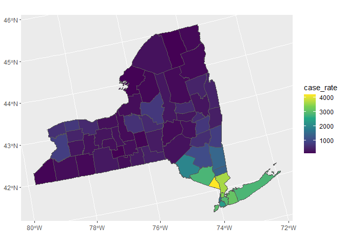
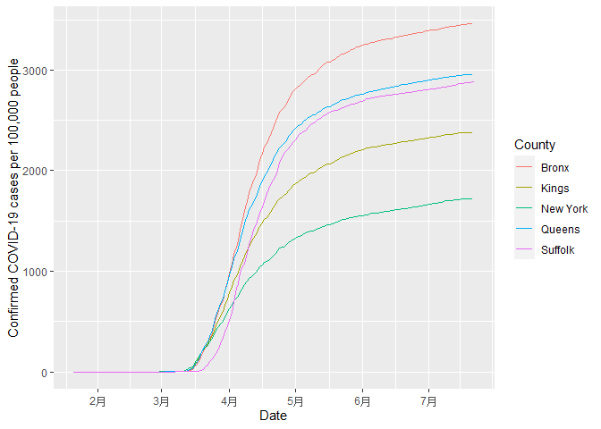
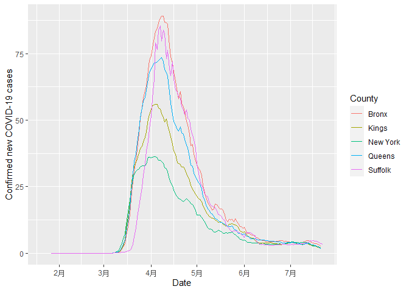
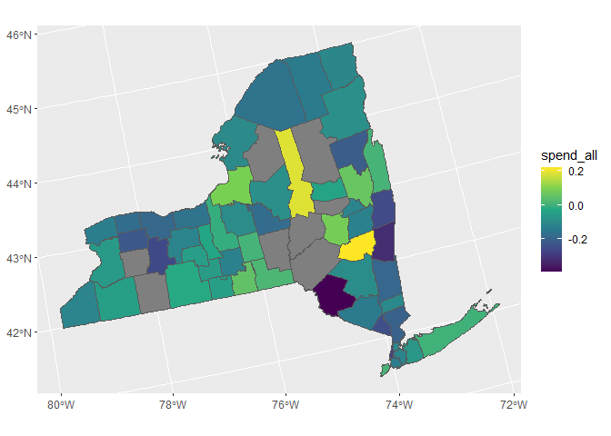
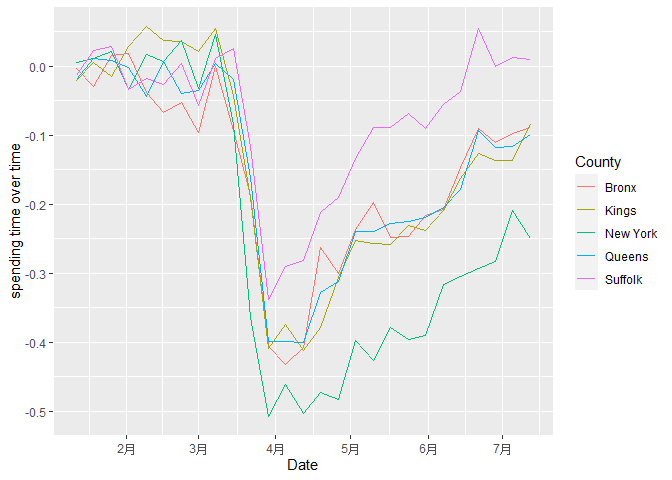

In this problem set you will open, process, and analyze the county-level
COVID-19 cases dataset. You will then open, process, and analyze the
county-level credit card spending data. Lastly, you will explore the
relationship between spending and COVID-19.

Hands-on Task 1: Prepare county-level COVID-19 cases data
=========================================================

Load the county-level COVID-19 cases data
-----------------------------------------

Go to the [Economic Tracker GitHub data
repository](https://github.com/Opportunitylab/EconomicTracker/tree/main/data)
and find the county-level COVID-19 cases dataset. Then read in the raw
.CSV file by using the URL of the page containing the data. You may need
to refer to the data dictionary to get more information about each
available dataset.

    #add your answer here
    library(tidyverse) 

    ## -- Attaching packages --------------------------------------------------- tidyverse 1.3.0 --

    ## √ ggplot2 3.3.2     √ purrr   0.3.4
    ## √ tibble  3.0.2     √ dplyr   1.0.0
    ## √ tidyr   1.1.0     √ stringr 1.4.0
    ## √ readr   1.3.1     √ forcats 0.5.0

    ## -- Conflicts ------------------------------------------------------ tidyverse_conflicts() --
    ## x dplyr::filter() masks stats::filter()
    ## x dplyr::lag()    masks stats::lag()

    library(sf)

    ## Linking to GEOS 3.8.0, GDAL 3.0.4, PROJ 6.3.1

    library(tidycensus)
    url <- "https://raw.githubusercontent.com/OpportunityInsights/EconomicTracker/main/data/COVID%20Cases%20-%20County%20-%20Daily.csv"
    covid_cases <- read.csv(url, na.strings = c('', '.', 'NA'))

Join county-level COVID-19 cases data frame with county IDs data crosswalk
--------------------------------------------------------------------------

Go to the [Economic Tracker GitHub data
repository](https://github.com/Opportunitylab/EconomicTracker/tree/main/data)
and find the county geographic ID crosswalk dataset. Then read in the
raw .CSV file by using the URL of the page containing the data. You may
need to refer to the data dictionary to get more information about each
available dataset.

Load the county ID crosswalk:

    county_id_url <- "https://raw.githubusercontent.com/Opportunitylab/EconomicTracker/main/data/GeoIDs%20-%20County.csv"
    county_id <- read.csv(county_id_url)

Join the county-level COVID-19 cases data frame with the county
geographic ID crosswalk data frame (you may need to look for the
matching ID that will allow you to link the two data frames):

    covid_cases <- left_join(covid_cases, county_id,
                             by = 'countyfips')

Create/prepare a date variable for the county-level COVID-19 cases data frame
-----------------------------------------------------------------------------

    covid_cases <- covid_cases %>%
      mutate(date = as.Date(paste(year, month, day, sep = '-'), '%Y-%m-%d'))

Create a data frame that is limited to counties in the state of New York
------------------------------------------------------------------------

    cc_NY <- covid_cases %>%
      filter(statename=='New York')

Create a map showing the rate of total COVID-19 cases by county in **New York State** on **June 29, 2020**
----------------------------------------------------------------------------------------------------------

### Obtain **county-level** geometries for New York State

Remember you can use this guide of how to use `tidycensus`:
<a href="https://walker-data.com/tidycensus/articles/basic-usage.html#working-with-acs-data-1" class="uri">https://walker-data.com/tidycensus/articles/basic-usage.html#working-with-acs-data-1</a>.
You can also refer to the lab and/or videos for instructions on how to
use it.

You must obtain an API key to request data through the `tidycensus()`
package (please refer to the lab and/or videos for details on how to do
this).

    county_num <- readRDS('county_geo_2018.rds')

### Make the county ID column in the geometries data frame compatible with the county-level COVID cases data frame

Convert the `GEOID` variable/column into numeric format. Make sure to
use the `as.numeric()` function.

    county_num <- mutate(county_num,countyfips=as.numeric(GEOID) )

### Use the COVID-19 cases data frame and create a data frame that only includes the June 29, 2020 observations in New York State

    NY_day <- filter(cc_NY,date=='2020-06-29')

### Join the June 29, 2020 county-level COVID-19 cases data frame with the county-level geography data frame

Note, that your `inner_join()` or `left_join()` must call the county
geometry data frame as the first argument and the COVID-cases data frame
as the second argument. Otherwise, the new data frame will not properly
maintain the geometries column for mapping.

    NY_day <- left_join(county_num, NY_day,
                             by = 'countyfips')

### Create a map of the total COVID-19 case rate by county in New York State on June 29, 2020

    NY_day %>%
      ggplot() + 
      geom_sf(aes(fill = case_rate )) + 
      coord_sf(crs = 5070)+
      scale_fill_viridis_c()

### Describe the map you just made and any interesting facts you can learn from it

Please write at least three sentences. Write your response here At June
29, 2020, the cases are concentrated in the south of New York state,
where the maximum case rate is about 4000.In most part of the state, the
case rate is lower than 1000. The virus has been controlled effectively.

Identify the 5 largest counties in New York State based on 2019 population
--------------------------------------------------------------------------

    NY_pop_rank <- cc_NY %>%
      group_by(countyname) %>%
      summarize(county_pop2019 = max(county_pop2019)) %>%
      arrange(desc(county_pop2019))

    ## `summarise()` ungrouping output (override with `.groups` argument)

    head(NY_pop_rank)

    ## Warning: `...` is not empty.
    ## 
    ## We detected these problematic arguments:
    ## * `needs_dots`
    ## 
    ## These dots only exist to allow future extensions and should be empty.
    ## Did you misspecify an argument?

    ## # A tibble: 6 x 2
    ##   countyname county_pop2019
    ##   <chr>               <int>
    ## 1 Kings             2559903
    ## 2 Queens            2253858
    ## 3 New York          1628706
    ## 4 Suffolk           1476601
    ## 5 Bronx             1418207
    ## 6 Nassau            1356924

Plot time series of COVID-19 case rate over time for the 5 largest counties in New York State
---------------------------------------------------------------------------------------------

For the rest of this assignment focus on the COVID cases data set
**across all of 2020** (NOT JUST June 29, 2020)

    cc_NY %>%
      filter(countyname %in% c('Kings', 'Queens', 'New York', 'Suffolk', 'Bronx')) %>%
      ggplot(aes(x = date, y = case_rate, color = countyname)) +
      geom_line() +
      labs(x = "Date", y = 'Confirmed COVID-19 cases per 100,000 people', color = "County") +
      scale_y_continuous(labels = function(y) format(y, scientific=FALSE))

    ## Warning: Removed 160 row(s) containing missing values (geom_path).

### Describe the plot you just made and any interesting facts you can learn from it

Please write at least two sentences.

Write your response here The virus started to spread later in Suffolk
than spreading in other counties. New York county takes the best measure
and Bronx the worst to control the spread as the New York has the least
case rate and Bronx the most in the end.

Plot time series of COVID-19 **NEW** case rate over time for the 5 largest counties in New York State
-----------------------------------------------------------------------------------------------------

For the rest of this assignment focus on the COVID cases data set across
all time (NOT JUST June 29, 2020)

    cc_NY %>%
      filter(countyname %in% c('Kings', 'Queens', 'New York', 'Suffolk', 'Bronx')) %>%
      ggplot(aes(x = date, y = new_case_rate, color = countyname)) +
      geom_line() +
      labs(x = "Date", y = 'Confirmed new COVID-19 cases', color = "County") +
      scale_y_continuous(labels = function(y) format(y, scientific=FALSE))

    ## Warning: Removed 194 row(s) containing missing values (geom_path).

### Describe the plot you just made and any interesting facts you can learn from it

Please write at least three sentences.

Write your response here The Suffolk actually has the second largest new
case rate, which shows it didn’t take a good measure to control the
spread. The turning point of new case rate in all the counties is at the
start of April. New York county takes the best measure as the increase
rate of new case rate starts to decrease sharply as early as the middle
of March, which is the earliest among all counties.

Hands-on Task 2: Prepare daily county-level spending data
=========================================================

Here you will work with county-level spending data from Affinity
Solutions. You can read more about these data at the [Opportunity Lab
Economic Tracker GitHub
repository](https://github.com/Opportunitylab/EconomicTracker).

Load the spending data
----------------------

Go to the [Economic Tracker GitHub data
repository](https://github.com/Opportunitylab/EconomicTracker/tree/main/data)
and find county-level Affinity spending dataset. Then read in the raw
.CSV file by using the URL of the page containing the data. You may need
to refer to the data dictionary to get more information about each
available dataset.

    #add your answer here
    county_AS_url <- "https://raw.githubusercontent.com/OpportunityInsights/EconomicTracker/main/data/Affinity%20-%20County%20-%20Weekly.csv"

    county_AS <- read.csv(county_AS_url, na.strings = c('', '.', 'NA'))

    #The introduction video for Lab 3 shows how to find the URL for a raw dataset and how to load it into R

Join spending data with county IDs data crosswalk
-------------------------------------------------

Join the county ID crosswalk data frame onto the spending data frame.
You already obtained this data frame in Hands-on Task 1 (again, you may
need to look at the two data frames to find the county ID required for
joining):

    county_AS <- left_join(county_AS, county_id,
                             by = 'countyfips')

Create/prepare a date variable for the county-level spending data frame
-----------------------------------------------------------------------

    county_AS <- county_AS %>%
      mutate(date = as.Date(paste(year, month, day_endofweek, sep = '-'), '%Y-%m-%d'))

Create a spending data frame that is limited to counties in the state of New York
---------------------------------------------------------------------------------

    AS_NY <- county_AS %>%
      filter(statename=='New York')

Create a map showing all spending relative to January by county in New York State on June 29, 2020 (use the variable for *all merchant category codes*)
-------------------------------------------------------------------------------------------------------------------------------------------------------

Carefully read the definition of the variables in the spending dataset

### Create a spending data frame with only the June 29, 2020 observations in New York State

    AS_day <- filter(AS_NY,date=='2020-06-28')

### Join the June 29, 2020 county-level spending data frame with the county-level geography data frame that was created in Hands-on Task 1

Note, that your `inner_join()` or `left_join()` must call the county
geometry data frame as the first argument and the spending data frame as
the second argument. Otherwise, the new data frame will not properly
maintain the geometries column for mapping.

    AS_day <- left_join(county_num, AS_day,
                             by = 'countyfips')

### Create a map of spending changes by county in New York State on June 29, 2020

Note: some counties will not have spending data

    AS_day %>%
      ggplot() + 
      geom_sf(aes(fill = spend_all )) + 
      coord_sf(crs = 5070)+
      scale_fill_viridis_c()

### Describe the map you just made and any interesting facts you can learn from it

Please write at least two sentences. Write your answer here The middle
of the state has the largest increase in spending, which is about 0.2.
Some county in the south of the state has the largest decrease in
spending, which is about -0.2.

Plot time series of ALL spending changes over time (relative to January) for the 5 largest counties in New York State
---------------------------------------------------------------------------------------------------------------------

    AS_NY %>%
      filter(countyname %in% c('Kings', 'Queens', 'New York', 'Suffolk', 'Bronx')) %>%
      ggplot(aes(x = date, y = spend_all, color = countyname)) +
      geom_line() +
      labs(x = "Date", y = 'spending time over time', color = "County") +
      scale_y_continuous(labels = function(y) format(y, scientific=FALSE))

### Describe the plot you just made and any interesting facts you can learn from it

Please write at least two sentences. Write your answer here The spending
in all of the counties has a sharp decline in the middle of March. The
spending started to rise from April. The New York county has the largest
decline and the Suffolk the least. The spending in Suffolk has turn back
to the original level.

Hands-on Task 3: Correlation
============================

Join the county-level COVID-cases data frame with the spending data frame
-------------------------------------------------------------------------

You will need to join these data frames based on county ID and date.

    spend_COVID <- left_join(covid_cases, county_AS,
                             by = c('countyfips','date'))

Estimate the correlation between the NEW case rates and spending changes
------------------------------------------------------------------------

    cor.test(spend_COVID$new_case_rate,spend_COVID$spend_all,method = 'pearson')

    ## 
    ##  Pearson's product-moment correlation
    ## 
    ## data:  spend_COVID$new_case_rate and spend_COVID$spend_all
    ## t = -15.829, df = 42549, p-value < 2.2e-16
    ## alternative hypothesis: true correlation is not equal to 0
    ## 95 percent confidence interval:
    ##  -0.08595354 -0.06706164
    ## sample estimates:
    ##         cor 
    ## -0.07651446

Negative weak relation

### Interpret the correlation you just estimated (please use simple words to describe the relationship)

Please write at least two sentences. Write your answer here Strong
possibility of relation. Weak negative relation.

### Does this correlation estimate tell the same overall story that the time series plots of new case rates and spending changes tell you? Why?

Please write at least four sentences. Write your answer here. Yes. In
the time series plots, the decrease of the spending and the increase of
case rate both happened in the middle of March. Later, when the case
rate started to decrease, the spending also increase. This shows there
is a negative relation between spending and case. The change in case
rate is recorded in thousand, while the change in spending is measured
in tenths unit. Therefore, the relation is weak negative relation.

Estimate the correlation between NEW confirmed case COUNTS and spending changes
-------------------------------------------------------------------------------

First, you need to use and repurpose the formula we developed in Lab 3
to estimate case counts from the case rate and the 2019 population size.

    spend_COVID <- spend_COVID %>%
      mutate(case_count = (new_case_rate * county_pop2019.x)/100000)
    cor.test(spend_COVID$case_count,spend_COVID$spend_all,method = 'pearson')

    ## 
    ##  Pearson's product-moment correlation
    ## 
    ## data:  spend_COVID$case_count and spend_COVID$spend_all
    ## t = -21.108, df = 42549, p-value < 2.2e-16
    ## alternative hypothesis: true correlation is not equal to 0
    ## 95 percent confidence interval:
    ##  -0.11119298 -0.09238675
    ## sample estimates:
    ##       cor 
    ## -0.101799

### Interpret the correlation you just estimated (please use simple words to describe the relationship)

Please write at least two sentences. Write your answer here Strong
possibility of relation. Weak negative relation.

### Is the correlation between spending and case COUNTS the same as the relationship between spending and case RATES? Why?

Please write at least two sentences. Write your answer here. Yes. The
NEW confirmed case COUNTS is proportional to the new case rate as the
NEW confirmed case COUNTS is the population/100000 times of the new case
rate. As there is a strong possibility of negative correlation between
new case rate and spending, there will also be such correlation between
NEW confirmed case COUNTS and spending. The correlation test shows that
the correlation is also weak, the correlation is mostly the same.
