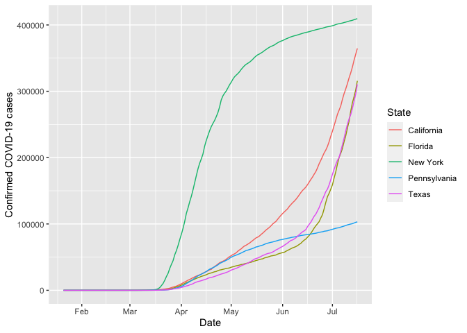
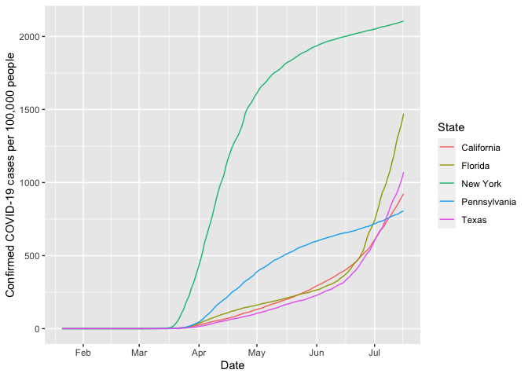
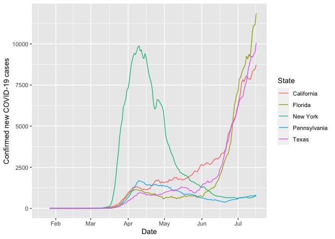
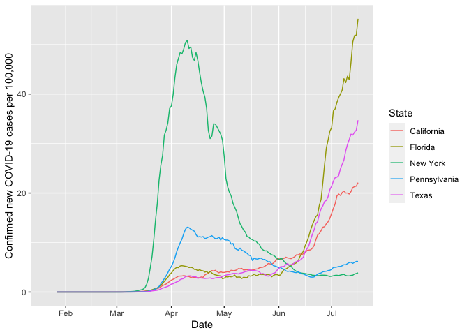
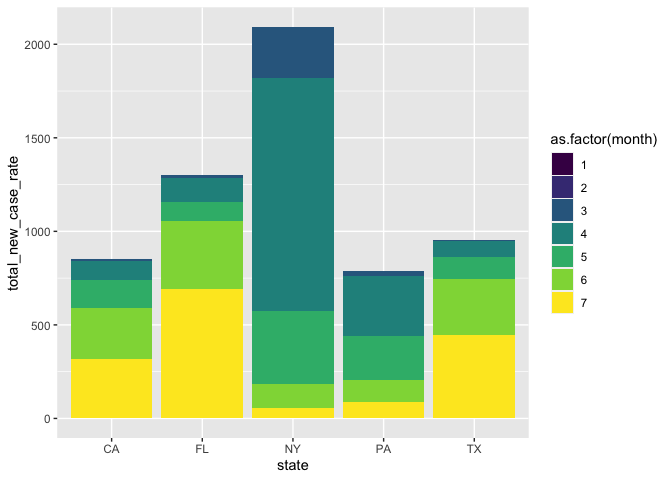
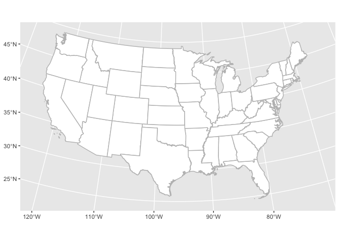
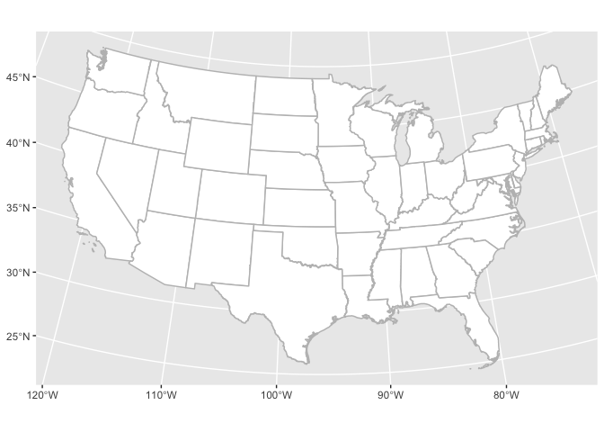
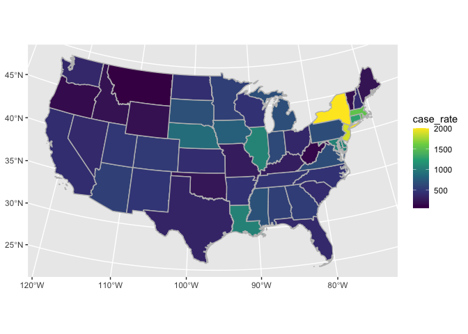
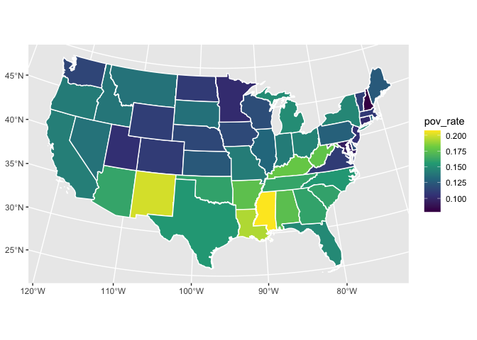

Lab Tutorial 3 - Explore COVID-19 data
================

  - [Overview](#overview)
      - [Goals](#goals)
      - [Data](#data)
  - [Preamble: Load the packages for this
    lab](#preamble-load-the-packages-for-this-lab)
  - [Part A: Download/prepare COVID-19 cases
    data](#part-a-downloadprepare-covid-19-cases-data)
      - [Data joining](#data-joining)
      - [Handling dates](#handling-dates)
      - [Calculate case counts](#calculate-case-counts)
  - [Part B: Graph COVID-19 trends over time by
    state](#part-b-graph-covid-19-trends-over-time-by-state)
      - [Find the 5 largest states based on 2019
        population](#find-the-5-largest-states-based-on-2019-population)
      - [Total cases by state](#total-cases-by-state)
      - [New cases by state](#new-cases-by-state)
      - [Cases by month and state](#cases-by-month-and-state)
  - [Part C: Prepare for mapping](#part-c-prepare-for-mapping)
      - [Setting up `tidycensus`](#setting-up-tidycensus)
      - [Find variables to load from
        `tidycensus`](#find-variables-to-load-from-tidycensus)
      - [Obtain state geometries](#obtain-state-geometries)
      - [Creating a map of the US](#creating-a-map-of-the-us)
  - [Part D: Map COVID-19 cases by
    state](#part-d-map-covid-19-cases-by-state)
  - [Summary](#summary)
  - [Bonus material: Relationship between COVID-19 case rates and
    poverty
    rates](#bonus-material-relationship-between-covid-19-case-rates-and-poverty-rates)

<br>

<hr>

<br>

# Overview

## Goals

This lab builds on the skills developed in the first two labs, and will
also introduce two more concepts:

  - Joining two data frames with `left_join()` or `inner_join()`
  - Handling dates with `as.Dates()`
  - Using the `paste()` function
  - Using `tidycensus()`
  - Creating time series plots
  - Creating stacked bar plots
  - Creating *choropleth map*

## Data

In this lab we will be working with COVID-related data the Opportunity
Insights group has gathered for anyone to use in their research.

You can read more about these data at the [Opportunity Lab Economic
Tracker GitHub
repository](https://github.com/Opportunitylab/EconomicTracker). These
data include COVID-19 cases/deaths, spending, job postings, mobility,
unemployment, and student learning at the state-, county-, and/or
city-level. The website provides information on the data sources and
data definitions.

For this lab we will focus on the COVID-19 cases data. To explore the
data we will plot trends over time by state and create maps to show the
geographic variation in cases across the US.

Steps:

1.  Download/prepare COVID-19 cases data
2.  Graph COVID-19 trends by state
3.  Prepare for mapping
4.  Plot a *time series*
5.  Map COVID-19 cases by state

<br>

<hr>

<br>

# Preamble: Load the packages for this lab

``` r
library(tidyverse) #we will use dplyr, readr and other libraries from this metalibrary
library(sf)        #this is what will make R into a Geographic Information System (GIS)
library(tidycensus) #simple Census decennial/five-year data API and includes simple feature geometry 

#if needed:
#install.packages('tidyverse')
#install.packages('sf')
#install.packages('tidycensus')
```

<br>

<hr>

<br>

# Part A: Download/prepare COVID-19 cases data

First, lets pull the daily COVID-cases data from the respective part of
the [EconomicTracker’s GitHub
page](https://github.com/Opportunitylab/EconomicTracker/tree/master/data).
Because the data are on GitHub, we can access it directly through R. We
simply read in the csv file from the website link.

To do this, we use the `read.csv` function where *url* is the address of
the data. Note that I include the option `na.strings = c('', '.', 'NA')`
to indicate that all values that are blank, a period, or `NA` should be
treated as missing values in the data. Missing values in the data will
now be displayed as `NA` in gray font.

``` r
url <- "https://raw.githubusercontent.com/Opportunitylab/EconomicTracker/main/data/COVID%20Cases%20-%20State%20-%20Daily.csv"
covid_cases <- read.csv(url, na.strings = c('', '.', 'NA'))

#alternative to download and store file locally
#download.file(url, destfile = "covid_data.csv")
```

Once we pull the data in, we use `glimpse()` to check what the data
looks like.

``` r
glimpse(covid_cases)
```

    ## Rows: 9,078
    ## Columns: 6
    ## $ year          <int> 2020, 2020, 2020, 2020, 2020, 2020, 2020, 2020, 2020, 2…
    ## $ month         <int> 1, 1, 1, 1, 1, 1, 1, 1, 1, 1, 1, 1, 1, 1, 1, 1, 1, 1, 1…
    ## $ day           <int> 21, 21, 21, 21, 21, 21, 21, 21, 21, 21, 21, 21, 21, 21,…
    ## $ statefips     <int> 1, 2, 4, 5, 6, 8, 9, 10, 11, 12, 13, 15, 16, 17, 18, 19…
    ## $ case_rate     <dbl> 0, 0, 0, 0, 0, 0, 0, 0, 0, 0, 0, 0, 0, 0, 0, 0, 0, 0, 0…
    ## $ new_case_rate <dbl> NA, NA, NA, NA, NA, NA, NA, NA, NA, NA, NA, NA, NA, NA,…

This shows that the `covid_cases` dataset contains `year`, `month`,
`day`, state id (`statefips`), COVID-19 case rate (`case_rate`), and new
COVID-19 case rate (`new_case_rate`). We can refer back to our codebook
for the definition of these variables. It is important to know that the
`case_rate` and `new_case_rate` columns are not raw numbers, they are
rates showing the number of cumulative or new cases per 100,000 people
in the population.

Note that our data frame tells us the state ID of each state, but it
does not directly tell us what the name of the state is. For example, we
can see that the first state in our data frame is state 1, but it does
not tell us the name of that state. To have the name of the state each
observation is representing, we need a *crosswalk* that tells us the
state ID that refers to each state by name.

In order to more easily refer to each state, we will bring in a dataset
that provides a crosswalk between `statefips` and the actual state
name/abbreviation. The EconomicTracker’s GitHub provides us with this
crosswalk data frame. Let’s import and name this data frame: `state_id`

``` r
state_id_url <- "https://raw.githubusercontent.com/Opportunitylab/EconomicTracker/main/data/GeoIDs%20-%20State.csv"
state_id <- read.csv(state_id_url)
```

Note the `state_id` crosswalk also includes each state’s estimated
population in 2019. This will be useful in Part B of this lab.

## Data joining

We need to now combine our COVID cases data frame (`covid_cases`) with
our `state_id` crosswalk data frame in order to have the state name in
addition to the state ID in a single data frame. We will link our
`covid_cases` data with the `state_id` crosswalk by linking the two data
frames by the state ID column: `statefips`.

### `m:1` vs. `1:1` joins

Our `covid_cases` data frame contains the number of cases in each day
for each state, and, thefore, contains multiple observations for each
state. We want to join this data frame with the `state_id` data frame,
which has a single observation for each state. This is a many-to-one
(`m:1`) join, where we have many observations for each state joined with
a data frame that has a single observation for each state.

In other situations (NOT our current situation), there may be a single
observation per ID in a data frame and we want to join these with a data
frame that also has a single observation per ID. An example of this
would be if we have a data frame with one observation for each state and
we want to join it with a data frame that has the total number of cases
in March 2020 for each state (this is a single observation per state).
These types of joins are called one-to-one (`1:1`) joins, because each
observation shows up only once for each ID (state) each data frame.

In our case we focus on the `m:1` join.

### Joining two data frames

There are multiple ways to join two data frames. We learned about the
`merge()` function in
[lab 1](https://github.com/big-data-big-problems/lab-1). Now we will
learn about some of the `dplyr` verbs to join/merge two data frames.

1.  `inner_join()` creates a new data frame that joins only the
    observations that exist in both data frames. Here is an example of
    how to use this: `inner_join(x,y, by='ID')`.
      - This links observations in the first argument (`x`) with
        matching observations in the second argument (`y`) based on a
        matching ID (`ID`), but it drops all observations that do not
        have a matching observation in both data frames
      - The two data frame arguments are linked by the keys specified in
        the `by =` argument. If you do not provide a `by =` argument,
        dplyr will automatically look for like-named columns and join by
        all matching columns between the two data frames.
      - The columns from both data frames are contained in the final
        joined data frame.
      - This works best if you only want to keep oservations that exist
        in both data frames, and you do not mind dropping any
        observations that exist in one data frame but not the other.
2.  `left_join()` allows you to join data frames when you want to make
    certain to keep all the observations in one data frame even if they
    do not have a matching observation in the data frame you are joining
    with. Here is an example of how to use this function: `left_join(x,
    y, by='ID')`.
      - The `left_join()` assures that our final data frame keeps all
        the observations in data frame `x` and brings on any matching
        observations in data frame `y`.  
      - If there is a matching observation, then it attaches all columns
        from `y` onto `x` for that observation.  
      - If there is no match then the unmatched observation in `x` is
        kept and the new columns from `y` are set to missing.  
      - Lastly, if there are multiple observations in `y` that could
        match with a single observation in `x` then new observations are
        generated in the new data frame for all the combinations of the
        matches.  
      - Note, the `right_join()` works similarly, but the data frame of
        focus is now `y`.

There are more esoteric verbs like `semi_join()` and `anti_join()` that
have their own uses but are not crucial for most cases. For more
information on any of these joins please refer to the following
reference guide <https://stat545.com/join-cheatsheet.html>.

### Joining our data frames

We want to link our `covid_cases` data frame with the `state_id`
crosswalk by linking the two data frames by the state ID column:
`statefips`.

Should we use an `inner_join()` or `left_join` to join or two data
frames? What is the benefit of one over the other?

Because both of our data frames have exactly 51 unique IDs (50 states +
D.C.), then both `inner_join()` and `left_join()` would do the exact
same thing. But if our `covid_cases` data frame had more state IDs than
the `state_id` data frame then each of these join functions would have
different outcomes.

Let’s use the `left_join()` function:

``` r
covid_cases <- left_join(covid_cases, state_id,
                         by = 'statefips')
```

We can take a peek at the data again and see that now we have the name
of each state assigned to each state ID. We can use `glimpse()` on the
data frame to show that the join was successful.

``` r
glimpse(covid_cases)
```

    ## Rows: 9,078
    ## Columns: 9
    ## $ year          <int> 2020, 2020, 2020, 2020, 2020, 2020, 2020, 2020, 2020, 2…
    ## $ month         <int> 1, 1, 1, 1, 1, 1, 1, 1, 1, 1, 1, 1, 1, 1, 1, 1, 1, 1, 1…
    ## $ day           <int> 21, 21, 21, 21, 21, 21, 21, 21, 21, 21, 21, 21, 21, 21,…
    ## $ statefips     <int> 1, 2, 4, 5, 6, 8, 9, 10, 11, 12, 13, 15, 16, 17, 18, 19…
    ## $ case_rate     <dbl> 0, 0, 0, 0, 0, 0, 0, 0, 0, 0, 0, 0, 0, 0, 0, 0, 0, 0, 0…
    ## $ new_case_rate <dbl> NA, NA, NA, NA, NA, NA, NA, NA, NA, NA, NA, NA, NA, NA,…
    ## $ statename     <chr> "Alabama", "Alaska", "Arizona", "Arkansas", "California…
    ## $ stateabbrev   <chr> "AL", "AK", "AZ", "AR", "CA", "CO", "CT", "DE", "DC", "…
    ## $ state_pop2019 <int> 4903185, 731545, 7278717, 3017804, 39512223, 5758736, 3…

## Handling dates

Next, let’s prepare the dates information. The dataset provides us
`year`, `month`, and `day` information, but we need to combine these
three pieces of information so that we can graph our data over time.
Setting up a date column allows us to more easily create expressions or
analyze our data over time since R knows that the values mean something
special and are not just integers (as with the component fields `year`,
`month` and `day`). To do this, we are going to create a new column that
combines the year, month, and day, and provides all this information in
a single date.

Remember: R expects that we format dates as year-month-day.

``` r
#we will use a mutate 
covid_cases <- covid_cases %>%
  mutate(date = as.Date(paste(year, month, day, sep = '-'), '%Y-%m-%d'))
```

Let’s unpack this a bit:

  - As we know from Lab 2, we can create a new column by using
    `mutate()`. Our new column’s name will be `date`.
  - We want to assign the combined year-month-day to this column using
    `as.Date()`.
      - Here is an example of `as.Date()` with toy arguments:
        `as.Date(x, 'format')`, where `x` is the text displaying the
        date we want and `format` is the order we want the year, month,
        and day to be displayed in.
      - We can create the text displaying the date for each observation
        by combining the year, month, and day. The `paste()` function
        allows us to combine information from columns or any text we
        want. The code `paste(year, month, day, sep = '-')` says that we
        want to combine year, month, and day together (in that order)
        and between each piece of information we want to have a `-`.

<!-- end list -->

``` r
glimpse(covid_cases)
```

    ## Rows: 9,078
    ## Columns: 10
    ## $ year          <int> 2020, 2020, 2020, 2020, 2020, 2020, 2020, 2020, 2020, 2…
    ## $ month         <int> 1, 1, 1, 1, 1, 1, 1, 1, 1, 1, 1, 1, 1, 1, 1, 1, 1, 1, 1…
    ## $ day           <int> 21, 21, 21, 21, 21, 21, 21, 21, 21, 21, 21, 21, 21, 21,…
    ## $ statefips     <int> 1, 2, 4, 5, 6, 8, 9, 10, 11, 12, 13, 15, 16, 17, 18, 19…
    ## $ case_rate     <dbl> 0, 0, 0, 0, 0, 0, 0, 0, 0, 0, 0, 0, 0, 0, 0, 0, 0, 0, 0…
    ## $ new_case_rate <dbl> NA, NA, NA, NA, NA, NA, NA, NA, NA, NA, NA, NA, NA, NA,…
    ## $ statename     <chr> "Alabama", "Alaska", "Arizona", "Arkansas", "California…
    ## $ stateabbrev   <chr> "AL", "AK", "AZ", "AR", "CA", "CO", "CT", "DE", "DC", "…
    ## $ state_pop2019 <int> 4903185, 731545, 7278717, 3017804, 39512223, 5758736, 3…
    ## $ date          <date> 2020-01-21, 2020-01-21, 2020-01-21, 2020-01-21, 2020-0…

## Calculate case counts

Our COVID-19 cases data contains the case rate, which stands for the
number of cases per 100,000. It does not directly tell us the case
counts. The equation used to calculate the case rate is:

\[Case Rate = \frac{NumberOfCases*100,000}{Estimated Population}\]

We can derive an estimate of the number of cases by using a bit of
algebra on the equation above:

\[\frac{Case Rate * Estimated Population}{100,000} = NumberOfCases\]

Our `covid_cases` data frame includes the case\_rate and the estimated
population for each state, which means we can just plug in those values
and we will have an estimate of the number of cases. Note that our
estimate of the number of cases will not always be a whole number due to
rounding in the case rate. The following code implements the equation to
obtain the case counts:

``` r
#we will use a mutate 
covid_cases <- covid_cases %>%
  mutate(case_count = (case_rate * state_pop2019)/100000)

glimpse(covid_cases)
```

    ## Rows: 9,078
    ## Columns: 11
    ## $ year          <int> 2020, 2020, 2020, 2020, 2020, 2020, 2020, 2020, 2020, 2…
    ## $ month         <int> 1, 1, 1, 1, 1, 1, 1, 1, 1, 1, 1, 1, 1, 1, 1, 1, 1, 1, 1…
    ## $ day           <int> 21, 21, 21, 21, 21, 21, 21, 21, 21, 21, 21, 21, 21, 21,…
    ## $ statefips     <int> 1, 2, 4, 5, 6, 8, 9, 10, 11, 12, 13, 15, 16, 17, 18, 19…
    ## $ case_rate     <dbl> 0, 0, 0, 0, 0, 0, 0, 0, 0, 0, 0, 0, 0, 0, 0, 0, 0, 0, 0…
    ## $ new_case_rate <dbl> NA, NA, NA, NA, NA, NA, NA, NA, NA, NA, NA, NA, NA, NA,…
    ## $ statename     <chr> "Alabama", "Alaska", "Arizona", "Arkansas", "California…
    ## $ stateabbrev   <chr> "AL", "AK", "AZ", "AR", "CA", "CO", "CT", "DE", "DC", "…
    ## $ state_pop2019 <int> 4903185, 731545, 7278717, 3017804, 39512223, 5758736, 3…
    ## $ date          <date> 2020-01-21, 2020-01-21, 2020-01-21, 2020-01-21, 2020-0…
    ## $ case_count    <dbl> 0, 0, 0, 0, 0, 0, 0, 0, 0, 0, 0, 0, 0, 0, 0, 0, 0, 0, 0…

We can use the same formula to generate a count of the number of new
cases based on the new\_case\_rate:

``` r
#we will use a mutate 
covid_cases <- covid_cases %>%
  mutate(new_case_count = (new_case_rate * state_pop2019)/100000)

glimpse(covid_cases)
```

    ## Rows: 9,078
    ## Columns: 12
    ## $ year           <int> 2020, 2020, 2020, 2020, 2020, 2020, 2020, 2020, 2020, …
    ## $ month          <int> 1, 1, 1, 1, 1, 1, 1, 1, 1, 1, 1, 1, 1, 1, 1, 1, 1, 1, …
    ## $ day            <int> 21, 21, 21, 21, 21, 21, 21, 21, 21, 21, 21, 21, 21, 21…
    ## $ statefips      <int> 1, 2, 4, 5, 6, 8, 9, 10, 11, 12, 13, 15, 16, 17, 18, 1…
    ## $ case_rate      <dbl> 0, 0, 0, 0, 0, 0, 0, 0, 0, 0, 0, 0, 0, 0, 0, 0, 0, 0, …
    ## $ new_case_rate  <dbl> NA, NA, NA, NA, NA, NA, NA, NA, NA, NA, NA, NA, NA, NA…
    ## $ statename      <chr> "Alabama", "Alaska", "Arizona", "Arkansas", "Californi…
    ## $ stateabbrev    <chr> "AL", "AK", "AZ", "AR", "CA", "CO", "CT", "DE", "DC", …
    ## $ state_pop2019  <int> 4903185, 731545, 7278717, 3017804, 39512223, 5758736, …
    ## $ date           <date> 2020-01-21, 2020-01-21, 2020-01-21, 2020-01-21, 2020-…
    ## $ case_count     <dbl> 0, 0, 0, 0, 0, 0, 0, 0, 0, 0, 0, 0, 0, 0, 0, 0, 0, 0, …
    ## $ new_case_count <dbl> NA, NA, NA, NA, NA, NA, NA, NA, NA, NA, NA, NA, NA, NA…

<br>

<hr>

<br>

# Part B: Graph COVID-19 trends over time by state

Now that we have a data frame that contains the COVID cases, the state
names, and the date for each observation we can plot a *time series*
showing the trends in cases over time by state.

## Find the 5 largest states based on 2019 population

Let’s make a temporary data frame with states ordered from largest
population to smallest population in 2019. We can use tools from
[lab 2](https://github.com/big-data-big-problems/lab-2) to do this.

``` r
state_pop_rank <- covid_cases %>%
  group_by(statename) %>%
  summarize(state_pop2019 = max(state_pop2019)) %>%
  arrange(desc(state_pop2019))
```

    ## `summarise()` ungrouping output (override with `.groups` argument)

``` r
head(state_pop_rank)
```

    ## # A tibble: 6 x 2
    ##   statename    state_pop2019
    ##   <chr>                <int>
    ## 1 California        39512223
    ## 2 Texas             28995881
    ## 3 Florida           21477737
    ## 4 New York          19453561
    ## 5 Pennsylvania      12801989
    ## 6 Illinois          12671821

## Total cases by state

We will plot the number of COVID-19 cases over time in the five largest
states: California, Texas, Florida, New York, and Pennsylvania To do
this, we are going to combine a filter and a ggplot command as follows:

``` r
covid_cases %>%
  filter(stateabbrev %in% c('CA', 'TX', 'FL', 'NY', 'PA')) %>%
  ggplot(aes(x = date, y = case_count, color = statename)) +
  geom_line() +
  labs(x = "Date", y = 'Confirmed COVID-19 cases', color = "State") +
  scale_y_continuous(labels = function(y) format(y, scientific=FALSE))
```

<!-- -->

Next, let’s look at the time series for the case rates. We need to make
sure that our y-axis label states that our data is a rate and not a raw
number, so I specify the `ylab` option to include the definition of the
data we are plotting.

``` r
covid_cases %>%
  filter(stateabbrev %in% c('CA', 'TX', 'FL', 'NY', 'PA')) %>%
  ggplot(aes(x = date, y = case_rate, color = statename)) +
  geom_line() +
  labs(x = "Date", y = 'Confirmed COVID-19 cases per 100,000 people', color = "State")
```

<!-- -->

  - How do the two plots differ?  
  - Does the state ordering change between the raw counts and the rates?
    Why?
  - Should we prefer raw counts over rates? Why?

## New cases by state

Now, lets repeat this for the number of new cases by state.

``` r
covid_cases %>%
  filter(stateabbrev %in% c('CA', 'TX', 'FL', 'NY', 'PA')) %>%
  ggplot(aes(x = date, y = new_case_count, color = statename)) +
  geom_line() +
  labs(x = "Date", y = 'Confirmed new COVID-19 cases', color = "State")
```

    ## Warning: Removed 30 row(s) containing missing values (geom_path).

<!-- -->

Now, lets repeat this for the rate of new cases by state.

``` r
covid_cases %>%
  filter(stateabbrev %in% c('CA', 'TX', 'FL', 'NY', 'PA')) %>%
  ggplot(aes(x = date, y = new_case_rate, color = statename)) +
  geom_line() +
  labs(x = "Date", y = 'Confirmed new COVID-19 cases per 100,000', color = "State")
```

    ## Warning: Removed 30 row(s) containing missing values (geom_path).

<!-- -->

  - Does the state ranking change between the raw counts and the rates?
    Why?
  - What are some differences between what the total cases plots tell us
    and what the new cases plots tell us?

## Cases by month and state

Let’s first create a data frame with the rate and count of new cases per
month for each state. The following code works as follows:

  - Name the new data frame `covid_cases_monthly`
  - Work with the `covid_cases` data frame
  - Only keep certain columns/variables in the final data frame (using
    `select()`)
  - Groupwise statistics should be based on state and month (using
    `group_by()`)
  - Use `summarize()` to create the rate of total new cases and count of
    total new cases (grouped by state and month)
  - Note, we need to include the `na.rm=TRUE` within the `sum()` in
    order to ignore days with a missing value, since these simply mean
    the rate in those days was zero.

<!-- end list -->

``` r
covid_cases_monthly <- covid_cases %>%
  select(statename, stateabbrev, new_case_rate, new_case_count, date, year, month) %>%
  group_by(stateabbrev, month) %>%
  summarize(total_new_case_rate = sum(new_case_rate, na.rm=TRUE) , total_new_case_count = sum(new_case_count, na.rm=TRUE))
```

    ## `summarise()` regrouping output by 'stateabbrev' (override with `.groups` argument)

Now, we can use this data frame to create a stacked bar chart that shows
the rate/count of total new cases in each month for each state. The
following code works as follows:

  - Work with the `covid_cases_monthly` data frame
  - Use `filter()` to only work with the largest five states
  - Call`ggplot()`
  - Define the plot aesthetics
      - Choose to fill the plot’s colors to represent each individual
        month. Note that I use `as.factor()` to treat each individual
        month as separate and not continuous. To better understand this,
        you can try removing the `as.factor()` part (NOTE: if you remove
        this you will need to change the `scale_fill_viridis()` function
        that `discrete=FALSE`)
      - The height of the plot is based on the `total_new_case_rate`
      - And each separate bar represents a different state (based on
        `stateabbrev`)
  - `geom_bar()` includes the required options to create a stacked bar
    plot
  - `scale_fill_viridis()` sets the color scheme, and we must tell it
    that each month is separate (discrete) since we told it that month
    is a factor
  - Lastly, `xlab()` chooses the name of the x-axis

<!-- end list -->

``` r
library(viridis) #allows us to set discrete color scheme for factor numbers
```

    ## Loading required package: viridisLite

``` r
covid_cases_monthly %>% 
  filter(stateabbrev %in% c('CA', 'TX', 'FL', 'NY', 'PA')) %>%
  ggplot(aes(fill=as.factor(month), y=total_new_case_rate, x=stateabbrev)) +
  geom_bar(position='stack', stat='identity') + 
  scale_fill_viridis(discrete = TRUE) +
  xlab('state')
```

<!-- -->

<br>

<hr>

<br>

# Part C: Prepare for mapping

While our graphs above were able to show changes over time, static maps
are good at showing geographic variation at a single time point (for
example, neighboring states with similar COVID case rates). Let’s shift
our focus to creating a *choropleth map* of the United States. We can
then plot COVID-19 cases data onto the map.

## Setting up `tidycensus`

We will use the `tidycensus` package, which contains mapping files and
Census statistics for different geographic levels. Details of how to use
this package are available
[here](https://walker-data.com/tidycensus/articles/basic-usage.html). To
use the `tidycensus` package we need to obtain an API key from the
following website: <https://api.census.gov/data/key_signup.html>. Simply
type in *Cornell University* as your organization name and your email
address. Once you finish this step, you will be emailed your API key.

> MAKE SURE TO CHECK YOUR EMAIL AND ACTIVATE YOUR KEY\!

APIs, or application programming interfaces, let us communicate with
online servers or other software to extend the functionality of our
scripts. We might use an API to download data, reference information on
a large geodatabase like Google Maps, or connect our software to other
platforms like Slack.

`tidycensus` gives us an R interface for communicating with the US
Census Bureau’s APIs and returns to us the data we request of it. But
the Census Bureau’s API requires that we have an API key in order to
communicate with it, which means that we need to provide the API key to
it otherwise it will just ignore our requests. This is a common feature
of web APIs that limits access to some group of authenticated users and
allows the hosting organization to track usage by users.

``` r
library(tidycensus)
#census_api_key("ADD API KEY", install = TRUE) 
#make sure you remove the # in front and include your API key
```

## Find variables to load from `tidycensus`

The ACS and Census datasets contain many possible variables and each of
these is identified by specific codes. `tidycensus()` allows us to
obtain variables from the Decennial Census (`sf1`), the 1-year ACS
(`acs1`), and the 5-year ACS (`acs5`).

As you may know, the Census is conducted every decade and is based on
responses by the full population in the United States. On the other
hand, the American Community Survey (ACS) is conducted on a yearly basis
since 2005 and is based only on a sample of the population in the United
States. Both surveys attempt to estimate various statistics for the
population, but each has its own strengths and weaknesses. For example,
the decesnnial Census is more precise because it is based on a much
larger set of respondents, but only every 10 years. While estimates from
the ACS may be less precise because it is based on a smaller set of
respodents, but it is more frequent and can provide more up-to-date
statistics than the Census can. Note the ACS has 1-year and 5-year
estimates that are aggregated to different geographic levels (varies
depending on whether using the 1- or 5-yr ACS or the decennial Census).

To identify the variables we want and their codes to search by, we need
to use the `load_variables()` function. We can obtain the list of
variables in the 2018 ACS 5-year estimates using the following code,
where we place the list of variables and definitions into the data frame
`acs5_2018_vars`:

``` r
acs5_2018_vars <- load_variables(2018, "acs5")
```

You can explore the variables, codes, and their definitions in this data
frame. More details on how to search this data frame can be found at the
`tidyverse` website:
<https://walker-data.com/tidycensus/articles/basic-usage.html#searching-for-variables>

## Obtain state geometries

We can get state geometries by requesting any variable at the geographic
level we are interested in. For this exercise lets request the 2018
population sizes (`B06012_001`) in each state.

``` r
state_num <- get_acs(geography = "state",
                     variables = 'B06012_001', year = 2018, geometry = TRUE)
```

    ## Getting data from the 2014-2018 5-year ACS

    ## Downloading feature geometry from the Census website.  To cache shapefiles for use in future sessions, set `options(tigris_use_cache = TRUE)`.

    ##   |                                                                              |                                                                      |   0%  |                                                                              |=                                                                     |   1%  |                                                                              |=                                                                     |   2%  |                                                                              |==                                                                    |   2%  |                                                                              |==                                                                    |   3%  |                                                                              |===                                                                   |   4%  |                                                                              |===                                                                   |   5%  |                                                                              |====                                                                  |   5%  |                                                                              |====                                                                  |   6%  |                                                                              |=====                                                                 |   7%  |                                                                              |=====                                                                 |   8%  |                                                                              |======                                                                |   8%  |                                                                              |======                                                                |   9%  |                                                                              |=======                                                               |  10%  |                                                                              |========                                                              |  11%  |                                                                              |========                                                              |  12%  |                                                                              |=========                                                             |  12%  |                                                                              |=========                                                             |  13%  |                                                                              |=========                                                             |  14%  |                                                                              |==========                                                            |  14%  |                                                                              |==========                                                            |  15%  |                                                                              |===========                                                           |  15%  |                                                                              |===========                                                           |  16%  |                                                                              |============                                                          |  17%  |                                                                              |============                                                          |  18%  |                                                                              |=============                                                         |  18%  |                                                                              |=============                                                         |  19%  |                                                                              |==============                                                        |  19%  |                                                                              |==============                                                        |  20%  |                                                                              |==============                                                        |  21%  |                                                                              |===============                                                       |  21%  |                                                                              |===============                                                       |  22%  |                                                                              |================                                                      |  22%  |                                                                              |================                                                      |  23%  |                                                                              |=================                                                     |  24%  |                                                                              |=================                                                     |  25%  |                                                                              |==================                                                    |  25%  |                                                                              |==================                                                    |  26%  |                                                                              |===================                                                   |  27%  |                                                                              |===================                                                   |  28%  |                                                                              |====================                                                  |  28%  |                                                                              |====================                                                  |  29%  |                                                                              |=====================                                                 |  29%  |                                                                              |=====================                                                 |  30%  |                                                                              |=====================                                                 |  31%  |                                                                              |======================                                                |  31%  |                                                                              |======================                                                |  32%  |                                                                              |=======================                                               |  33%  |                                                                              |=======================                                               |  34%  |                                                                              |========================                                              |  34%  |                                                                              |========================                                              |  35%  |                                                                              |=========================                                             |  35%  |                                                                              |=========================                                             |  36%  |                                                                              |==========================                                            |  37%  |                                                                              |===========================                                           |  38%  |                                                                              |===========================                                           |  39%  |                                                                              |============================                                          |  39%  |                                                                              |============================                                          |  40%  |                                                                              |============================                                          |  41%  |                                                                              |=============================                                         |  41%  |                                                                              |=============================                                         |  42%  |                                                                              |==============================                                        |  42%  |                                                                              |==============================                                        |  43%  |                                                                              |===============================                                       |  44%  |                                                                              |===============================                                       |  45%  |                                                                              |================================                                      |  45%  |                                                                              |================================                                      |  46%  |                                                                              |=================================                                     |  47%  |                                                                              |==================================                                    |  48%  |                                                                              |==================================                                    |  49%  |                                                                              |===================================                                   |  49%  |                                                                              |===================================                                   |  50%  |                                                                              |===================================                                   |  51%  |                                                                              |====================================                                  |  51%  |                                                                              |====================================                                  |  52%  |                                                                              |=====================================                                 |  52%  |                                                                              |=====================================                                 |  53%  |                                                                              |======================================                                |  54%  |                                                                              |======================================                                |  55%  |                                                                              |=======================================                               |  55%  |                                                                              |=======================================                               |  56%  |                                                                              |========================================                              |  57%  |                                                                              |========================================                              |  58%  |                                                                              |=========================================                             |  58%  |                                                                              |=========================================                             |  59%  |                                                                              |==========================================                            |  60%  |                                                                              |===========================================                           |  61%  |                                                                              |===========================================                           |  62%  |                                                                              |============================================                          |  62%  |                                                                              |============================================                          |  63%  |                                                                              |=============================================                         |  64%  |                                                                              |=============================================                         |  65%  |                                                                              |==============================================                        |  65%  |                                                                              |==============================================                        |  66%  |                                                                              |===============================================                       |  67%  |                                                                              |===============================================                       |  68%  |                                                                              |================================================                      |  68%  |                                                                              |================================================                      |  69%  |                                                                              |=================================================                     |  70%  |                                                                              |==================================================                    |  71%  |                                                                              |==================================================                    |  72%  |                                                                              |===================================================                   |  72%  |                                                                              |===================================================                   |  73%  |                                                                              |===================================================                   |  74%  |                                                                              |====================================================                  |  74%  |                                                                              |====================================================                  |  75%  |                                                                              |=====================================================                 |  75%  |                                                                              |=====================================================                 |  76%  |                                                                              |======================================================                |  77%  |                                                                              |======================================================                |  78%  |                                                                              |=======================================================               |  78%  |                                                                              |=======================================================               |  79%  |                                                                              |========================================================              |  79%  |                                                                              |========================================================              |  80%  |                                                                              |=========================================================             |  81%  |                                                                              |=========================================================             |  82%  |                                                                              |==========================================================            |  82%  |                                                                              |==========================================================            |  83%  |                                                                              |===========================================================           |  84%  |                                                                              |===========================================================           |  85%  |                                                                              |============================================================          |  85%  |                                                                              |============================================================          |  86%  |                                                                              |=============================================================         |  87%  |                                                                              |==============================================================        |  88%  |                                                                              |==============================================================        |  89%  |                                                                              |===============================================================       |  89%  |                                                                              |===============================================================       |  90%  |                                                                              |===============================================================       |  91%  |                                                                              |================================================================      |  91%  |                                                                              |================================================================      |  92%  |                                                                              |=================================================================     |  93%  |                                                                              |==================================================================    |  94%  |                                                                              |==================================================================    |  95%  |                                                                              |===================================================================   |  95%  |                                                                              |===================================================================   |  96%  |                                                                              |====================================================================  |  97%  |                                                                              |====================================================================  |  98%  |                                                                              |===================================================================== |  98%  |                                                                              |===================================================================== |  99%  |                                                                              |======================================================================| 100%

``` r
# I used the load_variables() function to find this variable code
```

We can use the `head()` statement to take a look at the first six
observations and their respective columns.

``` r
head(state_num)
```

    ## Simple feature collection with 6 features and 5 fields
    ## geometry type:  MULTIPOLYGON
    ## dimension:      XY
    ## bbox:           xmin: -103.0026 ymin: 28.92861 xmax: -75.24227 ymax: 40.6388
    ## CRS:            4269
    ##   GEOID           NAME   variable estimate  moe                       geometry
    ## 1    28    Mississippi B06012_001  2890347  856 MULTIPOLYGON (((-88.50297 3...
    ## 2    37 North Carolina B06012_001  9881292 1522 MULTIPOLYGON (((-75.72681 3...
    ## 3    40       Oklahoma B06012_001  3802004  857 MULTIPOLYGON (((-103.0026 3...
    ## 4    51       Virginia B06012_001  8162107 1377 MULTIPOLYGON (((-75.74241 3...
    ## 5    54  West Virginia B06012_001  1776501  743 MULTIPOLYGON (((-82.6432 38...
    ## 6    22      Louisiana B06012_001  4531598 1272 MULTIPOLYGON (((-88.8677 29...

We need to clean this data a bit so that we can easily merge it with our
COVID-19 cases data from the section above.

1.  Let’s rename the column that gives us the population estimate from
    `estimate` to `population2018`.

<!-- end list -->

``` r
state_num <- rename(state_num, population2018 = estimate)
```

2.  Remove unnecessary columns: `variable` and `moe`

<!-- end list -->

``` r
state_num <- select(state_num, -variable, -moe)

#alternatively:
#state_num$variable <- state_num$moe <- NULL
```

3.  Make the state ID column in this data frame compatible with the
    state ID column in the COVID cases data frame. The difference
    between the two data frames’ state ID columns is that the Census
    data frame’s state ID contains leading zeros, but the COVID cases
    data frame does not contain leading zeros (leading zeros are the
    zeros in front of numbers, for example 01 compared to 1). Note that
    in this data frame the state ID has the column name `GEOID`. It is
    fine that the column name is different from our COVID cases data
    frame, but we need the IDs themselves to be the same column type.

<!-- end list -->

``` r
state_num <- mutate(state_num, GEOID = as.numeric(GEOID))

#alternatively:
#state_num$GEOID <- as.numeric(state_num$GEOID)
```

Now that we have our prepared can easily make a map of the US states by
using the data we just pulled from `tidycensus`.

## Creating a map of the US

We can use `ggplot()` as we learned about in
[lab 2](https://github.com/big-data-big-problems/lab-2) to create a map.
For now, let’s create a map that only shows the outline of each state
but does not display any descriptive statistics. Here are details of
what each line in the code does:

  - The first line in the code below states that we are working with our
    data frame `state_num`
  - Then we call `ggplot()` but leave the inside of the parentheses
    empty since we do not want to plot descriptive statistics
  - `geom_sf()` says that each state’s geometry should be filled in
    white and the boundary lines should be gray
  - `coord_sf` sets the Coordinate Reference System (CRS) that is best
    for showing the continental United States and then chooses the max
    and minimum x- and y-coordinates to display on the map. Our chosen
    coordinates focus on the continental US, but we could expand the
    coordinates to show Alaska and Hawaii. For example, if we remove the
    `xlim` and `ylim` the map would stretch to show all the states that
    are in our data frame including Alaska and Hawaii (try it\!).

**NOTE: it can take a minute or two to process the map, so please be
patient when running this part of the code.**

``` r
ggplot(state_num) + 
  geom_sf(fill = 'white' , color = 'gray') + 
  coord_sf(crs = 5070, xlim = c(-2500000, 2500000), ylim = c(205000, 3200000))
```

<!-- -->

A slightly easier and cleaner way to focus on the contiguous United
States is to use a filter that removes Alaska, Hawaii, and Puerto Rico.
This way R chooses the optimal `xlim` and `ylim` for us.

``` r
state_num %>%
  filter( !NAME %in% c('Alaska','Hawaii','Puerto Rico') ) %>%
  ggplot() + 
  geom_sf(fill = 'white' , color = 'gray') + 
  coord_sf(crs = 5070)
```

<!-- -->

<br>

<hr>

<br>

# Part D: Map COVID-19 cases by state

Lastly, we want to plot the rate of COVID-19 cases in all states on June
17, 2020. To do this, we first create a subset of the data that only
includes information from this date.

``` r
covid_cases_june17 <- covid_cases %>%
  filter(date == '2020-06-17')
```

Next, we need to join the COVID cases from June 17, 2020 data frame onto
our mapping data frame that we created in the section above. We can
achieve this by again using the `left_join` function.

``` r
state_cases_june17 <- left_join(state_num, covid_cases_june17,
                         by = c('GEOID' = 'statefips'))
```

We can take a glimpse at our joined data using:

``` r
glimpse(state_cases_june17)
```

    ## Rows: 52
    ## Columns: 15
    ## $ GEOID          <dbl> 28, 37, 40, 51, 54, 22, 26, 25, 16, 12, 31, 53, 35, 72…
    ## $ NAME           <chr> "Mississippi", "North Carolina", "Oklahoma", "Virginia…
    ## $ population2018 <dbl> 2890347, 9881292, 3802004, 8162107, 1776501, 4531598, …
    ## $ year           <int> 2020, 2020, 2020, 2020, 2020, 2020, 2020, 2020, 2020, …
    ## $ month          <int> 6, 6, 6, 6, 6, 6, 6, 6, 6, 6, 6, 6, 6, NA, 6, 6, 6, 6,…
    ## $ day            <int> 17, 17, 17, 17, 17, 17, 17, 17, 17, 17, 17, 17, 17, NA…
    ## $ case_rate      <dbl> 694, 449, 225, 653, 133, 1049, 668, 1540, 203, 385, 89…
    ## $ new_case_rate  <dbl> 10.40, 12.00, 5.14, 6.02, 1.46, 14.10, 1.88, 4.13, 2.9…
    ## $ statename      <chr> "Mississippi", "North Carolina", "Oklahoma", "Virginia…
    ## $ stateabbrev    <chr> "MS", "NC", "OK", "VA", "WV", "LA", "MI", "MA", "ID", …
    ## $ state_pop2019  <int> 2976149, 10488084, 3956971, 8535519, 1792147, 4648794,…
    ## $ date           <date> 2020-06-17, 2020-06-17, 2020-06-17, 2020-06-17, 2020-…
    ## $ case_count     <dbl> 20654.474, 47091.497, 8903.185, 55736.939, 2383.556, 4…
    ## $ new_case_count <dbl> 309.51950, 1258.57008, 203.38831, 513.83824, 26.16535,…
    ## $ geometry       <MULTIPOLYGON [°]> MULTIPOLYGON (((-88.50297 3..., MULTIPOLY…

And now we can use very similar code from our last map, but now filling
the map colors based on COVID-19 case rate on June 17, 2020.

  - The first line in the code below states that we are working with our
    data frame `state_num`
  - We now call `ggplot()` but this time tell the map that we want to
    fill each state with their `case_rate`
  - `geom_sf()` says that we want the boundary lines to be white
  - `coord_sf` sets the same CRS as before and the same x- and
    y-coordinate limits for the map
  - `scale_fill_viridis_c()` is a color scale scheme that displays a
    continuous color distribution from purple to yellow

**NOTE: it can take a minute or two to process the map, so please be
patient when running this part of the code.**

``` r
state_cases_june17 %>%
  filter( !NAME %in% c('Alaska','Hawaii','Puerto Rico') ) %>%
  ggplot() + 
  geom_sf(aes(fill = case_rate) , color = 'gray') + 
  coord_sf(crs = 5070)+
  scale_fill_viridis_c()
```

<!-- -->

``` r
# Alternative:
# ggplot(state_cases, aes(fill = case_rate)) +
#   geom_sf(color = 'white') +
#   coord_sf(crs = 5070, xlim = c(-2500000, 2500000), ylim = c(205000, 3200000)) +
#   scale_fill_viridis_c()
```

<br>

<hr>

<br>

# Summary

1.  We explored the COVID-19 case-rate data from the Opportunity
    Insight’s EconomicTracker website. There are other related
    datasets on this website that provide other insights on the impacts
    of COVID-19.

2.  We used `left_join()` to combine multiple data frames. This allowed
    us to get more information about each state in our data frames.

3.  We can now generate a blank map of the United States. In addition,
    we are able to plot descriptive statistics on top of this map to
    look at geographic variation of these statistics.

<br>

<hr>

<br>

# Bonus material: Relationship between COVID-19 case rates and poverty rates

Is there a relationship between the a state’s poverty rate and its COVID
case rate?

To explore this question, lets obtain the poverty and population sizes
in each state in 2018. The `tidycensus` instructional website shows that
we can obtain an estimate along with a summary variable. In this case we
want the population in poverty to be the estimate and the summary
variable to be the total population. Having these two numbers will allow
us to calculate the poverty rate, which is calculated as: poverty rate =
number in poverty / number in population for whom poverty status was
determined.

``` r
state_pov_num <- get_acs(geography = "state",
                         variables = c(poverty_num = 'B06012_002'), 
                         summary_var = 'B06012_001', 
                         year = 2018, geometry = TRUE)
```

    ## Getting data from the 2014-2018 5-year ACS

    ## Downloading feature geometry from the Census website.  To cache shapefiles for use in future sessions, set `options(tigris_use_cache = TRUE)`.

``` r
head(state_pov_num)
```

    ## Simple feature collection with 6 features and 7 fields
    ## geometry type:  MULTIPOLYGON
    ## dimension:      XY
    ## bbox:           xmin: -103.0026 ymin: 28.92861 xmax: -75.24227 ymax: 40.6388
    ## CRS:            4269
    ##   GEOID           NAME    variable estimate   moe summary_est summary_moe
    ## 1    28    Mississippi poverty_num   599795  9117     2890347         856
    ## 2    37 North Carolina poverty_num  1523949 15319     9881292        1522
    ## 3    40       Oklahoma poverty_num   607810  7376     3802004         857
    ## 4    51       Virginia poverty_num   893580 13485     8162107        1377
    ## 5    54  West Virginia poverty_num   315464  5988     1776501         743
    ## 6    22      Louisiana poverty_num   878394 12965     4531598        1272
    ##                         geometry
    ## 1 MULTIPOLYGON (((-88.50297 3...
    ## 2 MULTIPOLYGON (((-75.72681 3...
    ## 3 MULTIPOLYGON (((-103.0026 3...
    ## 4 MULTIPOLYGON (((-75.74241 3...
    ## 5 MULTIPOLYGON (((-82.6432 38...
    ## 6 MULTIPOLYGON (((-88.8677 29...

Again, we need to clean this data for easy reading and to join with the
COVID-19 data frame.

1.  Let’s rename the column that gives us the population estimate from
    `estimate` to `num_poverty`.
2.  Let’s rename the column that gives us the population estimate from
    `summary_est` to `population2018`.
3.  Remove unnecessary columns: `variable`, `moe`, and `summary_moe`
4.  Make the state ID column in this data frame compatible with the
    state ID column in the COVID cases data frame, by removing the
    leading zeros.

<!-- end list -->

``` r
#let's make some quick changes to state_pov_num
state_pov_num <- state_pov_num %>%
  
  #rename some columns
  rename(num_poverty = estimate, 
         population2018 = summary_est) %>%
  
  #remove some columns we no longer need
  select(-variable, -moe, -summary_moe) %>%
  
  #coerce GEOID to numeric
  mutate(GEOID = as.numeric(GEOID))

#now let's look at the result
head(state_pov_num)
```

    ## Simple feature collection with 6 features and 4 fields
    ## geometry type:  MULTIPOLYGON
    ## dimension:      XY
    ## bbox:           xmin: -103.0026 ymin: 28.92861 xmax: -75.24227 ymax: 40.6388
    ## CRS:            4269
    ##   GEOID           NAME num_poverty population2018
    ## 1    28    Mississippi      599795        2890347
    ## 2    37 North Carolina     1523949        9881292
    ## 3    40       Oklahoma      607810        3802004
    ## 4    51       Virginia      893580        8162107
    ## 5    54  West Virginia      315464        1776501
    ## 6    22      Louisiana      878394        4531598
    ##                         geometry
    ## 1 MULTIPOLYGON (((-88.50297 3...
    ## 2 MULTIPOLYGON (((-75.72681 3...
    ## 3 MULTIPOLYGON (((-103.0026 3...
    ## 4 MULTIPOLYGON (((-75.74241 3...
    ## 5 MULTIPOLYGON (((-82.6432 38...
    ## 6 MULTIPOLYGON (((-88.8677 29...

Using our cleaned data frame, let’s calculate the poverty rate for each
state.

``` r
state_pov_num <- mutate(state_pov_num, pov_rate = num_poverty/population2018)

#alternatively:
#state_pov_num$pov_rate <- state_pov_num$num_poverty / state_pov_num$population2018
```

Now, just like before, we need to join the COVID cases from June 17,
2020 data frame onto our mapping data frame that we created in the
section above. We can achieve this by again using the `left_join`
function.

``` r
state_cases <- left_join(state_pov_num, covid_cases_june17,
                         by = c('GEOID' = 'statefips'))
```

We can take a look at the first six observations in our joined data
using,

``` r
head(state_cases)
```

    ## Simple feature collection with 6 features and 16 fields
    ## geometry type:  MULTIPOLYGON
    ## dimension:      XY
    ## bbox:           xmin: -103.0026 ymin: 28.92861 xmax: -75.24227 ymax: 40.6388
    ## CRS:            4269
    ##   GEOID           NAME num_poverty population2018  pov_rate year month day
    ## 1    28    Mississippi      599795        2890347 0.2075166 2020     6  17
    ## 2    37 North Carolina     1523949        9881292 0.1542257 2020     6  17
    ## 3    40       Oklahoma      607810        3802004 0.1598657 2020     6  17
    ## 4    51       Virginia      893580        8162107 0.1094791 2020     6  17
    ## 5    54  West Virginia      315464        1776501 0.1775760 2020     6  17
    ## 6    22      Louisiana      878394        4531598 0.1938376 2020     6  17
    ##   case_rate new_case_rate      statename stateabbrev state_pop2019       date
    ## 1       694         10.40    Mississippi          MS       2976149 2020-06-17
    ## 2       449         12.00 North Carolina          NC      10488084 2020-06-17
    ## 3       225          5.14       Oklahoma          OK       3956971 2020-06-17
    ## 4       653          6.02       Virginia          VA       8535519 2020-06-17
    ## 5       133          1.46  West Virginia          WV       1792147 2020-06-17
    ## 6      1049         14.10      Louisiana          LA       4648794 2020-06-17
    ##   case_count new_case_count                       geometry
    ## 1  20654.474      309.51950 MULTIPOLYGON (((-88.50297 3...
    ## 2  47091.497     1258.57008 MULTIPOLYGON (((-75.72681 3...
    ## 3   8903.185      203.38831 MULTIPOLYGON (((-103.0026 3...
    ## 4  55736.939      513.83824 MULTIPOLYGON (((-75.74241 3...
    ## 5   2383.556       26.16535 MULTIPOLYGON (((-82.6432 38...
    ## 6  48765.849      655.47995 MULTIPOLYGON (((-88.8677 29...

And now we can use very similar code from our last map, but now filling
the map colors based on the poverty rate estimated from the 2018
American Community Survey (ACS).

**NOTE: it can take a minute or two to process the map, so please be
patient when running this part of the code.**

``` r
state_cases %>%
  filter( !NAME %in% c('Alaska','Hawaii','Puerto Rico') ) %>%
  ggplot() + 
  geom_sf(aes(fill = pov_rate) , color = 'white') + 
  coord_sf(crs = 5070)+
  scale_fill_viridis_c()
```

<!-- -->

``` r
# Alternative:
# ggplot(state_cases, aes(fill = pov_rate)) + 
#   geom_sf(color = 'white') + 
#   coord_sf(crs = 5070, xlim = c(-2500000, 2500000), ylim = c(205000, 3200000)) +
#   scale_fill_viridis_c() 
```

  - Does the geographic variation in state COVID-19 case rates look
    similar to the geographic variation in state poverty rates?

  - How else can we explore the relationship between these two rates?

  - Do you think the relationship would look different if we looked at
    more granular geographic level? For example, county or city level
    data?

<!-- ```{r} -->

<!-- state_num_pov <- get_acs(geography = "state", -->

<!--                   variables = 'B06012_002', year=2018, geometry = TRUE) -->

<!-- state_hh_num <- get_acs(geography = "state", -->

<!--                   variables = "B17012_001", year=2018, geometry = TRUE) -->

<!-- state_hh_pov <- get_acs(geography = "state", -->

<!--                   variables = "B17012_002", year=2018, geometry = TRUE) -->

<!-- head(num) -->

<!-- ``` -->

<!-- To make a quick map, we will use the *usmap* package. -->

<!-- ```{r} -->

<!-- install.packages('usmap') -->

<!-- library(usmap) -->

<!-- ``` -->

<!-- ```{r} -->

<!-- plot_usmap(covid_cases_june17, values = "case_rates", color = "red") +  -->

<!--   scale_fill_continuous(name = 'Confirmed COVID-19 cases per 100,000 people', label = scales::comma) +  -->

<!--   theme(legend.position = "right") -->

<!-- ``` -->
