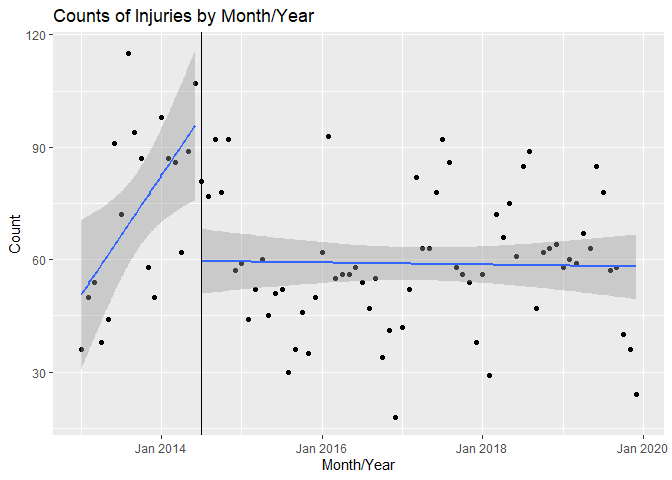
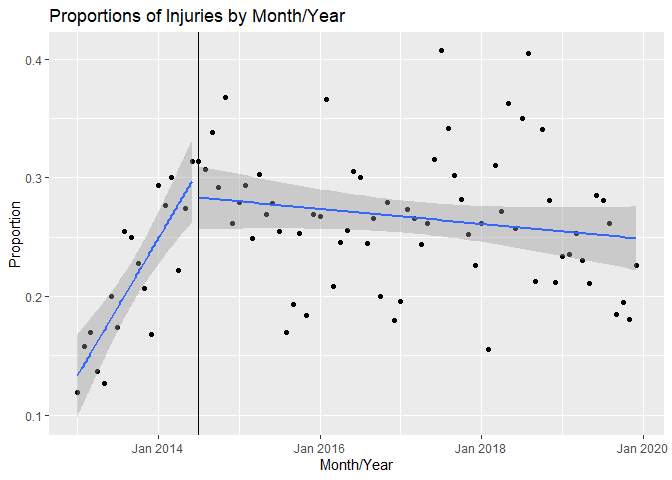
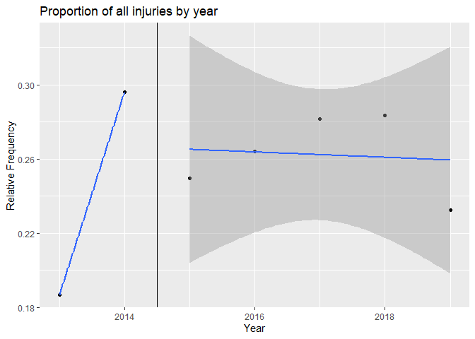
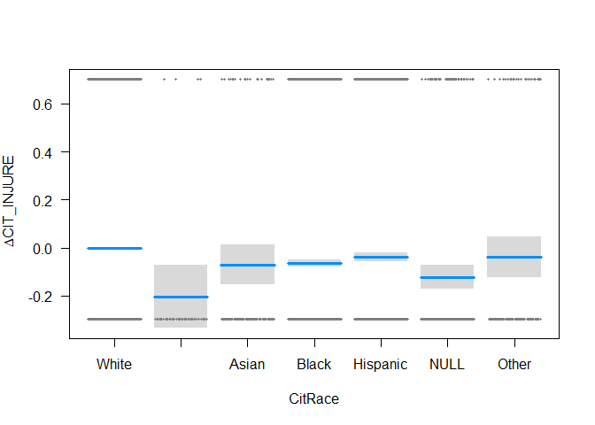
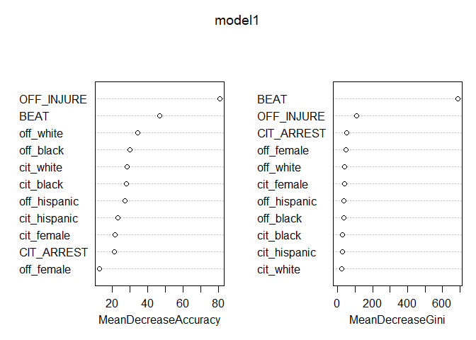

Lab Tutorial 4 - Criminal Justice Lab
================

  - [Overview: Examining 8 Can’t Wait in Dallas,
    Texas](#overview-examining-8-cant-wait-in-dallas-texas)
      - [Goals](#goals)
      - [Data](#data)
  - [Part A: Bringing in Data](#part-a-bringing-in-data)
  - [Part B: Examining/Cleaning our
    Data](#part-b-examiningcleaning-our-data)
  - [Part C: Visualizing Trends](#part-c-visualizing-trends)
  - [Part D: Correlation v. Causation](#part-d-correlation-v.-causation)
      - [**Correlation 1:** Testing whether race/gender/year is
        associated with likelihood of getting
        injured.](#correlation-1-testing-whether-racegenderyear-is-associated-with-likelihood-of-getting-injured.)
      - [**Correlation 2:** Testing whether race/gender match between
        citizen and officer is associated with likelihood of getting
        injured.](#correlation-2-testing-whether-racegender-match-between-citizen-and-officer-is-associated-with-likelihood-of-getting-injured.)
      - [**Correlation 3:** Testing whether location is associated with
        likelihood of getting
        injured.](#correlation-3-testing-whether-location-is-associated-with-likelihood-of-getting-injured.)
  - [Part E: Moving Toward Causal
    Inference](#part-e-moving-toward-causal-inference)
      - [**Step 1:** Let’s make some of the correlations we ran
        stronger](#step-1-lets-make-some-of-the-correlations-we-ran-stronger)
          - [A. Simple model of citizen injuries and their
            race](#a.-simple-model-of-citizen-injuries-and-their-race)
          - [B. Adding in controls](#b.-adding-in-controls)
      - [**Step 2:** Determine the relationship between citizen injuries
        and whether the policy was in
        effect](#step-2-determine-the-relationship-between-citizen-injuries-and-whether-the-policy-was-in-effect)
      - [**Step 3:** Interpret Findings and Next
        Steps](#step-3-interpret-findings-and-next-steps)
  - [BONUS Part F: Prediction](#bonus-part-f-prediction)

<br>

<hr>

<br>

# Overview: Examining 8 Can’t Wait in Dallas, Texas

## Goals

Over the past few decades, police violence has led some departments to
increase accountability by changing policies and making police response
data available to the public. Access to this data is especially useful
now, as we consider more recent events calling for massive police
reform. One popular movement is “8 Can’t Wait,” which calls for police
departments across the country to:

1)  Ban chokeholds and strangleholds  
2)  Require de-escalation  
3)  Require warning before shooting  
4)  Require exhausting all alternatives before shooting  
5)  Duty to intervene  
6)  Ban shooting at moving vehicles  
7)  Require use of force continuum  
8)  Require comprehensive reporting

The leaders of “8 Can’t Wait” believe these reforms will reduce police
violence (For more information about “8 Can’t Wait” read [this
article](https://www.vox.com/2020/6/5/21280402/8-cant-wait-explained-policing-reforms)
on Vox). However, some researchers state that the evidence upholding
this reform for its ability to reduce violence is based on
correlational, as opposed to causal, evidence.

So what is the difference between correlational and causal evidence, and
why is it so important?

Correlation doesn’t imply causation. Correlations allow us to examine
associations between two things in the social world, and are a necessary
condition for causation. However, they don’t guarantee that something
(e.g., a policy change) causes a response (e.g., a decrease in force
used) for a few different reasons. We will begin to explore the
difference between these two levels of *inference* in this tutorial.

## Data

One of the awesome benefits of today’s push for accountability is data
availability, which gives us the power to participate in these policy
debates\! For this tutorial, we reviewed [8 Can’t
Wait](https://8cantwait.org/) and [the Police Data
Initiative](https://www.policedatainitiative.org/datasets/use-of-force/)
websites. We looked for cities that were represented in both resources
for having implemented some of the reforms mentioned in “8 Can’t Wait,”
we determined when the reforms were implemented in the city, and then
whether there was police data available before and after the reforms
were implemented. We chose Dallas, Texas for this example.

Dallas Context: Former Dallas Police Chief David Brown was chief from
2010 to 2017. In 2017, Renee Hall took over the position. Chief Brown
introduced de-escalation in 2012, but increased spending on/intensity of
de-escalation training in August 2014
[link](https://www.theatlantic.com/politics/archive/2016/07/dallas-police/490583/).
We don’t have data going back far enough to understand whether there was
an initial decrease in use of force as a result of de-escalation, but we
can determine whether there was a decrease as a result of the 2014 push.
We can also examine the relationship between a leadership change and use
of force. We will discuss how to begin thinking about how to determine
whether the association we find is causal or not.

(If you’re interested in this topic, check back to [the
database](http://useofforceproject.org/database) in a few months to see
if there are updates on the first ever comprehensive use of force
database)

``` r
#Loading Packages

#install.packages("tidyverse")
#install.packages("ggpubr")
#install.packages("crosswalkr")
#install.packages("zoo")
#install.packages("randomForest")
#install.packages('caTools') 
#install.packages("collapse")
#install.packages("doBy")
#install.pacakages("visreg")

library(collapse)
require(doBy)
library(visreg)
library(tidyverse) #metapackage of all tidyverse packages
library(crosswalkr) #this is going to help us read in data from a series of years
library(zoo)
library(randomForest) #for prediction analysis!
```

<br>

<hr>

<br>

# Part A: Bringing in Data

Today we’re doing something a little different\! We’re going to take in
multiple years of data to build a longitudinal dataset. Before we do
this, let’s go over a little vocabulary:  
1\. Cross-sectional Data: This is data from a population at a specific
point in time. An example might be collecting information on students
from all public schools in New York in 2020. The popoulation would be
all children from Kindergarten through 12th grade. Our specific time
point would be 2020. We could collect information on their race, gender,
and rates of detention or in-school-suspensions. This would allow us to
answer questions like how do detention rates differ by race and
gender?  
2\. Longitudinal Data: This is when you repeatedly collect data from the
same sample over an extended period of time. Updating our example above,
we could have a sample of students, such as all Kindergarten students in
New York Public schools in 1990. We could then follow them every year
from Kindergarten to 12th grade (or longer). We could then track the
number of times they receive detention or in-school-suspension. This
would allow us to answer different questions, like how do detention
rates change over time?

Let’s start by loading the files in the `input` folder of this lab’s
repository.

``` r
#load the Dallas datasets
d2013 <- read.csv('./input/Police_Response_to_Resistance_-_2013.csv')
d2014 <- read.csv('./input/Police__2014_Response_to_Resistance.csv')
d2015 <- read.csv('./input/Police__2015_Response_to_Resistance.csv')
d2016 <- read.csv('./input/Police_Response_to_Resistance_-_2016.csv')
d2017 <- read.csv('./input/Police_Response_to_Resistance___2017.csv')
d2018 <- read.csv('./input/Police_Response_to_Resistance_-_2018.csv')
d2019 <- read.csv('./input/Police_Response_to_Resistance___2019.csv')

#load a crosswalk to match up different years into a single table
cw <- read.csv('./input/Crosswalk.csv')
```

One of the challenges associated with building this type of dataset is
that sometimes the data that is collected over time has different column
names or variable values.

Let’s test if two years have the same column names using `colnames()`.
Here we test if each column name of `d2013` is present (i.e., `%in%`)
within the `d2014` or `d2015` tables. We then use the `%>%` pipe to pass
the test results to table to count `TRUE` and `FALSE` values.

``` r
#are the 2013 column names present in 2014? %>% tabulate T/F
colnames(d2013) %in% colnames(d2014) %>% table
```

    ## .
    ## FALSE  TRUE 
    ##    11    29

``` r
#are the 2013 column names present in 2015? %>% tabulate T/F
colnames(d2013) %in% colnames(d2015) %>% table
```

    ## .
    ## FALSE  TRUE 
    ##    23    17

Looks like we have some work to do in order to create a *harmonized* set
of data across years.

`renamefrom()` allows us to use a “crosswalk” csv file that contains all
of the variable names from each year in their own column and one column
that represents a consistent name for all of the variables. `renamefrom`
then takes the following arguments `olddata`, `crosswalk`,
`oldvariablename`, `newvariablename` for mapping the `olddata`’s
`oldvariablename`s to `newvariablename`s using the `crosswalk`.

Our final dataset will be composed of every unique police response from
2013-2019.

``` r
#Use renamefrom(olddata, crosswalk, oldvariablename, newvariable) function to rename all of our variables in a consistent way using our crosswalk
df2013 <- renamefrom(d2013, cw, c2013, VarName)
df2014 <- renamefrom(d2014, cw, c2014, VarName)
df2015 <- renamefrom(d2015, cw, c2015, VarName)
df2016 <- renamefrom(d2016, cw, c2016, VarName)
df2017 <- renamefrom(d2017, cw, c2017, VarName)
df2018 <- renamefrom(d2018, cw, c2018, VarName)
df2019 <- renamefrom(d2019, cw, c2019, VarName)

#rbind() stacks the datasets together so that we have one dataset where each row is a different day/police response.
df <- rbind(df2013, df2014, df2015, df2016, df2017, df2018, df2019) 
```

Extension: Instead of using 7 lines of code to bring in each dataset,
try adding a loop to make your code more elegant

``` r
#Code your answer here
```

# Part B: Examining/Cleaning our Data

Let’s look at injuries over time. A few steps to examine/prepare our
data:  
1\. These data are dirty\! Viewing the data, we see `CIT_INJURE`
(whether a citizen was injured) can be `true`, `Yes`, `false` or `No`.
It can also be `true` or `yes` when `CitCondTyp` (or the condition the
police left them in) indicates they were NOT injured. We will fix the
first and ignore the second for the time being  
2\. For now, we’re going to focus on recoding `CIT_INJURE` 3. We will
create a year variable  
4\. We will then collapse our data so that we can get a count of
injuries by year

``` r
#Examining unique values
unique(df$CIT_INJURE)
```

    ## [1] "No"    "Yes"   ""      "true"  "false"

``` r
#Recoding values
df <- df %>%
  mutate(CIT_INJURE = case_when(
    CIT_INJURE %in% c("No", "false") ~ 0,
    CIT_INJURE %in% c("Yes", "true") ~ 1))

#Checking to make sure our code worked!
unique(df$CIT_INJURE)
```

    ## [1]  0  1 NA

``` r
class(df$CIT_INJURE)
```

    ## [1] "numeric"

As an aside, we could examine the trends over time using other
variables, but WOAH are some of them dirty. We should consider ways to
“clean” our variables. Below we examine CitCondType (or the Condition
the Citizen was in upon arrest). View the data and try to think of ways
to “clean” it up. Strings can be DIRTY, so think of common mistakes:

1.  Are codes really the same, but one is plural? (e.g., abrasion v.
    abrasions)  
2.  Are some of the codes the same but with different capitalization
    patterns? (e.g., Abrasion v. abrasion v. ABRASION)  
3.  Are codes just variants of one another (e.g., Abrasion v.
    Abrasion/Scrape)

We can condense all of these by using simple cleaning techniques. We
won’t fully clean this variable, but we’ll run through a few examples.

IMPORTANT: When cleaning data, never clean a “raw” variable directly.
You should make a copy of the variable and clean that one. This is
because you as a researcher will likely make decisions they could be
contested by others. Make sure to keep track of your rationals for
later.

``` r
#Examining the number of unique values of our variable of interest
length(unique(df$CitCondTyp)) # there are 975 unique citizen condition types - yikes!
```

    ## [1] 975

``` r
#Cleaning operations
df$CitCondTypClean <- tolower(df$CitCondTyp) #tolower() makes 
df$CitCondTypClean <- str_replace_all(df$CitCondTypClean, "abrasion/scrape", "abrasion") #replaces abrasion/scrape with abrasion 

length(unique(df$CitCondTypClean)) # there are 975 unique citizen condition types - yikes!
```

    ## [1] 925

``` r
#there are many functions for cleaning strings/character values, and these can be combined with Regular Expressions that are generalized strings for making multiple matches (e.g., removing any type of punctuation with :punc:)
#str_replace(string, pattern, replacement)
#str_remove(string, pattern) - remove pattern
#str_detect(string, pattern) - flag if pattern present
```

Other cleaning options:

1.  Consider parsing the data with code `parse()` and creating a count
    of the number of injuries listed  
2.  Consider creating indicators for the most common injuries of
    interest so `df$abrasion = 1` if `str_detect(df$CitCondTyp,
    "abrasion")`  
3.  Consider creating a variable of intensity. Go through the data and
    determine which injuries seem the most intense (e.g.,
    hospitalization), create a scale (e.g., 1 (least intense) to 5 (most
    intense)). Create a variable `df$intense = 5` if `df$intense = 5 if
    str_detect(df$CitCondTyp, "hospitalization")`.

Now, back to our example using CIT\_INJURE…

``` r
# Now, we'll create a YEAR and a YEAR/MONTH variable by manipulating the OCCURED_D variable
df$year <- substring(df$OCCURRED_D, 7, 10) #substring() takes the 7th to 10th characters from OCCURRED_D and places them into a new year variable
df$year <- as.numeric(df$year) #this ensures the new variable is coded as a number

df$month <- substring(df$OCCURRED_D, 1, 2) 
df$month <- as.numeric(df$month)

df$year_month <- as.yearmon(paste(df$year, df$month), "%Y %m") #creating a time variable that is equal to the month/year of the observation
```

We create two data frames by year and month/year. The first is of counts
of citizen injuries and the second is the proportion of citizen
injuries. We do this for both year and month/year in order to show how
choosing different periods of time can reveal different variation. We do
not graph by day because there is too much “noise” in this type of
graph. Essentially there is only really one or a few observations per
day, so the trends are difficult to determine. Further, when we think
about policies, we aren’t really expecting to see a difference between
one day and the next. Instead, we want to aggregate up to a time period
that “makes sense” or one where we can argue that we feel like the
policy would have enough time to actually precipitate change.

``` r
#Yearly summaries
inj_year <- df %>%
  group_by(year, CIT_INJURE) %>%
  summarise(n = n()) %>% #summarizes by the year and whether CIT_INJURE=0 or 1 
  mutate(prop = n / sum(n)) %>% #summarize proportion of all observations in each year
  na.omit() %>% #excludes the row created for observations without a year
  filter(CIT_INJURE == 1) #subsets our dataset to only those observations where CIT_INJURE =1
```

    ## `summarise()` regrouping output by 'year' (override with `.groups` argument)

``` r
#Month/Year summaries
inj_year_month <- df %>%
  group_by(year_month, CIT_INJURE) %>%
  summarise(n = n())  %>%
  mutate(prop = n / sum(n)) %>%
  na.omit() %>%
  filter(CIT_INJURE == 1)
```

    ## `summarise()` regrouping output by 'year_month' (override with `.groups` argument)

Extension: Now is the time to go through your dataset and start thinking
about hypotheses. We’re interested in explaining citizen injuries. We
know we want to examine whether the policy reduces injuries, however are
there other variables that might explain injury rates? Run some
additional summary tables to explain differences over time for different
groups (male/female).

``` r
#Code your answer here
```

# Part C: Visualizing Trends

Using what we learned in lab 2, we are going to start to examine our
data to see what trends are taking place. We’re interested in whether
injuries decreased after the policy went into place, so we can think
about using countes. However, counts can be misleading. Counts tell us
the frequency of injuries, but what if there were fewer police
responses? Then there could be fewer injuries overall by design, while
the proportion of injuries to responses could have increased. Let’s try
to visualize our data to get a better picture of what’s going on before
we move into data analysis.

``` r
#Plotting Counts of Injuries by Month/Year (this uses ggplot2)
ggplot(inj_year_month, aes(x = year_month, y = n, group = year_month < 2014.5)) +
  geom_point() +
  geom_smooth(method = "lm") +
  geom_vline(xintercept = 2014.5) +
  labs(x = "Month/Year", y = "Count", title = "Counts of Injuries by Month/Year")
```

    ## `geom_smooth()` using formula 'y ~ x'

<!-- -->

``` r
#Plotting Proportion of Injuries by Month/Year (this uses ggplot2)
ggplot(inj_year_month, aes(x = year_month, y = prop, group = year_month < 2014.5)) +
  geom_point() +
  geom_smooth(method = "lm") +
  geom_vline(xintercept = 2014.5) +
  labs(x = "Month/Year", y = "Proportion", title = "Proportions of Injuries by Month/Year")
```

    ## `geom_smooth()` using formula 'y ~ x'

<!-- -->

``` r
#Plotting Proportion of Injuries by Year
ggplot(inj_year, aes(x = year, y = prop, group = year < 2014.5)) +
  geom_point() +
  geom_smooth(method = "lm") +
  geom_vline(xintercept = 2014.5) +
  labs(x = "Year", y = "Relative Frequency", title = "Proportion of all injuries by year")
```

    ## `geom_smooth()` using formula 'y ~ x'

    ## Warning in qt((1 - level)/2, df): NaNs produced

    ## Warning in max(ids, na.rm = TRUE): no non-missing arguments to max; returning -
    ## Inf

<!-- -->

Extension: Use the hypotheses and tables you created in Part B and plot
your trends. Is there variation between groups?

``` r
#Code your answer here
```

# Part D: Correlation v. Causation

At the heart of our analysis is the question: did Dallas’ introduction
of de-escalation training decrease use of force, which we are measuring
with citizen injuries. But before we get there, we’ve come up with the
following questions:

1.  Is the frequency of citizen injury related to the race/gender of the
    citizen (e.g., are Black/Hispanic citizens more likely to be
    injured)?
2.  Is the frequency of citizen injury lower if the citizen and officers
    race/gender are the same?  
3.  Is the frequency of citizen injury lower if the crime occurred in
    certain locations?

To answer these questions we need to develop hypotheses. A hypothesis is
a prediction about a relationship that is informed by knowledge. We
always have two hypotheses a null and an alternative. A null hypothesis
is that there is no relationship, while an alternative is stating why
something is happening. Here’s an example:  
Null Hypothesis: Black citizens are not more likely to be injured than
their white peers. Alternative Hypothesis: Citizens are more likely to
be injured if they are Black.

To avoid p-hacking, or running as many tests as possible and basing our
hypotheses on significant findings, we really need to focus on first
developing hypotheses and exploring our data to make sure it is equipped
to handle the questions we’re interested in. Once we do that, we can use
what we learned in lab 2 to start visualizing trends.

In order to answer these questions/hypotheses, we have to create some
new variables and run some checks on our data. Another issue with
longitudinal data is that sometimes codes change over time and we need
to ensure consistency\! For instance, think about how race and gender
have evolved recently. Sometimes counties will add options over time,
such as multiple races or non-binary. This is not the case in this data,
but good we checked\!

``` r
#Ensuring DIVISION is consistent across year 
df %>%
  group_by(year, DIVISION) %>%
  summarize(n = n()) 
```

    ## `summarise()` regrouping output by 'year' (override with `.groups` argument)

    ## # A tibble: 56 x 3
    ## # Groups:   year [8]
    ##     year DIVISION            n
    ##    <dbl> <chr>           <int>
    ##  1  2013 ""                  5
    ##  2  2013 "CENTRAL"         652
    ##  3  2013 "NORTH CENTRAL"   268
    ##  4  2013 "NORTHEAST"       810
    ##  5  2013 "NORTHWEST"       465
    ##  6  2013 "SOUTH CENTRAL"   630
    ##  7  2013 "SOUTHEAST"       763
    ##  8  2013 "SOUTHWEST"       628
    ##  9  2014 "CENTRAL"         594
    ## 10  2014 "NORTH CENTRAL"   253
    ## # ... with 46 more rows

``` r
#Checking Race/Sex
df %>%
  group_by(CitSex) %>%
  tally() #tally is equivalent to summarize(n = n())
```

    ## # A tibble: 5 x 2
    ##   CitSex        n
    ##   <chr>     <int>
    ## 1 ""           11
    ## 2 "Female"   3681
    ## 3 "Male"    16851
    ## 4 "NULL"       50
    ## 5 "Unknown"    17

``` r
df %>%
  group_by(CitRace) %>%
  tally()
```

    ## # A tibble: 9 x 2
    ##   CitRace            n
    ##   <chr>          <int>
    ## 1 ""                 2
    ## 2 "American Ind"    42
    ## 3 "Asian"          111
    ## 4 "Black"        11032
    ## 5 "Hispanic"      4642
    ## 6 "NULL"           349
    ## 7 "Other"          104
    ## 8 "Unknown"         25
    ## 9 "White"         4303

``` r
df %>%
  group_by(OffSex) %>%
  tally()
```

    ## # A tibble: 3 x 2
    ##   OffSex       n
    ##   <chr>    <int>
    ## 1 ""           1
    ## 2 "Female"  2300
    ## 3 "Male"   18309

``` r
df %>%
  group_by(OffRace) %>%
  tally()
```

    ## # A tibble: 7 x 2
    ##   OffRace            n
    ##   <chr>          <int>
    ## 1 ""                 1
    ## 2 "American Ind"    95
    ## 3 "Asian"          552
    ## 4 "Black"         2939
    ## 5 "Hispanic"      4497
    ## 6 "Other"          195
    ## 7 "White"        12331

``` r
#Removing missing or incorrectly coded DIVISIONS/Sex/Race 
#CAUTION: think about the implications of removing these observations - how many obs are we losing? 
df <- df %>%
 filter_at(vars(DIVISION, CitSex, CitRace, CitSex, CitRace), #these variables
           all_vars(!. %in% c("", "O/T", "Null", "Unknown"))) #all do not have values in set defined by c()
```

When we run our analyses, we will want indicator variables to more
easily check summary statistics and run statistical tests. Generally,
statistical tests cannot interpret variables that are stored as
characters.

``` r
#Creating new gender variable
df$cit_female <- ifelse(df$CitSex == "Female", 1, 0)
df$off_female <- ifelse(df$OffSex == "Female", 1, 0)

#Creating new race variable (indicator for black, white, Hispanic, by construction the ommitted group will be all other races)
df$cit_black <- ifelse(df$CitRace == "Black", 1, 0)
df$cit_white <- ifelse(df$CitRace == "White", 1, 0)
df$cit_hispanic <- ifelse(df$CitRace == "Hispanic", 1, 0)

df$off_black <- ifelse(df$OffRace == "Black", 1, 0)
df$off_white <- ifelse(df$OffRace == "White", 1, 0)
df$off_hispanic <- ifelse(df$OffRace == "Hispanic", 1, 0)
 
#Creating indicators for whether race/gender are the same between citizens and officers
df$co_race_b <- df$cit_black == df$off_black 
df$co_race_w <- df$cit_white == df$off_white 
df$co_race_h <- df$cit_hispanic == df$off_hispanic 
df$co_gen_f <- df$cit_female == df$off_female
df <- df %>% mutate_at(vars(starts_with("co_")), as.numeric)

#Turning division into an integer
df$DIVISION_INT <- recode(df$DIVISION, "CENTRAL" = "1", "NORTH CENTRAL" = "2", "NORTHEAST" = "3", "NORTHWEST" = "4", "SOUTH CENTRAL" = "5", "SOUTHEAST" = "6", "SOUTHWEST" = "7", default = NA_character_)
df$DIVISION_INT <- as.numeric(df$DIVISION_INT)
```

## **Correlation 1:** Testing whether race/gender/year is associated with likelihood of getting injured.

Correlation rules of thumb: A coefficient of \<0.1 indicates a
negligible association, while \>0.9 is a very strong relationship.
Values in-between are disputable. For example, a correlation coefficient
of 0.65 could either be interpreted as a “good” or “moderate”
correlation.

Significance levels: When we interpret our p-values we use the following
rules of thumbs for most of our analyses including correlations, ttests,
anovas, and linear regressions (we’ll get to these later tests below):

| Significance level       | Implication                                                                                   |
| ------------------------ | --------------------------------------------------------------------------------------------- |
| p-value \> 0.10          | fail to reject the null (i.e., there is no difference between the groups we’re relating)      |
| 0.05 \< p-value \< 0.10  | weak evidence against the null (i.e., we might be able to argue there is a difference)        |
| 0.10 \< p-value \< 0.05  | moderate evidence against the null (i.e., we might be able to argue there is a difference)    |
| 0.05 \< p-value \< 0.01  | good evidence against the null (i.e., we might be able to argue there is a difference)        |
| 0.01 \< p-value \< 0.001 | strong evidence against the null (i.e., we might be able to argue there is a difference)      |
| p-value \< 0.001         | very strong evidence against the null (i.e., we might be able to argue there is a difference) |

For this first set of correlations, we find weak, significant
relationships for all pairings. In particular, we find black and female
citizens experience less injuries, while citizen injuries increase for
whites, Hispanics, and over time. This seems counter to what we would
expect. Why is that? Likely because we are using our initial dataset
that does not aggregate our data by month.

``` r
#Correlation tests 
resb <- cor.test(df$cit_black, df$CIT_INJURE, method = "pearson")
resw <- cor.test(df$cit_white, df$CIT_INJURE, method = "pearson")
resh <- cor.test(df$cit_hispanic, df$CIT_INJURE, method = "pearson")
resf <- cor.test(df$cit_female, df$CIT_INJURE, method = "pearson")
resy <- cor.test(df$year, df$CIT_INJURE, method = "pearson")

#WE'RE NOW USING WHAT WE LEARNED IN LAB 1! - Vectors and matrices are great for displaying data concisely 

#Placing the estimates and p-values for each test into a vetor
corrvalues <- c(resb$estimate, resw$estimate, resh$estimate, resf$estimate, resy$estimate, resb$p.value, resw$p.value, resh$p.value, resf$p.value, resy$p.value)

#Creating an output matrix with our test results!
x <- matrix(corrvalues, nrow = 5, dimnames = list(c("black", "white", "hispanic", "female", "year"), c("estimate","p value")))  #recall that c() allows us to concatenate values in R. So here we are concatenating these unique names into a list 
x 
```

    ##              estimate      p value
    ## black    -0.045080103 1.132779e-10
    ## white     0.055008909 3.540372e-15
    ## hispanic  0.009144447 1.910947e-01
    ## female   -0.067498327 4.423921e-22
    ## year      0.031955677 4.885270e-06

## **Correlation 2:** Testing whether race/gender match between citizen and officer is associated with likelihood of getting injured.

Here we find that when the race matches between officers and citizens
who are black and Hispanic, instances of injury increase. HOWEVER, this
relationship is not significant for black racial match. The counter is
true for white and female officer-citizen match. Again only one
relationship is significant and that is the white racial match.

``` r
#Correlation tests 
resb2 <- cor.test(df$co_race_b, df$CIT_INJURE, method = "pearson")
resw2 <- cor.test(df$co_race_w, df$CIT_INJURE, method = "pearson")
resh2 <- cor.test(df$co_race_h, df$CIT_INJURE, method = "pearson")
resf2 <- cor.test(df$co_gen_f, df$CIT_INJURE, method = "pearson")


#Placing the estimates and p-values for each test into a vetor
corrvalues <- c(resb2$estimate, resw2$estimate, resh2$estimate, resf2$estimate, resb2$p.value, resw2$p.value, resh2$p.value, resf2$p.value)

#Creating an output matrix with our test results!
y <- matrix(corrvalues, nrow = 4, dimnames = list(c("black","white","hispanic", "female"), c("estimate","p value")))
y
```

    ##              estimate      p value
    ## black     0.033046204 2.293417e-06
    ## white     0.037732458 6.803769e-08
    ## hispanic -0.003868099 5.802647e-01
    ## female    0.054607854 5.595462e-15

## **Correlation 3:** Testing whether location is associated with likelihood of getting injured.

Finally, we find no significant relationship between citizen injury and
location.

``` r
#Correlation tests for Officer Beat
resbeat <- cor.test(as.numeric(df$BEAT), df$CIT_INJURE, method = "pearson")
resbeat$estimate
```

    ##         cor 
    ## 0.003788319

``` r
resbeat$p.value
```

    ## [1] 0.5880993

``` r
#Correlation tests for Dallas Division
resdiv <- cor.test(df$DIVISION_INT, df$CIT_INJURE, method = "pearson")
resdiv$estimate
```

    ##          cor 
    ## 0.0009388714

``` r
resdiv$p.value
```

    ## [1] 0.8932253

Extension: Rerun the correlations on the pooled data and see if any of
your results change? Why might they?

``` r
#Code your answer here
```

# Part E: Moving Toward Causal Inference

Now, we want to start moving towards inferring causality. So what is
causality? Go back to elementary school when you ran an experiment to
see what type of fertilizer was best for growing the tallest plants. Our
outcome was plant height. You wanted to ensure the starting point was
the same for all of the plants: you had three buckets that were the same
size, each was filled with the same dirt, you planted 3 of the same type
of seeds into each dirt, and you placed them in the same room with the
same light and water exposure. Now, you added fertilizer 1 to one plant,
fertilizer 2 to the second plant, and you left the third plant alone.
The goal was to make sure the environments were EXACTLY the same in
order to concretely say which condition led to the tallest plant. You
had a control to because you didn’t want to just assume that fertilizer
was better than nothing at all. It could be the case that fertilizer 1
grew a taller plant than fertilizer 2, but both fertilizers grew smaller
plants than the control.

This idea is what we are trying to replicate in our example of police
reform. We want to see whether a reform leads to reductions in crime,
BUT as soon as a policy is passed we lose our control, or our
*counterfactual*. We don’t know what would have happened to police force
in the absence of passing the policy. So we attempt to get rid of this
by controlling for any variation we can observe.

## **Step 1:** Let’s make some of the correlations we ran stronger

We found a significant relationship that indicated a negative
relationship between a citizen being black and a citizen getting
injured. This might seem contrary to the narrative we’re currently
hearing in the news. BUT maybe this relationship is biased. There could
be other factors, like the whether the citizen is female, whether the
arresting officer is black, etc. that could mitigate this relationship.
We will examine this association through a regression framework.
Regressions allow us to add “controls” into the relationship. Again,
like our fertilizer experiment, we want to make sure that we are
controlling for all other observable differences that we believe could
be leading to changes in use of force (or citizen injuries), so that we
can truly say whether the relationship we found is true.

We’re going to use `lm()` which is a linear model function. This will
allow us to test our outcome, or dependent variable (Y), which in this
case is citizen injuries on our independent variable (X), which in this
case is whether the citizen is black. We use a formula syntax in `lm()`
where the first variable is the dependent variable that is expressed as
a function (`~`) of one or more independent variables. By specifying the
`data` argument we tell `lm()` that all variables named in this formula
come from `df`.

### A. Simple model of citizen injuries and their race

Our intercept is the mean of our outcome when all of our independent
variables are equal to 0. Our other estimates are to be added to the
intercept.

Interpretation of Model 1: 27% of arrests end with citizen injures for
non-black citizens, the rate increases experience injuries 27% of the
time, and the rate decreases by .4% for black citizens. This decrease is
statistically significant.

Is our model believable? Our R-squared explains the proportion of
variance of our dependent variable explained by our independent
variable. Here we have a value of 0.002032. An R-squared is out of 1, so
our model really isn’t doing great.

``` r
table(df$CIT_INJURE)
```

    ## 
    ##     0     1 
    ## 15285  5156

``` r
initial_cb <- lm(CIT_INJURE ~ cit_black, data = df)
summary(initial_cb) #this provides us with an output where we can determine whether the relationship is significant or not. 
```

    ## 
    ## Call:
    ## lm(formula = CIT_INJURE ~ cit_black, data = df)
    ## 
    ## Residuals:
    ##     Min      1Q  Median      3Q     Max 
    ## -0.2733 -0.2733 -0.2341  0.7267  0.7660 
    ## 
    ## Coefficients:
    ##              Estimate Std. Error t value Pr(>|t|)    
    ## (Intercept)  0.273313   0.004459  61.298  < 2e-16 ***
    ## cit_black   -0.039263   0.006086  -6.451 1.13e-10 ***
    ## ---
    ## Signif. codes:  0 '***' 0.001 '**' 0.01 '*' 0.05 '.' 0.1 ' ' 1
    ## 
    ## Residual standard error: 0.4339 on 20439 degrees of freedom
    ## Multiple R-squared:  0.002032,   Adjusted R-squared:  0.001983 
    ## F-statistic: 41.62 on 1 and 20439 DF,  p-value: 1.133e-10

``` r
initial_cw <- lm(CIT_INJURE ~ cit_white, data = df)
summary(initial_cw) #summary() provides us with an output where we can determine whether the relationship is significant or not. 
```

    ## 
    ## Call:
    ## lm(formula = CIT_INJURE ~ cit_white, data = df)
    ## 
    ## Residuals:
    ##     Min      1Q  Median      3Q     Max 
    ## -0.2987 -0.2399 -0.2399  0.7013  0.7601 
    ## 
    ## Coefficients:
    ##             Estimate Std. Error t value Pr(>|t|)    
    ## (Intercept) 0.239946   0.003411  70.341  < 2e-16 ***
    ## cit_white   0.058722   0.007456   7.876 3.54e-15 ***
    ## ---
    ## Signif. codes:  0 '***' 0.001 '**' 0.01 '*' 0.05 '.' 0.1 ' ' 1
    ## 
    ## Residual standard error: 0.4337 on 20439 degrees of freedom
    ## Multiple R-squared:  0.003026,   Adjusted R-squared:  0.002977 
    ## F-statistic: 62.04 on 1 and 20439 DF,  p-value: 3.54e-15

Could we improve our model? What does it really mean to compare averages
of Black individuals to all other races? Maybe we should compare across
races

``` r
#Treating race as a factor and setting white as our comparison group
df$CitRace<-as.factor(df$CitRace)
df$CitRace<-relevel(df$CitRace, ref="White")

summary(lm(CIT_INJURE~CitRace, data=df))
```

    ## 
    ## Call:
    ## lm(formula = CIT_INJURE ~ CitRace, data = df)
    ## 
    ## Residuals:
    ##     Min      1Q  Median      3Q     Max 
    ## -0.2987 -0.2596 -0.2341  0.7013  0.9048 
    ## 
    ## Coefficients:
    ##                      Estimate Std. Error t value Pr(>|t|)    
    ## (Intercept)          0.298668   0.006626  45.072  < 2e-16 ***
    ## CitRaceAmerican Ind -0.203430   0.067213  -3.027  0.00248 ** 
    ## CitRaceAsian        -0.070096   0.042818  -1.637  0.10163    
    ## CitRaceBlack        -0.064618   0.007812  -8.271  < 2e-16 ***
    ## CitRaceHispanic     -0.039071   0.009201  -4.246 2.18e-05 ***
    ## CitRaceNULL         -0.121839   0.024835  -4.906 9.37e-07 ***
    ## CitRaceOther        -0.039053   0.043018  -0.908  0.36399    
    ## ---
    ## Signif. codes:  0 '***' 0.001 '**' 0.01 '*' 0.05 '.' 0.1 ' ' 1
    ## 
    ## Residual standard error: 0.4335 on 20434 degrees of freedom
    ## Multiple R-squared:  0.004168,   Adjusted R-squared:  0.003875 
    ## F-statistic: 14.25 on 6 and 20434 DF,  p-value: 2.795e-16

Here we visualize the results of our regression using the `visreg`
function.

``` r
inj <- lm(CIT_INJURE ~ CitRace, data = df)

visreg(inj, "CitRace", type="contrast")
```

<!-- -->

Extension: Can you think of how we could improve this graph? Could we
consider aggregating our data by month to see variation in rates? Try to
do this here.

``` r
#Code answer here
```

### B. Adding in controls

Also, maybe there are other factors that we should control for to make
sure this relationship is not confounded by relevant alternative
explanations. For example: maybe there is just a natural decrease over
time, maybe the difference is attenuated (or weakened) if the arresting
officer is female or white, black, or Hispanic. We will control for
these to see if our significance level changes.

``` r
summary(lm(CIT_INJURE ~ CitRace + year, data = df))
```

    ## 
    ## Call:
    ## lm(formula = CIT_INJURE ~ CitRace + year, data = df)
    ## 
    ## Residuals:
    ##     Min      1Q  Median      3Q     Max 
    ## -0.3189 -0.2553 -0.2355  0.6811  0.9183 
    ## 
    ## Coefficients:
    ##                       Estimate Std. Error t value Pr(>|t|)    
    ## (Intercept)         -12.617916   2.882122  -4.378 1.20e-05 ***
    ## CitRaceAmerican Ind  -0.205242   0.067182  -3.055  0.00225 ** 
    ## CitRaceAsian         -0.067485   0.042802  -1.577  0.11488    
    ## CitRaceBlack         -0.064200   0.007809  -8.221  < 2e-16 ***
    ## CitRaceHispanic      -0.037974   0.009200  -4.128 3.68e-05 ***
    ## CitRaceNULL          -0.120075   0.024826  -4.837 1.33e-06 ***
    ## CitRaceOther         -0.039548   0.042998  -0.920  0.35771    
    ## year                  0.006408   0.001430   4.482 7.45e-06 ***
    ## ---
    ## Signif. codes:  0 '***' 0.001 '**' 0.01 '*' 0.05 '.' 0.1 ' ' 1
    ## 
    ## Residual standard error: 0.4333 on 20433 degrees of freedom
    ## Multiple R-squared:  0.005146,   Adjusted R-squared:  0.004805 
    ## F-statistic:  15.1 on 7 and 20433 DF,  p-value: < 2.2e-16

We ran our regressions, but as with everything in this world our
estimates instrinsically have uncertainty associated with them. A
confidence interval is the uncertainty around our mean predictions. We
generally present a 95% confidence interval, or the interval where we
can be 95% confident that our mean predictions will fall within the
given range.

``` r
ci <- predict(inj, interval = "confidence")
df <- cbind(df, ci)
```

Extension: What other variables do you think could explain the
relationship between race and citizen injury? Try to hypothesize about
what other variables could potentially attenuate the relationship. Add
controls to your model and practice interpreting what they mean here.

``` r
#Code answer here
```

## **Step 2:** Determine the relationship between citizen injuries and whether the policy was in effect

Each observation of our dataset represents a single incident, and the
majority of incidents happen on unique days. In order to have enough
observations on a day to say something of substance, we should aggregate
our data up to the month by year level introduced earlier. This will
then tell us whether monthly crime is increasing or decreasing (as
opposed to daily crime, which is likely very random). We run a
regression, on the count of citizen injuries that occurred before and
after the policy. But this is kind of a weird regression. Our
independent variable, when the policy was passed, takes the value of 0
and 1. So the result of our linear regression is just telling us the
average injury counts before the policy and after the policy. We see the
counts significantly decreased, but this isn’t very useful.

``` r
#Indicator equal to 1 or TRUE after the policy was passed
inj_year_month$policy <- inj_year_month$year_month >= 2014.5

#Running summary statistics 
inj_year_month %>%
  group_by(policy) %>%
  summarise(
    count = n(),
    mean = mean(n, na.rm = TRUE),
    sd = sd(n, na.rm = TRUE)
  )
```

    ## `summarise()` ungrouping output (override with `.groups` argument)

    ## # A tibble: 2 x 4
    ##   policy count  mean    sd
    ##   <lgl>  <int> <dbl> <dbl>
    ## 1 FALSE     18  73.2  24.6
    ## 2 TRUE      66  58.8  17.6

ANOVA allows us to test the relationship between a continuous outcome,
count of citizen injuries, and a binary predictor variable, whether the
policy was passed or not. We’re interested in the Pr(\>F) piece of the
output, which provides us with the p-value and tells us in this case
there is a difference in citizen injuries after the policy was passed.

``` r
# Compute the analysis of variance
res.aov <- aov(n ~ policy, data = inj_year_month)
# Summary of the analysis
summary(res.aov)
```

    ##             Df Sum Sq Mean Sq F value  Pr(>F)   
    ## policy       1   2922    2922   7.876 0.00626 **
    ## Residuals   82  30422     371                   
    ## ---
    ## Signif. codes:  0 '***' 0.001 '**' 0.01 '*' 0.05 '.' 0.1 ' ' 1

Very similar to ANOVA, we can conduct a student’s t-test of whether
there is a significant difference between the two means we found in our
summary table. We found after the policy, the average number of citizens
injured was 58.3 per month, while before the average was 73.2. This
relationship is significant. HOWEVER, think about the difference. We
have WAY more months in the post period than in the pre-period. Should
we limit our time horizon after the policy? The longer we project into
the future, the more likely there are other things changing in the city
that could lead to changes in crime rate.

``` r
#t-test
pairwise.t.test(inj_year_month$n, inj_year_month$policy,
                 p.adjust.method = "BH")
```

    ## 
    ##  Pairwise comparisons using t tests with pooled SD 
    ## 
    ## data:  inj_year_month$n and inj_year_month$policy 
    ## 
    ##      FALSE 
    ## TRUE 0.0063
    ## 
    ## P value adjustment method: BH

Finally, we can run a regression. A regression is a linear model that
allows us to fit a linear trend to see if there is a difference in the
trend between two groups. Because our predictor is binary (or coded as 0
or 1), the coefficient here is just the difference between the two
means.

``` r
#Running a regression 
count <- lm(n ~ policy, data = inj_year_month) 
summary(count)
```

    ## 
    ## Call:
    ## lm(formula = n ~ policy, data = inj_year_month)
    ## 
    ## Residuals:
    ##     Min      1Q  Median      3Q     Max 
    ## -40.848 -13.098  -0.848  14.278  41.778 
    ## 
    ## Coefficients:
    ##             Estimate Std. Error t value Pr(>|t|)    
    ## (Intercept)   73.222      4.540  16.129  < 2e-16 ***
    ## policyTRUE   -14.374      5.122  -2.806  0.00626 ** 
    ## ---
    ## Signif. codes:  0 '***' 0.001 '**' 0.01 '*' 0.05 '.' 0.1 ' ' 1
    ## 
    ## Residual standard error: 19.26 on 82 degrees of freedom
    ## Multiple R-squared:  0.08763,    Adjusted R-squared:  0.07651 
    ## F-statistic: 7.876 on 1 and 82 DF,  p-value: 0.006256

## **Step 3:** Interpret Findings and Next Steps

We can’t truly same something causal here because we do not have a
counterfactual. But let’s imagine a situation when we might be able to.
Imagine a city very similar to Dallas in terms of observable characters,
e.g., a similar racial composition, average income, etc. Think back to
our plant example from earlier; we want all of the conditions the same.
The treatment in this case is no longer fertilizer, though, now the
treatment is whether the city passed a policy or not. In this example,
imagined Dallas passed the de-escalation policy but City Y did NOT. This
would then allow us to overcome the limitation we came across above. NOW
we can graph Dallas and City Y’s injury counts BEFORE and AFTER the
policy. We would want to see that the BEFORE trends were the same
between the two cities. If this were the case, then any difference in
trends in the time AFTER the policy was passed would tell us whether the
policy caused a decrease in use of force.

But getting a control city isn’t always easy. So how can we make our
estimate more believable? We can start by removing variation (or changes
in observable characteristics) within Dallas before and after the
policy. We can try to get rid of differences in the city that might
explain the difference in citizen injuries.

1.  Maybe there were more white or black people arrested before the
    policy versus after. This could explain why arrests were higher or
    lower over time.  
2.  Maybe there were more arrests in certain sectors before or after the
    policy.  
3.  We could also consider adding other datasets to bring in to help
    explain the relationship. If we had zip codes in our arrest data, we
    could bring in zip code level demographics from the Census to
    determine whether the difference we found in injuries before and
    after the policy was attenuated (or weakened) when we include (or
    control for) zip code characteristics. If the relationship weakened
    when we included controls we would know that the policy was not
    necessarily what led to change, but actually changes in who is
    living in the city.

# BONUS Part F: Prediction

When to use machine learning versus linear regression?

Think about what your intention is as a researcher. For linear
regressions, we want to tell a causal story. Does X cause Y. Does our
policy cause a decrease in citizen injuries. However, machine learning
is used to predict and instead of relying on linear relationships, it
uses decision trees. So consider all of the factors that could predit
citizen injuries that we explored above. Consider an individuals’
gender. We know they are female, now consider whether they are white,
Black, Asian, or some other race. Now assume the individual is female,
white, and whether they have a history of arrest. Machine learning uses
decision trees to predict an individuals’ likelihood of being injured
when arrested. What’s more the data learns from itself to predict the
likliehood of an event, which we’ll note more below.

There are a few limitations to prediction models:

1.  They do not provide us with a causal story.  
2.  We cannot interpret the coefficients of a machine learning model the
    same way as in a linear regression. This is why they are sometimes
    referred to as “black box” models—i.e., we cannot look inside to see
    what’s going on. Just because a variable has a higher coefficient,
    doesn’t mean that it leads to a change in the outcome of X%.
    Instead, the coefficients tell us which variables have strong
    predictive power.  
3.  Predicting relationships requires us to split our dataset into
    “train” and “test” subsets, so we need a large sample size. We’ll
    go over rules of thumb for doing this below.  
4.  Our prediction might be good in-sample, but not for out-of-sample.
    This is a crucial step that we’ll go over below.

Our review of prediction is limited here. In addition to these steps,
you would want to run additional machine learning models to compare them
and determine which has the strongest predictive power.

``` r
#Subsetting My Dataset
myvars <- c("CIT_INJURE", "BEAT", "off_female", "off_white", "off_black", "off_hispanic", "OFF_INJURE", "CIT_ARREST", "cit_white", "cit_black", "cit_hispanic", "cit_female" ) 
pred_df <- df[myvars]  

pred_df$BEAT<-as.numeric(pred_df$BEAT)

pred_df$OFF_INJURE <- recode(pred_df$OFF_INJURE, "No" = "0", "Yes" = "1",  .default = NA_character_)
pred_df$OFF_INJURE <- as.numeric(pred_df$OFF_INJURE)
pred_df <- subset(pred_df, pred_df$OFF_INJURE!="")

pred_df$CIT_ARREST <- recode(pred_df$CIT_ARREST, "No" = "0", "Yes" = "1",  .default = NA_character_)
pred_df$CIT_ARREST <- as.numeric(pred_df$CIT_ARREST)
pred_df <- subset(pred_df, pred_df$CIT_ARREST!="")

summary(pred_df)
```

    ##    CIT_INJURE          BEAT         off_female       off_white     
    ##  Min.   :0.0000   Min.   :111.0   Min.   :0.0000   Min.   :0.0000  
    ##  1st Qu.:0.0000   1st Qu.:226.0   1st Qu.:0.0000   1st Qu.:0.0000  
    ##  Median :0.0000   Median :351.0   Median :0.0000   Median :1.0000  
    ##  Mean   :0.2505   Mean   :397.4   Mean   :0.1105   Mean   :0.6035  
    ##  3rd Qu.:1.0000   3rd Qu.:543.0   3rd Qu.:0.0000   3rd Qu.:1.0000  
    ##  Max.   :1.0000   Max.   :757.0   Max.   :1.0000   Max.   :1.0000  
    ##    off_black       off_hispanic      OFF_INJURE       CIT_ARREST    
    ##  Min.   :0.0000   Min.   :0.0000   Min.   :0.0000   Min.   :0.0000  
    ##  1st Qu.:0.0000   1st Qu.:0.0000   1st Qu.:0.0000   1st Qu.:1.0000  
    ##  Median :0.0000   Median :0.0000   Median :0.0000   Median :1.0000  
    ##  Mean   :0.1518   Mean   :0.2053   Mean   :0.1073   Mean   :0.8726  
    ##  3rd Qu.:0.0000   3rd Qu.:0.0000   3rd Qu.:0.0000   3rd Qu.:1.0000  
    ##  Max.   :1.0000   Max.   :1.0000   Max.   :1.0000   Max.   :1.0000  
    ##    cit_white        cit_black       cit_hispanic      cit_female   
    ##  Min.   :0.0000   Min.   :0.0000   Min.   :0.0000   Min.   :0.000  
    ##  1st Qu.:0.0000   1st Qu.:0.0000   1st Qu.:0.0000   1st Qu.:0.000  
    ##  Median :0.0000   Median :1.0000   Median :0.0000   Median :0.000  
    ##  Mean   :0.2057   Mean   :0.5364   Mean   :0.2282   Mean   :0.187  
    ##  3rd Qu.:0.0000   3rd Qu.:1.0000   3rd Qu.:0.0000   3rd Qu.:0.000  
    ##  Max.   :1.0000   Max.   :1.0000   Max.   :1.0000   Max.   :1.000

``` r
#Prepping the Train and Test Datasets
set.seed(100) #sets the starting sequence to make sure we get the same results each time we run the below code
train <- sample(nrow(pred_df), 0.7*nrow(pred_df), replace = FALSE) #splitting the data into 70% for train and 30% for test is common
TrainSet <- pred_df[train,]
ValidSet <- pred_df[-train,]
summary(TrainSet)
```

    ##    CIT_INJURE          BEAT         off_female      off_white     
    ##  Min.   :0.0000   Min.   :111.0   Min.   :0.000   Min.   :0.0000  
    ##  1st Qu.:0.0000   1st Qu.:226.0   1st Qu.:0.000   1st Qu.:0.0000  
    ##  Median :0.0000   Median :351.0   Median :0.000   Median :1.0000  
    ##  Mean   :0.2512   Mean   :397.9   Mean   :0.108   Mean   :0.6012  
    ##  3rd Qu.:1.0000   3rd Qu.:545.0   3rd Qu.:0.000   3rd Qu.:1.0000  
    ##  Max.   :1.0000   Max.   :757.0   Max.   :1.000   Max.   :1.0000  
    ##    off_black       off_hispanic      OFF_INJURE       CIT_ARREST   
    ##  Min.   :0.0000   Min.   :0.0000   Min.   :0.0000   Min.   :0.000  
    ##  1st Qu.:0.0000   1st Qu.:0.0000   1st Qu.:0.0000   1st Qu.:1.000  
    ##  Median :0.0000   Median :0.0000   Median :0.0000   Median :1.000  
    ##  Mean   :0.1517   Mean   :0.2055   Mean   :0.1038   Mean   :0.874  
    ##  3rd Qu.:0.0000   3rd Qu.:0.0000   3rd Qu.:0.0000   3rd Qu.:1.000  
    ##  Max.   :1.0000   Max.   :1.0000   Max.   :1.0000   Max.   :1.000  
    ##    cit_white        cit_black       cit_hispanic      cit_female    
    ##  Min.   :0.0000   Min.   :0.0000   Min.   :0.0000   Min.   :0.0000  
    ##  1st Qu.:0.0000   1st Qu.:0.0000   1st Qu.:0.0000   1st Qu.:0.0000  
    ##  Median :0.0000   Median :1.0000   Median :0.0000   Median :0.0000  
    ##  Mean   :0.2081   Mean   :0.5391   Mean   :0.2249   Mean   :0.1922  
    ##  3rd Qu.:0.0000   3rd Qu.:1.0000   3rd Qu.:0.0000   3rd Qu.:0.0000  
    ##  Max.   :1.0000   Max.   :1.0000   Max.   :1.0000   Max.   :1.0000

``` r
summary(ValidSet)
```

    ##    CIT_INJURE          BEAT         off_female       off_white     
    ##  Min.   :0.0000   Min.   :111.0   Min.   :0.0000   Min.   :0.0000  
    ##  1st Qu.:0.0000   1st Qu.:227.0   1st Qu.:0.0000   1st Qu.:0.0000  
    ##  Median :0.0000   Median :351.0   Median :0.0000   Median :1.0000  
    ##  Mean   :0.2488   Mean   :396.2   Mean   :0.1165   Mean   :0.6091  
    ##  3rd Qu.:0.0000   3rd Qu.:541.0   3rd Qu.:0.0000   3rd Qu.:1.0000  
    ##  Max.   :1.0000   Max.   :757.0   Max.   :1.0000   Max.   :1.0000  
    ##    off_black      off_hispanic     OFF_INJURE       CIT_ARREST    
    ##  Min.   :0.000   Min.   :0.000   Min.   :0.0000   Min.   :0.0000  
    ##  1st Qu.:0.000   1st Qu.:0.000   1st Qu.:0.0000   1st Qu.:1.0000  
    ##  Median :0.000   Median :0.000   Median :0.0000   Median :1.0000  
    ##  Mean   :0.152   Mean   :0.205   Mean   :0.1154   Mean   :0.8693  
    ##  3rd Qu.:0.000   3rd Qu.:0.000   3rd Qu.:0.0000   3rd Qu.:1.0000  
    ##  Max.   :1.000   Max.   :1.000   Max.   :1.0000   Max.   :1.0000  
    ##    cit_white        cit_black       cit_hispanic      cit_female    
    ##  Min.   :0.0000   Min.   :0.0000   Min.   :0.0000   Min.   :0.0000  
    ##  1st Qu.:0.0000   1st Qu.:0.0000   1st Qu.:0.0000   1st Qu.:0.0000  
    ##  Median :0.0000   Median :1.0000   Median :0.0000   Median :0.0000  
    ##  Mean   :0.2003   Mean   :0.5303   Mean   :0.2357   Mean   :0.1749  
    ##  3rd Qu.:0.0000   3rd Qu.:1.0000   3rd Qu.:0.0000   3rd Qu.:0.0000  
    ##  Max.   :1.0000   Max.   :1.0000   Max.   :1.0000   Max.   :1.0000

``` r
#Running a Random Forest Model
#Note you don't have to specify ntree and mtry. These change the number of trees and the number of variables randomly sampled at each stage. 
model1 <- randomForest( as.factor(CIT_INJURE)~ ., data = TrainSet, ntree = 500, mtry = 6,importance = TRUE)
model1
```

    ## 
    ## Call:
    ##  randomForest(formula = as.factor(CIT_INJURE) ~ ., data = TrainSet,      ntree = 500, mtry = 6, importance = TRUE) 
    ##                Type of random forest: classification
    ##                      Number of trees: 500
    ## No. of variables tried at each split: 6
    ## 
    ##         OOB estimate of  error rate: 25.12%
    ## Confusion matrix:
    ##      0   1 class.error
    ## 0 7457 323  0.04151671
    ## 1 2287 323  0.87624521

Our error rate is very high, 25%. We can try to play with the ntree and
mtry, but this might mean that our model is not very predictive or
believable. That’s okay. It might mean that this is not a great dataset
for conducting predictive analysis. If we added other variables in our
dataset, we might be able to get a better prediction. Regardless, we’ll
continue the example to show how we can test the “importance” of
variables in predicting citizen injuries. It looks like whether the
officer was injured and the BEAT the officer was on when the incident
occured best predict whether the citizen will be injured.

``` r
#Checking the importance of variables in our model
importance(model1)    
```

    ##                      0          1 MeanDecreaseAccuracy MeanDecreaseGini
    ## BEAT         42.065821  11.061135             46.63416        685.50109
    ## off_female   15.739194  -2.114851             12.81246         47.76397
    ## off_white    37.116187 -20.484364             34.34764         37.98713
    ## off_black    32.998546 -15.126484             29.88567         32.85762
    ## off_hispanic 31.067498 -19.249795             26.94061         33.39742
    ## OFF_INJURE   62.750003  64.761043             80.78875        107.93916
    ## CIT_ARREST    9.490431  23.467183             20.93357         51.47090
    ## cit_white    29.053912 -11.472312             28.45639         24.26060
    ## cit_black    28.599152 -15.378251             28.05525         27.80287
    ## cit_hispanic 25.574958 -15.811397             23.26817         24.55978
    ## cit_female   12.368624  18.876165             21.51197         37.40466

``` r
varImpPlot(model1) 
```

<!-- -->
