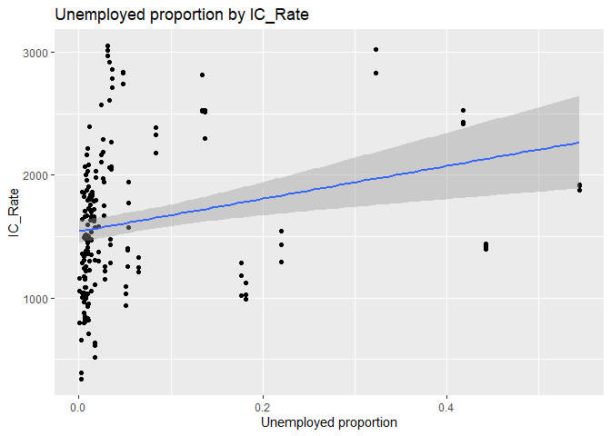
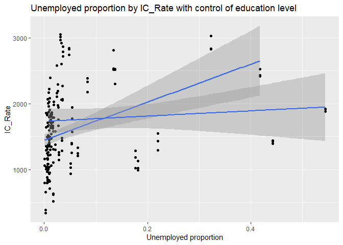
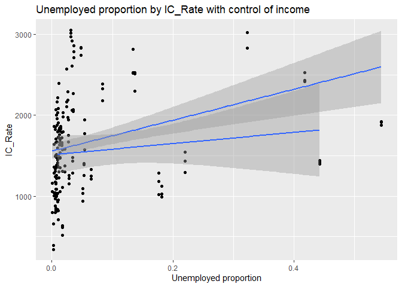
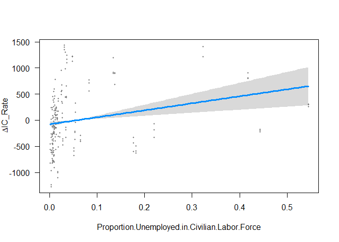
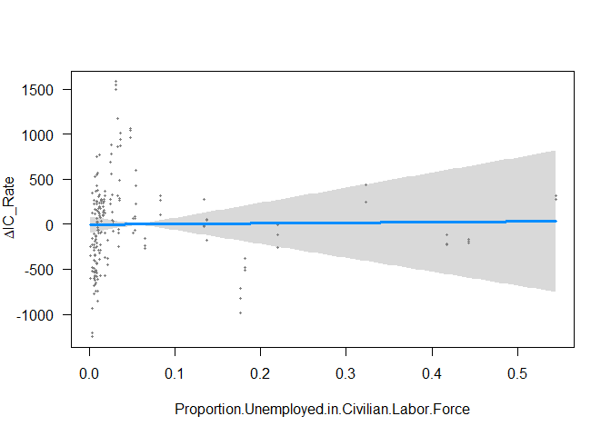

 

 

Submission Instructions
=======================

Download the lab-four-problem-set.rmd file from GitHub and code your
answers in that file. Rename the file lastname\_firstname\_lab1.md. You
must knit your .rmd as an .md. Upload your problem set through the
Assignments tab in Canvas by July 29th at 12PM. Remember that in an R
Markdown file writing in the white space will be read as text, so you
write responses to your questions in the white space.

Data Overview
=============

Our data represents crime rates by county in New York from 2016-2018.
Crime rates are reported using three categories: Index, Violent, and
Property Crimes. Data was collected from
<a href="https://www.criminaljustice.ny.gov/crimnet/ojsa/countycrimestats.html" class="uri">https://www.criminaljustice.ny.gov/crimnet/ojsa/countycrimestats.html</a>.
We also have demographic information for each county collected from the
United States Census. Definitions for each variables are below.

Variables:

<table>
<colgroup>
<col style="width: 50%" />
<col style="width: 50%" />
</colgroup>
<thead>
<tr class="header">
<th>Variable</th>
<th>Description</th>
</tr>
</thead>
<tbody>
<tr class="odd">
<td><code>gisjoin</code></td>
<td>GIS unique id that allows the user to merge data to a county GIS shapefile</td>
</tr>
<tr class="even">
<td><code>year</code></td>
<td>Year the data was collected. Census data was collected between 2014-2018 and is presented as a weighted average, but we should think of all demographic data as coming from 2016.</td>
</tr>
<tr class="odd">
<td><code>county/countyname</code></td>
<td>County name</td>
</tr>
<tr class="even">
<td><code>countya/countfip</code></td>
<td>County FIPS code</td>
</tr>
<tr class="odd">
<td><code>male</code></td>
<td>male represents the total number of individuals who identify as male overall and by the following age groups: under 18, 18 to 34 years of age, 35 to 64 years of age, and 65 or older. The total number of individuals who were surveyed to obtain these statistics are found in sex by age: total population</td>
</tr>
<tr class="even">
<td><code>female</code></td>
<td>female represents the total number of individuals who identify as female overall and by the following age groups: under 18, 18 to 34 years of age, 35 to 64 years of age, and 65 or older. The total number of individuals who were surveyed to obtain these statistics are found in sex by age: total population</td>
</tr>
<tr class="odd">
<td><code>race</code></td>
<td>Race represents the total number of individuals who identify as white, Black, Asian, American Indian, Nativan Hawaiian or other. The total number of individuals who were surveyed to obtain these statistics are found in Race: total population</td>
</tr>
<tr class="even">
<td><code>education</code></td>
<td>Education represents the total number of individuals who have achieved a certain level of education as defined by HS degree or less, some college, and college or more. The total number of individuals who were surveyed to obtain these statistics are found in education: total population</td>
</tr>
<tr class="odd">
<td><code>median household income</code></td>
<td>The median household income</td>
</tr>
<tr class="even">
<td><code>proportion (un)employed in civilian labor force</code></td>
<td>Of the civilian labor force, these are the proportions (0-1) of individuals who are either employed or unemployed. This does not include those serving in the armed forces or those that are not in the civilian labor force (e.g., individuals over 65)</td>
</tr>
<tr class="odd">
<td><code>population</code></td>
<td>The total number of indivudals living in the county</td>
</tr>
<tr class="even">
<td><code>index crime</code></td>
<td>Index crimes include all counts of murder and nonnegligent homicide, rape, robbery, aggravated assualt, burglary, motor vehicle theft, larceny-theft, and arson</td>
</tr>
<tr class="odd">
<td><code>violent crime</code></td>
<td>Violent crime is defined as an event where an offender or perpetrator uses or threatens to use force upon a victim</td>
</tr>
<tr class="even">
<td><code>property crime</code></td>
<td>Property crime is defined as an event where a victim’s property is stolen or destroyed without the use or threat of force against the victim. This is represented as an overall count of occurences and a rate per</td>
</tr>
<tr class="odd">
<td><code>new york city</code></td>
<td>This is an indicator stating whether the county is in New York City</td>
</tr>
</tbody>
</table>

Problem Set Questions
=====================

1. Read in the crime data using the `renamefrom()` function. You will need to create a crosswalk.
-------------------------------------------------------------------------------------------------

    library(collapse)

    ## collapse 1.2.1, see ?`collapse-package` or ?`collapse-documentation`

    ## 
    ## Attaching package: 'collapse'

    ## The following object is masked from 'package:stats':
    ## 
    ##     D

    require(doBy)

    ## Loading required package: doBy

    library(visreg)
    library(tidyverse)

    ## -- Attaching packages --------------------------------------------------- tidyverse 1.3.0 --

    ## √ ggplot2 3.3.2     √ purrr   0.3.4
    ## √ tibble  3.0.2     √ dplyr   1.0.0
    ## √ tidyr   1.1.0     √ stringr 1.4.0
    ## √ readr   1.3.1     √ forcats 0.5.0

    ## -- Conflicts ------------------------------------------------------ tidyverse_conflicts() --
    ## x dplyr::filter()   masks stats::filter()
    ## x dplyr::lag()      masks stats::lag()
    ## x dplyr::order_by() masks doBy::order_by()

    library(crosswalkr)
    library(zoo)

    ## 
    ## Attaching package: 'zoo'

    ## The following object is masked from 'package:collapse':
    ## 
    ##     is.regular

    ## The following objects are masked from 'package:base':
    ## 
    ##     as.Date, as.Date.numeric

    library(randomForest)

    ## randomForest 4.6-14

    ## Type rfNews() to see new features/changes/bug fixes.

    ## 
    ## Attaching package: 'randomForest'

    ## The following object is masked from 'package:dplyr':
    ## 
    ##     combine

    ## The following object is masked from 'package:ggplot2':
    ## 
    ##     margin

    library(readxl)
    c2016 <- read_xlsx('./problem-set-4-data/2016-county-index-rates.xlsx')
    c2017 <- read_xlsx('./problem-set-4-data/2017-county-index-rates.xlsx')
    c2018 <- read_xlsx('./problem-set-4-data/2018-county-index-rates.xlsx')
    crosswalk <- read.csv('./problem-set-4-data/crosswalk.csv')
    cf2016 <- renamefrom(c2016, crosswalk, a2016, VarName)
    cf2017 <- renamefrom(c2017, crosswalk, a2017, VarName)
    cf2018 <- renamefrom(c2018, crosswalk, a2018, VarName)
    cf <- rbind(cf2016,cf2017,cf2018)

2. Merge in the demographic data. Examine your variables. Correct the three variables that are incorrectly coded. You need to determine which variables these are by viewing your data and running the checks we learned in lab 1.
----------------------------------------------------------------------------------------------------------------------------------------------------------------------------------------------------------------------------------

    dg <- read.csv('./problem-set-4-data/ny_demographic_census.csv')
    cfdg <- left_join(cf, dg, by = 'GISJOIN')
    head(cfdg)

    ## Warning: `...` is not empty.
    ## 
    ## We detected these problematic arguments:
    ## * `needs_dots`
    ## 
    ## These dots only exist to allow future extensions and should be empty.
    ## Did you misspecify an argument?

    ## # A tibble: 6 x 41
    ##   GISJOIN  Year CountyFIPS County `Population ` IC_Count IC_Rate VC_Count
    ##   <chr>   <dbl>      <dbl> <chr>          <dbl>    <dbl>   <dbl>    <dbl>
    ## 1 G36000~  2016          1 Albany        308401     8769   2843.     1099
    ## 2 G36000~  2016          3 Alleg~         46858      571   1219.       81
    ## 3 G36000~  2016          5 Bronx        1458255    36834   2526.    13817
    ## 4 G36000~  2016          7 Broome        194518     5424   2788.      640
    ## 5 G36000~  2016          9 Catta~         75126     1251   1665.      138
    ## 6 G36001~  2016         11 Cayuga         77462     1427   1842.      184
    ## # ... with 33 more variables: VC_Rate <dbl>, PC_Count <dbl>, PC_Rate <dbl>,
    ## #   NY <dbl>, YEAR <chr>, STATE <chr>, COUNTY <chr>, COUNTYA <int>,
    ## #   Sex.by.Age..Total.Population <int>, Male..Total.Population <int>,
    ## #   Male..Under.18 <int>, Male..18.to.34.years.old <int>,
    ## #   Male..35.to.64.years.old <int>, Male..65.years.or.Older <int>,
    ## #   Female..Total.Population <int>, Female..Under.18 <int>,
    ## #   Female..18.to.34.years.old <int>, Female..35.to.64.years.old <int>,
    ## #   Female..65.years.or.Older <int>, Race..Total.Population <int>, White <int>,
    ## #   Black <int>, American.Indian <int>, Asian <int>, Native.Hawaiian <int>,
    ## #   Other.Race <int>, Education..Total.Population <int>,
    ## #   High.School.Degree.or.Less <int>, Some.College <int>,
    ## #   College.or.More <int>, Median.Household.Income <int>,
    ## #   Proportion.Employed.in.Civilian.Labor.Force <dbl>,
    ## #   Proportion.Unemployed.in.Civilian.Labor.Force <dbl>

    tail(cfdg)

    ## Warning: `...` is not empty.
    ## 
    ## We detected these problematic arguments:
    ## * `needs_dots`
    ## 
    ## These dots only exist to allow future extensions and should be empty.
    ## Did you misspecify an argument?

    ## # A tibble: 6 x 41
    ##   GISJOIN  Year CountyFIPS County `Population ` IC_Count IC_Rate VC_Count
    ##   <chr>   <dbl>      <dbl> <chr>          <dbl>    <dbl>   <dbl>    <dbl>
    ## 1 G36011~  2018        113 Warren         63165      952   1507.       96
    ## 2 G36011~  2018        115 Washi~         60229      426    707.       73
    ## 3 G36011~  2018        117 Wayne          88547     1468   1658.      171
    ## 4 G36011~  2018        119 Westc~        966057     9849   1020.     1689
    ## 5 G36012~  2018        121 Wyomi~         39510      333    843.       63
    ## 6 G36012~  2018        123 Yates          24430      245   1003.       17
    ## # ... with 33 more variables: VC_Rate <dbl>, PC_Count <dbl>, PC_Rate <dbl>,
    ## #   NY <dbl>, YEAR <chr>, STATE <chr>, COUNTY <chr>, COUNTYA <int>,
    ## #   Sex.by.Age..Total.Population <int>, Male..Total.Population <int>,
    ## #   Male..Under.18 <int>, Male..18.to.34.years.old <int>,
    ## #   Male..35.to.64.years.old <int>, Male..65.years.or.Older <int>,
    ## #   Female..Total.Population <int>, Female..Under.18 <int>,
    ## #   Female..18.to.34.years.old <int>, Female..35.to.64.years.old <int>,
    ## #   Female..65.years.or.Older <int>, Race..Total.Population <int>, White <int>,
    ## #   Black <int>, American.Indian <int>, Asian <int>, Native.Hawaiian <int>,
    ## #   Other.Race <int>, Education..Total.Population <int>,
    ## #   High.School.Degree.or.Less <int>, Some.College <int>,
    ## #   College.or.More <int>, Median.Household.Income <int>,
    ## #   Proportion.Employed.in.Civilian.Labor.Force <dbl>,
    ## #   Proportion.Unemployed.in.Civilian.Labor.Force <dbl>

3. Write a null and alternative hypothesis that you can feasibly answer with your data (e.g., crime rates (consider overall, index, violent, or property) are higher in counties with higher proportions of X). Your hypothesis should NOT be related to time; we will examine this later.
------------------------------------------------------------------------------------------------------------------------------------------------------------------------------------------------------------------------------------------------------------------------------------------

Write your answer here The index crime rate is higher in counties with
higher proportion of unemployed in civilian labor force.

4. Run a preliminary correlation for your hypothesis. Report on the strength of the relationship, the significance level, and whether the correlation supports your null or alternative hypothesis. (HINT: If you use a demographic variable that is reported as a count, you will need to turn this into a proportion. Also consider whether your variable makes sense on its own).
------------------------------------------------------------------------------------------------------------------------------------------------------------------------------------------------------------------------------------------------------------------------------------------------------------------------------------------------------------------------------------

The p-value is close to 0. The relation is significant. The cor-value is
about 0.25, which is a moderate positive correlation. The relation test
supports the hypothesis.

    cor.test(cfdg$IC_Rate,cfdg$Proportion.Unemployed.in.Civilian.Labor.Force,method = 'pearson')

    ## 
    ##  Pearson's product-moment correlation
    ## 
    ## data:  cfdg$IC_Rate and cfdg$Proportion.Unemployed.in.Civilian.Labor.Force
    ## t = 3.4918, df = 184, p-value = 0.0006007
    ## alternative hypothesis: true correlation is not equal to 0
    ## 95 percent confidence interval:
    ##  0.1093353 0.3795583
    ## sample estimates:
    ##      cor 
    ## 0.249293

5. Run a ttest for your hypothesis. In order to run a ttest, your independent variable will need to be binary (or coded as 0 v 1). Recall we created indicators in lab 1. Write a rationale for why you split your variable the way you did. Report the means of your outcome for the two groups you created, and the significance level from the ttest. Compare your findings here to step 4. Speak to similarities and differences between the two tests.
-----------------------------------------------------------------------------------------------------------------------------------------------------------------------------------------------------------------------------------------------------------------------------------------------------------------------------------------------------------------------------------------------------------------------------------------------------------

Write your response here I choose the median value as the boundary
because it could indicate the overall data. The mean of IC\_Rate for the
group with unemployment rate higher than average has a higher value,
which is 1904. The other group is 1556. The p-value is about 0.0019,
which is still significant, but larger than the one in part 4. This
t-test also shows the significant positive relation between index crime
rate and unemployment rate.

    cfdg$un <- cfdg$Proportion.Unemployed.in.Civilian.Labor.Force >= mean(cfdg$Proportion.Unemployed.in.Civilian.Labor.Force) 

    aggregate(cfdg$IC_Rate, list(cfdg$un), mean)

    ##   Group.1        x
    ## 1   FALSE 1556.382
    ## 2    TRUE 1904.089

    pairwise.t.test(cfdg$IC_Rate, cfdg$un,
                     p.adjust.method = "BH")

    ## 
    ##  Pairwise comparisons using t tests with pooled SD 
    ## 
    ## data:  cfdg$IC_Rate and cfdg$un 
    ## 
    ##      FALSE 
    ## TRUE 0.0019
    ## 
    ## P value adjustment method: BH

6. What other variables do you think could explain the relationship you found in step 4? Write at least 2 other variables you think could attenuate (or weaken) your relationship and explain why. If necessary, recode the variables in this section. The way you code your variables will help you tell your story later on. Finally, thinking back to lab 4 write 1 sentence about whether it make sense to use factors you use factors?
-------------------------------------------------------------------------------------------------------------------------------------------------------------------------------------------------------------------------------------------------------------------------------------------------------------------------------------------------------------------------------------------------------------------------------------------

Write your response here The median income and education level may also
has effect. The unemployment might not be the cause of crime. The
unemployment may caused by the low education level. The low education
level might be the cause instead. Moreover, the unemployment may cause a
low income, which is probably the direct cause of crime. Although people
are unemployed, if their family still has a high household income, or
they have higher education level, it is less likely for them to commit a
crime. It is unreasonable for considering the unemployed rate as the
only factor.

    EDU <- lm(IC_Rate ~ Proportion.Unemployed.in.Civilian.Labor.Force + College.or.More/Education..Total.Population, data=cfdg)
    Income <- lm(IC_Rate ~ Proportion.Unemployed.in.Civilian.Labor.Force + Median.Household.Income, data=cfdg)
    summary(EDU)

    ## 
    ## Call:
    ## lm(formula = IC_Rate ~ Proportion.Unemployed.in.Civilian.Labor.Force + 
    ##     College.or.More/Education..Total.Population, data = cfdg)
    ## 
    ## Residuals:
    ##     Min      1Q  Median      3Q     Max 
    ## -1138.4  -439.9   -13.5   353.3  1452.9 
    ## 
    ## Coefficients:
    ##                                                 Estimate Std. Error t value
    ## (Intercept)                                    1.466e+03  5.320e+01  27.563
    ## Proportion.Unemployed.in.Civilian.Labor.Force  2.187e+03  8.897e+02   2.458
    ## College.or.More                                2.139e-03  9.186e-04   2.328
    ## College.or.More:Education..Total.Population   -1.953e-09  6.681e-10  -2.923
    ##                                               Pr(>|t|)    
    ## (Intercept)                                     <2e-16 ***
    ## Proportion.Unemployed.in.Civilian.Labor.Force   0.0149 *  
    ## College.or.More                                 0.0210 *  
    ## College.or.More:Education..Total.Population     0.0039 ** 
    ## ---
    ## Signif. codes:  0 '***' 0.001 '**' 0.01 '*' 0.05 '.' 0.1 ' ' 1
    ## 
    ## Residual standard error: 562.9 on 182 degrees of freedom
    ## Multiple R-squared:  0.1043, Adjusted R-squared:  0.08952 
    ## F-statistic: 7.063 on 3 and 182 DF,  p-value: 0.0001619

    summary(Income)

    ## 
    ## Call:
    ## lm(formula = IC_Rate ~ Proportion.Unemployed.in.Civilian.Labor.Force + 
    ##     Median.Household.Income, data = cfdg)
    ## 
    ## Residuals:
    ##      Min       1Q   Median       3Q      Max 
    ## -1288.51  -375.80   -75.32   299.96  1516.38 
    ## 
    ## Coefficients:
    ##                                                 Estimate Std. Error t value
    ## (Intercept)                                    2.212e+03  1.774e+02  12.468
    ## Proportion.Unemployed.in.Civilian.Labor.Force  1.670e+03  3.781e+02   4.416
    ## Median.Household.Income                       -1.142e-02  2.917e-03  -3.915
    ##                                               Pr(>|t|)    
    ## (Intercept)                                    < 2e-16 ***
    ## Proportion.Unemployed.in.Civilian.Labor.Force 1.72e-05 ***
    ## Median.Household.Income                       0.000127 ***
    ## ---
    ## Signif. codes:  0 '***' 0.001 '**' 0.01 '*' 0.05 '.' 0.1 ' ' 1
    ## 
    ## Residual standard error: 551.8 on 183 degrees of freedom
    ## Multiple R-squared:  0.1346, Adjusted R-squared:  0.1252 
    ## F-statistic: 14.23 on 2 and 183 DF,  p-value: 1.795e-06

7. Create a graph/plot/map of your choice that examines your hypothesis from step 3/4. Replicate your graph/plot/map but this time adding in trends for the different groups you identified in step 6. Write 1-2 sentences briefly summarizing what you find. (HINT: Think about whether a line graph or a bar chart makes more sense for this exercise. Feel free to get creative here. You may add in a time dimension if you would like, though it is not necessary).
------------------------------------------------------------------------------------------------------------------------------------------------------------------------------------------------------------------------------------------------------------------------------------------------------------------------------------------------------------------------------------------------------------------------------------------------------------------------

    ggplot (cfdg, aes(y = IC_Rate, x = Proportion.Unemployed.in.Civilian.Labor.Force)) +
      geom_point() +
      geom_smooth(method = "lm") +
      labs(y = "IC_Rate", x = "Unemployed proportion", title = "Unemployed proportion by IC_Rate")

    ## `geom_smooth()` using formula 'y ~ x'

It correspond to the hypothesis in 3/4,where there is a positive
relation between unemployed proportion and IC\_Rate.

    ggplot (cfdg, aes(y = IC_Rate, x = Proportion.Unemployed.in.Civilian.Labor.Force, group=College.or.More/Education..Total.Population>mean(College.or.More/Education..Total.Population))) +
      geom_point() +
      geom_smooth(method = "lm") +
      labs(y = "IC_Rate", x = "Unemployed proportion", title = "Unemployed proportion by IC_Rate with control of education level")

    ## `geom_smooth()` using formula 'y ~ x'

    ggplot (cfdg, aes(y = IC_Rate, x = Proportion.Unemployed.in.Civilian.Labor.Force, group=Median.Household.Income>mean(Median.Household.Income))) +
      geom_point() +
      geom_smooth(method = "lm") +
      labs(y = "IC_Rate", x = "Unemployed proportion", title = "Unemployed proportion by IC_Rate with control of income")

    ## `geom_smooth()` using formula 'y ~ x'

Both of them become flatter and having a higher intercept.With these
controls, the relation between unemployment and crime rate become
weaker. This means some part of the relation is explained through
factors controled, income and education.

8. Run three linear models. The first model should be the “naive” model that only examines the relationship between your outcome and independent variable (identified in step 4). Your second model should be your “control” model where you add in the groups you identified in step 6. Your final model is another “control” model where you add year to your model (add year by itself removing the groups from your second model). Write 3-4 sentences interpreting the estimates between your naive and control models. Pay particular attention to estimates, significance, and your r-squared and compare between your models. Think hard about what your estimates actually mean. Your interpration of the estimates depend on how your outcome variable was coded.
---------------------------------------------------------------------------------------------------------------------------------------------------------------------------------------------------------------------------------------------------------------------------------------------------------------------------------------------------------------------------------------------------------------------------------------------------------------------------------------------------------------------------------------------------------------------------------------------------------------------------------------------------------------------------------------------------------------------------------------------------------------------------

    Lunemployed <- lm(IC_Rate ~ Proportion.Unemployed.in.Civilian.Labor.Force, data=cfdg)
    Lcontrol <- lm(IC_Rate ~ Proportion.Unemployed.in.Civilian.Labor.Force + Median.Household.Income + College.or.More/Education..Total.Population, data=cfdg)
    Lyear <- lm(IC_Rate ~ Proportion.Unemployed.in.Civilian.Labor.Force + Year, data=cfdg)
    summary(Lunemployed)

    ## 
    ## Call:
    ## lm(formula = IC_Rate ~ Proportion.Unemployed.in.Civilian.Labor.Force, 
    ##     data = cfdg)
    ## 
    ## Residuals:
    ##      Min       1Q   Median       3Q      Max 
    ## -1204.25  -412.31   -63.82   332.45  1469.48 
    ## 
    ## Coefficients:
    ##                                               Estimate Std. Error t value
    ## (Intercept)                                    1540.89      47.46  32.464
    ## Proportion.Unemployed.in.Civilian.Labor.Force  1335.24     382.39   3.492
    ##                                               Pr(>|t|)    
    ## (Intercept)                                    < 2e-16 ***
    ## Proportion.Unemployed.in.Civilian.Labor.Force 0.000601 ***
    ## ---
    ## Signif. codes:  0 '***' 0.001 '**' 0.01 '*' 0.05 '.' 0.1 ' ' 1
    ## 
    ## Residual standard error: 572.9 on 184 degrees of freedom
    ## Multiple R-squared:  0.06215,    Adjusted R-squared:  0.05705 
    ## F-statistic: 12.19 on 1 and 184 DF,  p-value: 0.0006007

    summary(Lcontrol)

    ## 
    ## Call:
    ## lm(formula = IC_Rate ~ Proportion.Unemployed.in.Civilian.Labor.Force + 
    ##     Median.Household.Income + College.or.More/Education..Total.Population, 
    ##     data = cfdg)
    ## 
    ## Residuals:
    ##      Min       1Q   Median       3Q      Max 
    ## -1246.02  -286.79     2.69   258.84  1584.39 
    ## 
    ## Coefficients:
    ##                                                 Estimate Std. Error t value
    ## (Intercept)                                    3.003e+03  1.997e+02  15.036
    ## Proportion.Unemployed.in.Civilian.Labor.Force  6.820e+01  8.145e+02   0.084
    ## Median.Household.Income                       -2.795e-02  3.536e-03  -7.905
    ## College.or.More                                7.759e-03  1.066e-03   7.280
    ## College.or.More:Education..Total.Population   -4.226e-09  6.452e-10  -6.550
    ##                                               Pr(>|t|)    
    ## (Intercept)                                    < 2e-16 ***
    ## Proportion.Unemployed.in.Civilian.Labor.Force    0.933    
    ## Median.Household.Income                       2.53e-13 ***
    ## College.or.More                               9.88e-12 ***
    ## College.or.More:Education..Total.Population   5.76e-10 ***
    ## ---
    ## Signif. codes:  0 '***' 0.001 '**' 0.01 '*' 0.05 '.' 0.1 ' ' 1
    ## 
    ## Residual standard error: 486.7 on 181 degrees of freedom
    ## Multiple R-squared:  0.3342, Adjusted R-squared:  0.3195 
    ## F-statistic: 22.71 on 4 and 181 DF,  p-value: 3.226e-15

    summary(Lyear)

    ## 
    ## Call:
    ## lm(formula = IC_Rate ~ Proportion.Unemployed.in.Civilian.Labor.Force + 
    ##     Year, data = cfdg)
    ## 
    ## Residuals:
    ##      Min       1Q   Median       3Q      Max 
    ## -1158.18  -411.32   -66.13   340.30  1550.50 
    ## 
    ## Coefficients:
    ##                                                Estimate Std. Error t value
    ## (Intercept)                                   231416.88  102647.72   2.254
    ## Proportion.Unemployed.in.Civilian.Labor.Force   1335.24     378.28   3.530
    ## Year                                            -113.97      50.89  -2.239
    ##                                               Pr(>|t|)    
    ## (Intercept)                                   0.025352 *  
    ## Proportion.Unemployed.in.Civilian.Labor.Force 0.000526 ***
    ## Year                                          0.026330 *  
    ## ---
    ## Signif. codes:  0 '***' 0.001 '**' 0.01 '*' 0.05 '.' 0.1 ' ' 1
    ## 
    ## Residual standard error: 566.7 on 183 degrees of freedom
    ## Multiple R-squared:  0.08716,    Adjusted R-squared:  0.07719 
    ## F-statistic: 8.737 on 2 and 183 DF,  p-value: 0.0002377

With the control group, there is a larger R-square value and smaller
p-value, which means the relation is better explained by the model with
control groups. However, the model with year control has larger p-value
and smaller R-square. Therefore, year is not related to the crime rate.

9. Visualize your regressions by graphing the residuals from both your naive and control models in step 8. Write 3-4 setences explaining what the graphs show, paying particular attention to the interpretation of your confidence intervals.
----------------------------------------------------------------------------------------------------------------------------------------------------------------------------------------------------------------------------------------------

    visreg(Lunemployed, "Proportion.Unemployed.in.Civilian.Labor.Force", type = "contrast")

    visreg(Lcontrol, "Proportion.Unemployed.in.Civilian.Labor.Force", type = "contrast")

    ## Warning:   Note that you are attempting to plot a 'main effect' in a model that contains an
    ##   interaction.  This is potentially misleading; you may wish to consider using the 'by'
    ##   argument.

    ## Conditions used in construction of plot
    ## Median.Household.Income: 55890
    ## College.or.More: 14318
    ## Education..Total.Population: 59851.5

The naive one has an increasing large residual with the increase of
unemployment rate. This means the naive model can’t explain well when
unemployment increase. The control model has residuals almost zero,
which means the model could explain well at any state. However, it has a
large confidence intervals, which means there is a probability that the
model are not fully explaining the relation.

10. For a policy leader of your choice, explain your hypothesis and why it is important for them to consider. Next summarize your findings. Finally, recall that our data represents counties in New York State for the years 2016 to 2018. What other data would you like in order to better understand your hypotheses (e.g., time points, neighborhoods)? How would this data better help you answer the question you are interested in? Specifically speak to HOW this new data would allow you to isolate the relationship you’re interested in. Write 2-3 paragraphs.
---------------------------------------------------------------------------------------------------------------------------------------------------------------------------------------------------------------------------------------------------------------------------------------------------------------------------------------------------------------------------------------------------------------------------------------------------------------------------------------------------------------------------------------------------------------------------

Write your answer here. Unemployment rate has a correlation with the
index crime rate. However, the direct reason is the education level and
household income. Therefore, to decrease the index crime rate, it is
better to encourage and support education, subsidizing poor families.
However, the average education level and average household income may
vary from state to state. To better understand the relation, there
should be data in other state. These data will help me to determine
whether the crime rate is related to the average value in each place or
not. (e.g.Suppose one state has high average education and income level
and the other low value. If there are two counties with same edu and
income level, whether the county in high value state will have a high
index rate or not.) The geographical environment may also affect the
value in different state. To eliminate such variation, I could use the
data in one state but in different year. Since the original data is from
2016 to 2018, which is too short, a data with longer time lag would be
preferable. To isolate such relation, I could set a control with the
average edu and income of each state and year and do the linear model.
